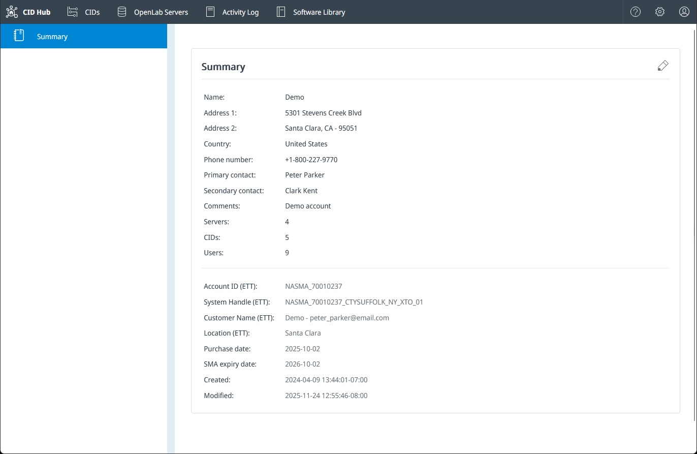
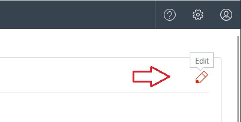
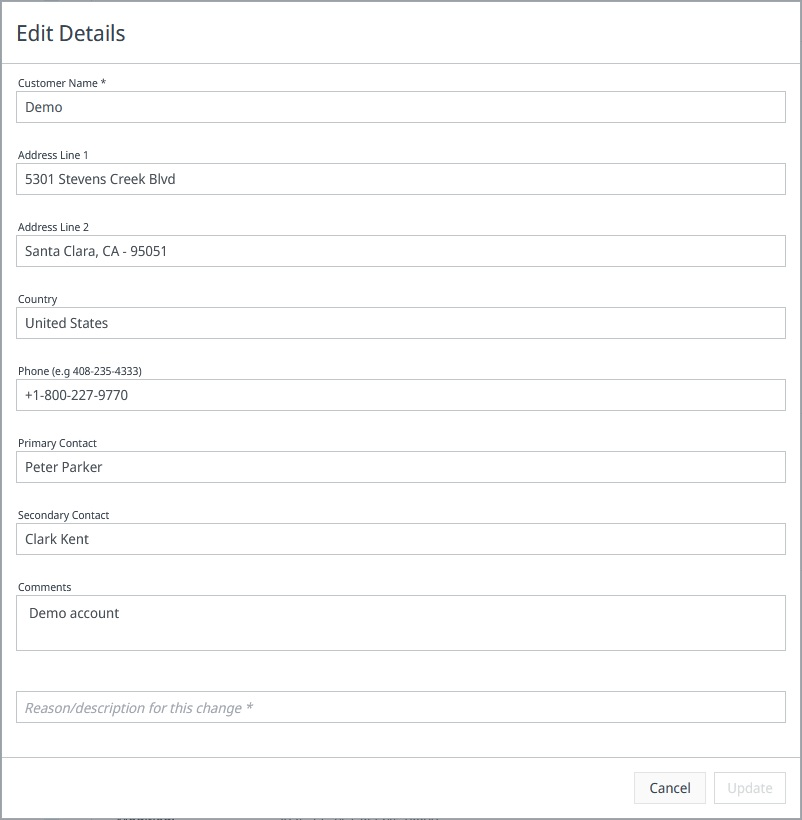

# Manage account settings

Use the **Account** page in CID Hub to review your organization's account details and keep the address, phone number, and contacts current. Administrators in your account can edit; other users can view.

## Prerequisites

- You must have a CID Hub account and be signed in. Any signed-in user in your account can view the **Account** page.
- To make changes, you must have the **Administrator** role. See [Manage users and roles](./manage-users-and-roles).

## Open the Account page

The Account page opens from the Settings menu in the top navigation bar.

1. Click the **Settings** (gear) icon in the top-right corner of the top navigation bar.
2. Select **Account**.

   The **Account Summary** page opens with your organization's details.

   

## Account Summary

The Account Summary page shows:

- **Company name and address**. Your organization's registered name and mailing address.
- **Country and phone**. The account's country and primary phone number.
- **Primary contact and secondary contact**. The people CID Hub shows as the main account contacts.
- **Comments**. Free-text notes stored with the account.
- **Servers, CIDs, and Users**. Read-only counts of the OpenLab Servers, CIDs, and users registered to the account.
- **Date created and Date modified**. When the account was created and last updated.
- **Purchase date and SMA expiry date**. Licensing dates shown when Agilent has set them.

## Edit account details

Update your account details when your organization's address, contacts, or other information changes.

1. On the Account Summary page, click the **Edit** (pencil) icon.

   

   The **Edit Details** dialog opens.

   

2. Update any of the editable fields: address, country, phone, primary or secondary contact, and comments. The company name is also editable but must remain unique across all CID Hub accounts (matching is case-insensitive); it cannot be blank.

3. Enter a justification in the **Reason/description for this change** field. This field is required and is recorded with the change in the Activity Log.

4. Click **Update** to save, or **Cancel** to discard your edits.

:::note
Fields labeled **(ETT)**, along with **Purchase date** and **SMA expiry date**, are managed by Agilent for licensing and internal record-keeping. They appear on the summary when set, but you cannot edit them from your account. Contact Agilent support if any of these values is wrong.
:::

## See also

- [Manage users and roles](./manage-users-and-roles): invite users, assign Administrator or User roles, and remove access.
- [View activity logs](../monitoring/view-activity-logs): review who changed which account details and when.
- [Security model](../../security/security-model): understand roles, sign-in methods, and session behavior in CID Hub.
