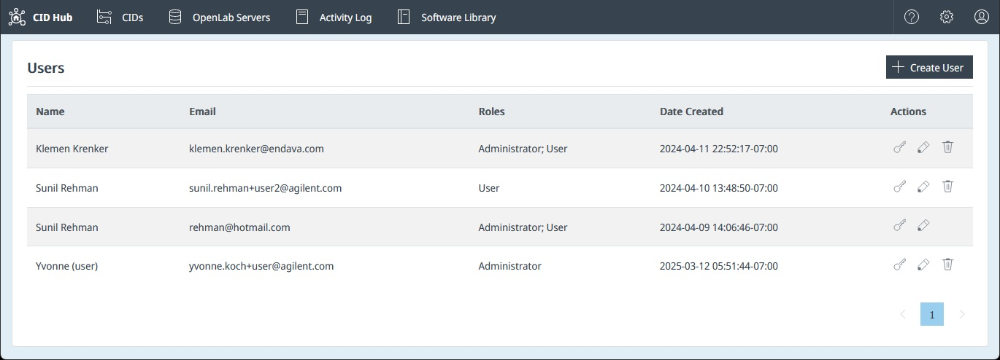
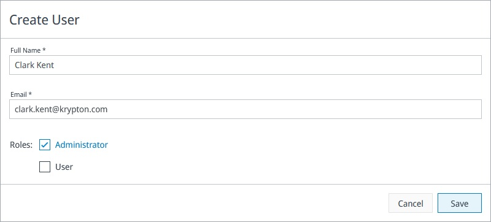

# <mark>Manage users and roles</mark>

Use the **Users** page in CID Hub to invite people to your account, assign them a role, reset their password, and remove their access when they no longer need it. Roles, and what each one can do, are described in [Role privileges](#role-privileges) below.

Your account's first Administrator is created by Agilent when the account is provisioned. From that point on, Administrators in your account manage everyone else.

:::note
Welcome emails are sent from `no-reply@hub.cid.agilent.com` with subject **Connected Instrument Device Hub for OpenLab CDS: Your Temporary Password**. Ask your IT team to allow this sender so invitations and password-reset emails are not filtered out.
:::

## Prerequisites

- You must sign in as an **Administrator** to invite, edit, reset, or remove other users.
- You need each new user's full name and email address before you invite them.

## Open the Users page

1. Click the **Settings** (gear) icon in the top-right corner of the top navigation bar.
2. Select **Users**.

   The Users list opens. From here you can add, edit, reset, or remove users.

   

## Role privileges

CID Hub defines two roles. A user can hold one role or both at once.

### Administrator

Administrators have full control of the account:

- Register, edit, and remove OpenLab Servers.
- Define and update software templates for servers and CIDs.
- Add, edit, and remove CIDs.
- Configure CID network settings.
- Perform administrative actions on CIDs (for example, **Reset OpenLab CDS**, **Reboot System**).
- Manage other users (invite, change roles, remove).
- Edit account details.

### User

The **User** role suits lab staff who operate CIDs day-to-day but should not change configuration:

- View CIDs and their status.
- View server configurations (read-only).
- Launch CDS Desktop on a CID.
- Grant or revoke remote access for support.
- Restart or shut down a CID.

Users **cannot** change software, modify networking, add or remove CIDs or servers, or manage other users.

## Invite a user

1. On the Users page, click **+ Create User**.
2. In the **Create User** dialog, enter the user's **Full Name** and **Email**.
3. Select one or both roles: **Administrator**, **User**.
4. Click **Save**.

   

   The new user receives a welcome email at the address you entered, with a temporary password and a link to sign in.

:::note
Email addresses are case-insensitive. CID Hub converts the address to lowercase on entry, so `Jane.Doe@example.com` and `jane.doe@example.com` are treated as the same user.
:::

## Edit a user

You can change a user's full name or role assignment at any time. The email address is the account identifier and cannot be changed; if a user needs a different email, remove the account and invite them again.

1. Find the user in the list.
2. Click the **Edit** (pencil) icon in the **Actions** column.
3. Update the **Full Name** or change which roles are selected.
4. Click **Save**.

If you edit your own account, the page reloads so your session reflects the new role assignment.

## Reset a user's password

If a user forgets their password or their temporary password expires before they sign in, send them a fresh reset email.

1. Find the user in the list.
2. Click the **Reset Password** (key) icon in the **Actions** column.
3. Confirm when prompted.

   CID Hub emails the user a link to set a new password. The link works once and replaces any previous temporary password.

## Remove a user

Removing a user revokes their access to your account.

1. Find the user in the list.
2. Click the **Delete** (trash can) icon in the **Actions** column.
3. Confirm when prompted.

The user is removed from the directory immediately. If they have an active CID Hub session, it is terminated on the next backend authorization check (within about a minute), and any further requests are rejected.

:::note
You cannot remove your own account. Ask another Administrator to do it, or contact Agilent support if you are the only Administrator.
:::

## See also

- [Manage account settings](./manage-account-settings): change account details and contact information.
- [View activity logs](../monitoring/view-activity-logs): review sign-in, sign-out, and user-management events.
- [Security model](../../security/security-model): identity provider, supported sign-in methods, and the session-revocation model for removed users.
