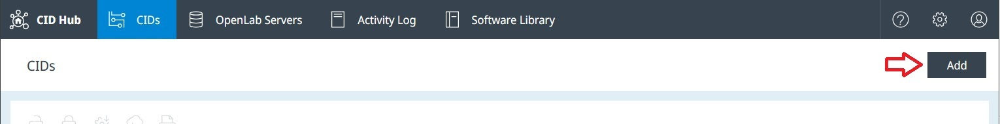
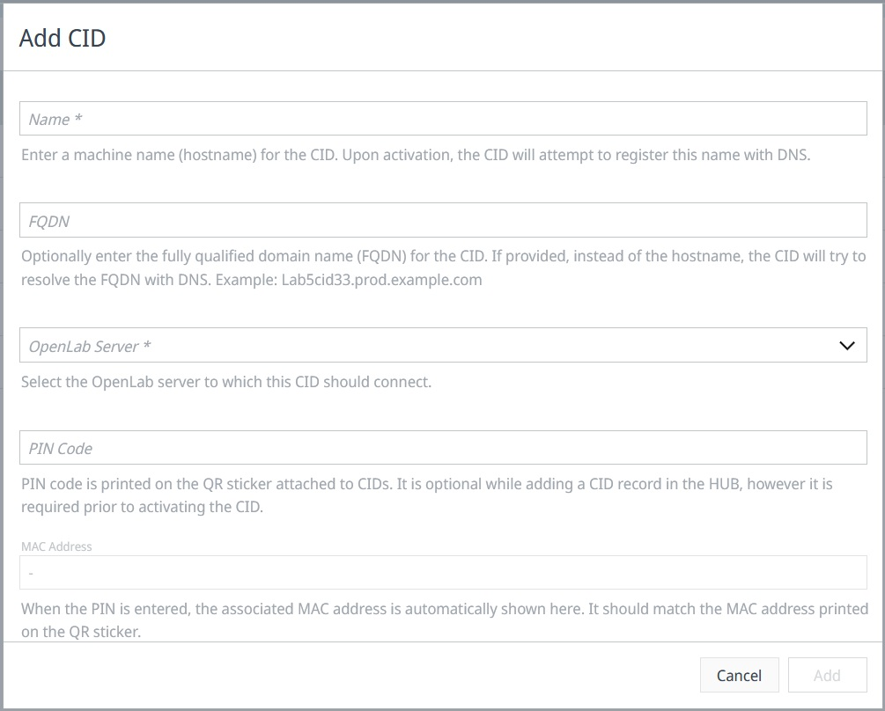

# Activate a CID
<!-- What, why, when, how -->
## Overview
Each physical CID you own must have a corresponding record in the CID Hub before it can be used. These online records define the configuration that each CID should apply. These records also required for accessing the CID and performing action on them.

:::note
Before activating a CID, you must "[register an OpenLab Server](register-a-server)" and "[define a software template](define-software-template)" for it.
:::

---

## Add a CID record

Clicking on the Add button launches the add CID dialog,

#### Field Descriptions  

- **Name**  
  Enter a machine name (hostname) for the CID. For better compatibility with some DNS systems, it is recommended to use no more than **15 lowercase alphanumeric letters** when entering this. It is also recommended to follow some pattern that can identify a CID and also distinguish them from AICs. For example: cid-1290lc-53

- **FQDN** *(use only if needed)*  
  When the CID activates, it confirms that its hostname can be resolved by the DNS server to the IP that DHCP has assigned to it. In rare situations when hostname resolution does not work, entering the fully qualified domain name (FQDN) causes the CID to resolve the FQDN with DNS instead.
  
- **OpenLab Server**  
  This informas the CIDs which server they must register with. This selection also provides the default software configuration template for the the CID.

- **PIN Code**  
  Pin code printed on the QR code attached to the physical device links it with the CID Hub record. The PIN code is used by the CID to legitimately identify itself with the CID Hub. Without it the activation cannot proceed. 

---

## Monitor Activation Process

### Recent Activities

---

