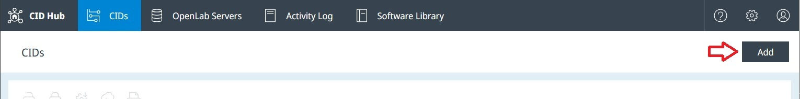
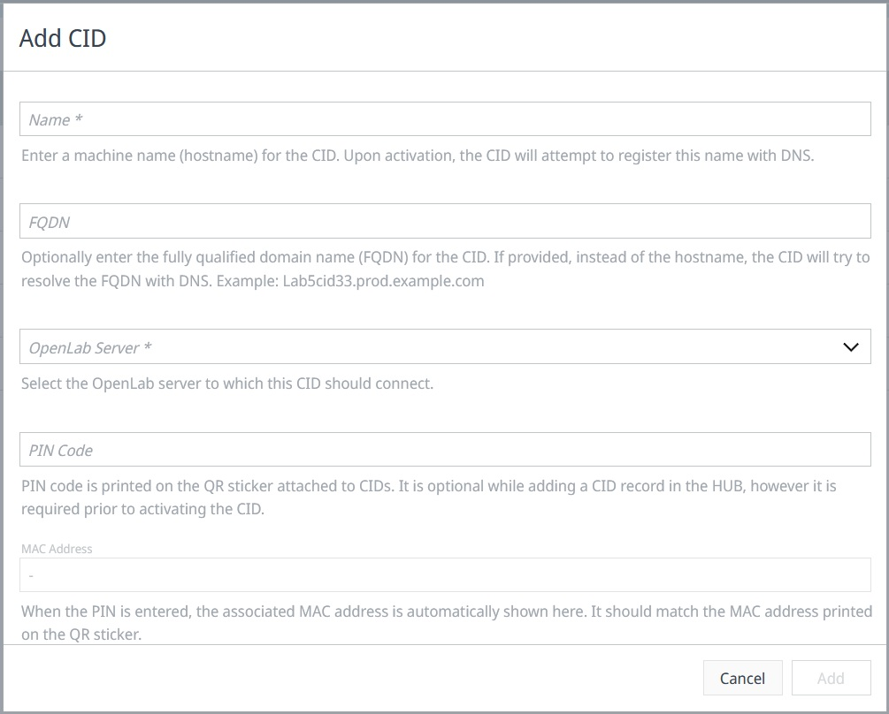
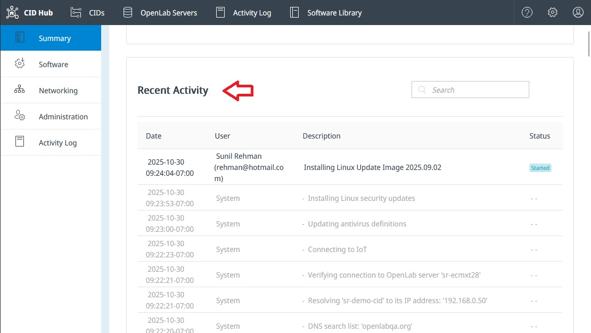

# Activate a CID
<!-- What, why, when, how -->
## Overview
Each physical CID must have a corresponding record in the CID Hub before it can be used. These online records define the configuration that the CID would assume. These records are also required for accessing the CID and performing actions on them.

:::info
Before activating a CID, you must "[register an OpenLab Server](register-a-server)" and "[define a software template](define-software-template)" for it.
:::

---

## Add a CID record

Clicking on the **Add** button launches the add CID dialog.

New CIDs are constantly checking for a corresponding CID record in the Hub with a matching PIN code. As soon as the CID finds such a record, it starts activating itself using information specified in the record.

#### Field Descriptions  

- **Name**  
  Enter a machine name (hostname) for the CID. For better compatibility with some DNS systems, it is recommended to use no more than **15 lowercase alphanumeric letters** when entering this. It is also recommended to follow some pattern that can identify a CID and also distinguish them from AICs. For example: cid-1290lc-53

- **FQDN** *(use only if needed)*  
  When the CID activates, it confirms that its hostname can be resolved by the DNS server to the IP that DHCP has assigned to it. In rare situations when hostname resolution does not work, entering the fully qualified domain name (FQDN) causes the CID to resolve the FQDN with DNS instead.
  
- **OpenLab Server**  
  This informs the CIDs which server they must register with. This selection also provides the default software configuration template for the the CID.

- **PIN Code**  
  Pin code printed on the QR code attached to the physical device links it with the CID Hub record. The PIN code is used by the CID to legitimately identify itself with the CID Hub. Without it the activation cannot proceed. 

---

## Activation Process

The CID activation process consists of the following steps:

- Verify network connection on house NIC
- Connect to the CID Hub
- Get OpenLab Server information
- Change hostname (if needed) to what is specified in the CID record in the Hub
- Confirm that DNS can resolve CID's hostname and that it resolves to the IP address assigned to it
- Confirm that CID can connect to AWS IoT services
- Confirm connection to OLSS Server
- Install latest Linux Update and antivirus definitions
- Download, install, and start CDS Virtual Machine
- If needed, install ECM 3.x APIs in the CDS Virtual Machine
- Configure and Register the CDS Virtual Machine as an AIC with the OLSS Server
- Install Windows Updates on the CDS Virtual Machine
- Install selected drivers and add-ons
- Setup scheduled antivirus scans
- Update passwords for the CID Linux subsystem and for the CDS virtual machine

### Recent Activities

The CID activities are recorded and displayed in the "*Recent Activity*" section at the bottom of the **Summary** page of the CID. You can monitor this section to see what step the CID has performed. It also shows any issues that the CID encounters along the way.

