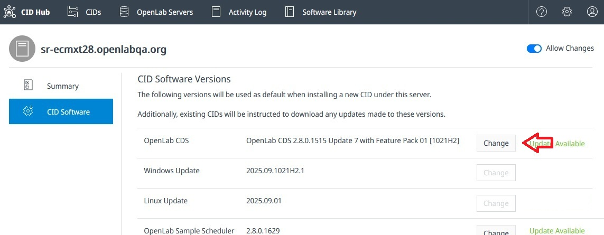

# Update/Upgrade CDS

New CDS updates and upgrades are published to the **CID Hub** as they become available.

To view all available versions, open the **Software Library** tab and then select **OpenLab CDS**.

You can choose which version of CDS to install on your CIDs from the **Software** tab on either your [**server**](/howto/define-software-template) or an individual [**CID**](/howto/configure-software-exceptions).

:::tip[Important]
- Changing the CDS version resets all driver and add-on selections to their defaults for that version. If your deployment requires specific versions, make sure to reselect them after changing the CDS version.
- If selecting **OpenLab CDS 2.8 Update 9** or later, verify that your CIDs have **Windows 11 license stickers**.
:::

On the Software page, the **Update Available** label appears for *updates* within the same major/minor version (e.g., `2.8.1` → `2.8.2`).  
*Upgrades* across major/minor versions (e.g., `2.7` → `2.8`) do **not** display this label.

Select **Change** to view available versions, review release notes, and choose the version you want to install.

After selecting the version, [**apply the changes**](apply-updates) to your CID(s) to install the update or upgrade.
