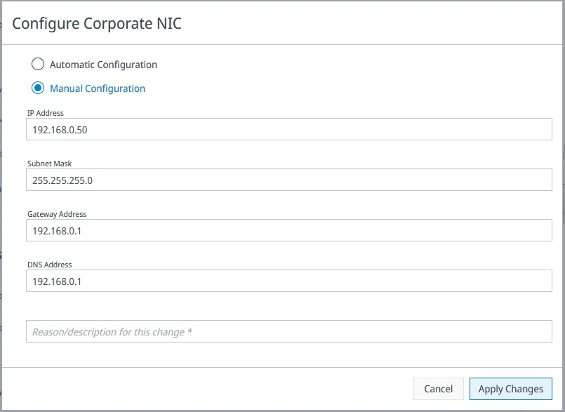
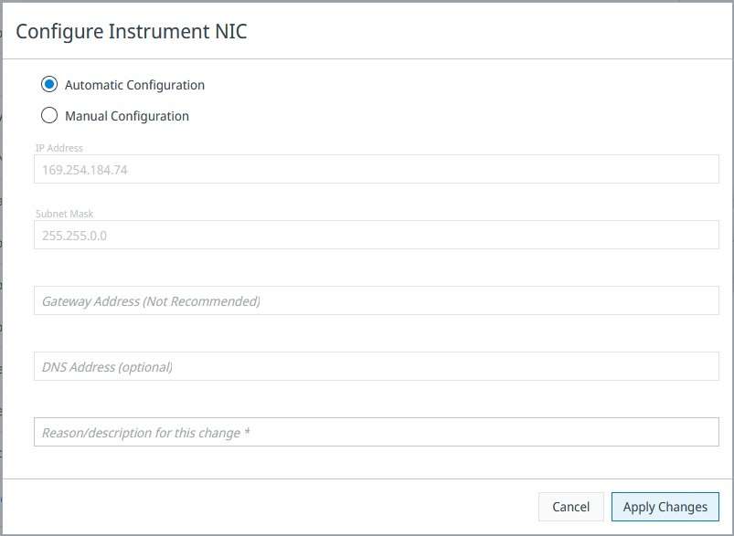

# Configure Network Cards

CIDs include two Network Interface Cards (NICs):  
- **Home / Corporate NIC** – Connects the CID to the corporate network, OpenLab Server, and the Internet.  
- **Instrument NIC** – Connects to the instrument and does not require external network access.

See the following topic for prerequisites:
- [Networking Requirements](../system-requirements#networking-requirements)  
- [Supported Topologies](../system-requirements#supported-topologies)

You can access a CID’s networking settings by selecting the **Networking** tab for that CID.

---

## Networking Page Overview

The Networking page displays the status and configuration of both NICs, including:

- Configuration method (Automatic/DHCP or Manual)
- Connection state
- IP address and subnet mask
- MAC address
- DNS and gateway information (if applicable)

Click **Show Details** to see technical information about the connections in Linux.

Each NIC has a **Configure** button that opens its configuration dialog.

### Automatic Revert Protection
When new settings are applied, the system first attempts to activate the configuration.  
If the CID cannot re-establish connectivity, the settings are automatically reverted to the last known working configuration.

This protection reduces the risk of misconfiguration, but it **cannot prevent all types of lockouts**, especially when modifying Corporate NIC parameters.

---

## Corporate NIC (Home NIC)

The Corporate NIC is the primary communication path between the CID, the CID Hub, and the OpenLab Server. Because it affects all external connectivity, modifying it must be done carefully.

### Configuration Methods

#### Automatic Configuration (DHCP)
The CID obtains its IP, subnet mask, gateway, and DNS settings from the corporate DHCP server.  
This is the recommended configuration in most environments.

#### Manual Configuration (Static IP)
Use only when required by your corporate IT policies.  
Required fields:

- **IP Address**  
- **Subnet Mask**  
- **Gateway Address**  
- **DNS Address**  
- **Reason/description for this change** (mandatory for auditing)

### ⚠ Important Warning: Possible Loss of Access
Incorrect manual configuration of the Corporate NIC can cause the CID to become unreachable.  
Examples include:

- Entering an incorrect gateway or subnet  
- Using an IP address already in use  
- Selecting a subnet that isolates the CID from the OpenLab Server  
- Assigning DNS settings that prevent name resolution  

Although the system attempts to revert changes when connectivity fails, some errors cannot be automatically detected.

**Instrument NIC changes do not carry this risk**, because they do not affect the corporate network route.

---

## Instrument NIC

The Instrument NIC isolates instrument communication from the corporate network.  
It does **not** need Internet access, and it typically uses:

- DHCP when supported by the instrument  
- Auto-IP (169.254.x.x) when no DHCP server is present  
- A static IP only when required by specific instrument setups  

### Configuration Screen

When configuring the Instrument NIC, the dialog includes:

#### Automatic Configuration
The CID automatically selects an appropriate IP address for instrument communications (DHCP or Auto-IP).  
This is recommended unless your instrument requires static addressing.

#### Manual Configuration
Manual mode allows the instrument network to be explicitly assigned.  
Fields include:

- **IP Address**  
- **Subnet Mask**  
- **Gateway Address (Not Recommended)**  
  - The instrument network should remain isolated.  
  - A gateway is almost never needed and should only be set if specifically instructed by an instrument manufacturer.  
- **DNS Address (optional)**  
  - Typically unused because instrument communication does not require name resolution.  
- **Reason/description for this change** (required)

### Why Gateway Is Not Recommended
The Instrument NIC does not need to reach the Internet, CID Hub, or OpenLab Server.  
Adding a gateway can:

- Break instrument isolation  
- Cause unwanted routing behavior  
- Allow traffic to leak into corporate networks

### No Lockout Risk
Changes to the Instrument NIC **cannot** lock you out of the CID, as the corporate network path is unaffected.  
The automatic revert mechanism applies here as well, but failure is extremely low-impact.

---

## Applying Changes

1. Select **Configure** under the desired NIC.  
2. Choose **Automatic** or **Manual** configuration.  
3. Enter the required fields.  
4. Click **Apply Changes**.  
5. The CID activates the new settings:  
   - If successful, they become the active configuration.  
   - If unsuccessful, the CID automatically rolls back to the previous settings.  
6. Refresh or revisit the Networking page to confirm the new configuration.

---

## Best Practices

- Prefer **DHCP** for the Corporate NIC unless static IPs are explicitly required.  
- For the Instrument NIC, avoid setting a gateway and DNS unless instructed by an instrument vendor.  
- Coordinate Corporate NIC changes with your IT department to prevent IP or routing conflicts.  
- Ensure **Allow Changes** is enabled before making modifications.  
