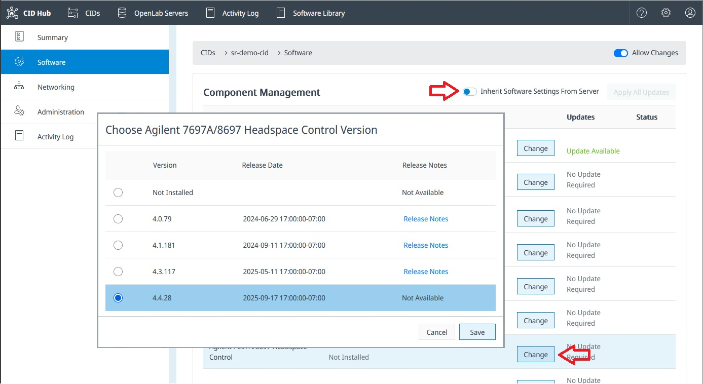

# Configure Software Exceptions on a CID

By default, all CIDs inherit their software configuration (drivers, add-ons, etc.) from the server's main software template (see "[define software template](define-software-template)").

However, you may need one or more specific CIDs to use unique setups. For example, a CID might need a MicroGC driver or another might need a Headspace driver. And you would want to do this without adding those drivers to all CIDs.

To do this, you must configure the specific CIDs to stop inheriting from the server. This allows you to manage their software components individually.

### How to Disable Inheritance
- Navigate to the "Software" settings for the CIDs you want to change.
- Locate the toggle switch labeled "Inherit Software Settings From Server".
- Switch this toggle to the Off position.

Once inheritance is disabled, you can manage that CID's drivers and add-ons independently.

:::warning[caution]
A CID that is not inheriting will **no longer receive software updates** from the server template.
Any changes made to the server's software template **will be ignored** by this CID. You are now responsible for managing this CID's software individually. 
:::
