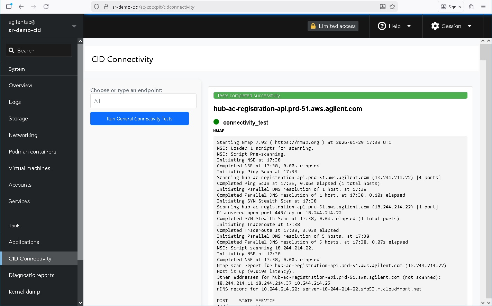

# Connectivity Tester Overview

The Connectivity Tester is a diagnostic application within the Linux Cockpit interface of the Connected Instrument Device (CID). It enables administrators to troubleshoot communication issues by testing the device's ability to reach essential external services required for activation, monitoring, and software management.

## Key Advantages

**Universal Availability**

The Connectivity Tester does not require the CID to be registered or activated in the CID Hub to function. It is accessible immediately after the physical CID is powered on and acquires a reachable IP address on the corporate network. This makes it the primary tool for troubleshooting a new CID experiencing initial connection failures.

## Accessing the App

The method for accessing the Cockpit interface depends on your device status:

| Device Status | Access Method |
|---|---|
| **Activated CIDs** | Navigate to the Administration tab for your device in the CID Hub and click **Launch Cockpit** |
| **Unactivated CIDs** | Enter the device's local IP address directly in a web browser: `https://<CID-IP>/ac-cockpit/` |

## Authentication

Login credentials vary based on the device's connection status to the Hub:

### Activated Devices
- **Username:** `agilentac`
- **Password:** Retrieve the complex, 10-character password from the Administration tab in the CID Hub
- **Note:** This password is automatically recycled every 24 hours for security purposes

### Unactivated Devices
- **Username:** `agilentac`
- **Password:** Use the factory default password provided by Agilent support/services personnel.

## Diagnostic Features

The Connectivity Tester runs NMAP command to identify network blockages:

`
nmap -v --script=resolveall --traceroute -p 443 <URL>
` 

### Predefined Endpoints
Tests connectivity to all required services including:
- CID Hub registration API
- AWS IoT services
- S3 software buckets
- Microsoft Windows Update domains

### Custom URL Testing
- Enter a custom URL (e.g., `www.agilent.com`) to test general internet reachability

