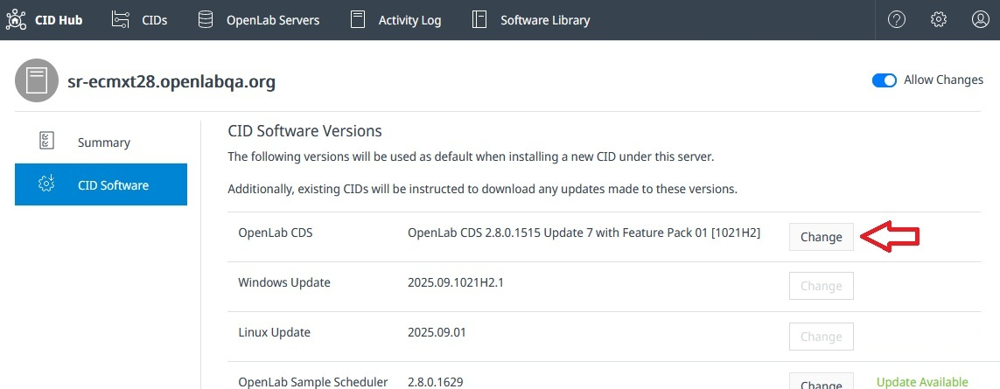

# Update/Upgrade CDS

New CDS updates and upgrades are published to the CID Hub when they are released.

To view the available versions, go to the **Software Library** tab, then open the **OpenLab CDS** section.

You can choose which version of CDS you want to install on your CIDs from the **Software** tab on either your [**server**](/howto/define-software-template) or an individual [**CID**](/howto/configure-software-exceptions).

:::tip[Important]
-  When you change the CDS version, all driver and add-on selections are reset to their defaults for that version. If your setup requires specific driver or add-on versions, make sure to reselect them after changing the CDS version.
-  If selecting "OpenLab CDS 2.8 Update 9" or above make sure that your CIDs have Windows 11 license stickers on them. 
:::

On the Software page, the **Update Available** label appears when an update is available for your CDS version (e.g., `CDS 2.8.1` to `CDS 2.8.2`). Upgrades (e.g. `CDS 2.7` to `CDS 2.8`) do not show the label.

Select **Change** to view available versions, read release notes, and select them to be installed.

After making your selections, you can [**apply the changes**](apply-updates) to your CID(s).
