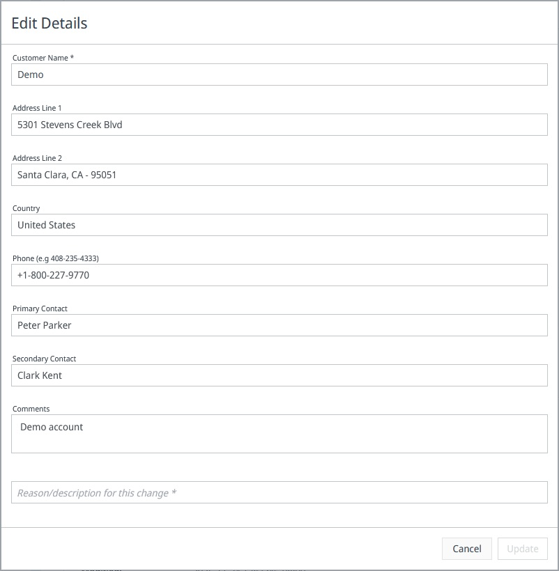

# Manage Account Settings

## Overview

The Account Settings page allows administrators to view and manage their organization's account details within the CID Hub, such as the company name, address, and contact information.

---

## Accessing Account Settings

To manage your account settings:
1.  Click the **Settings** (gear) icon in the top-right corner of the navigation bar.
2.  From the dropdown menu, select **Account**.

This will take you to the **Account Summary** page.

---

## Account Summary

The Account Summary page displays your organization's key information, including:
-   Company Name and Address
-   Primary and Secondary Contacts
-   The number of Servers, CIDs, and Users associated with the account.

---

## Editing Account Details

1.  To update your account information, click the **Edit** (pencil) icon on the Summary page.

    

2.  The **Edit Details** dialog will open. You can update your organization's address, phone number, and contacts here.

    

3.  You must provide a justification for the changes in the **Reason/description for this change** field.
4.  Click **Update** to save your changes, or **Cancel** to discard them.

:::info ETT Fields
Fields labeled with (ETT) and Purchase/SMA dates are for Agilent's internal use and cannot be edited by customers.
:::

