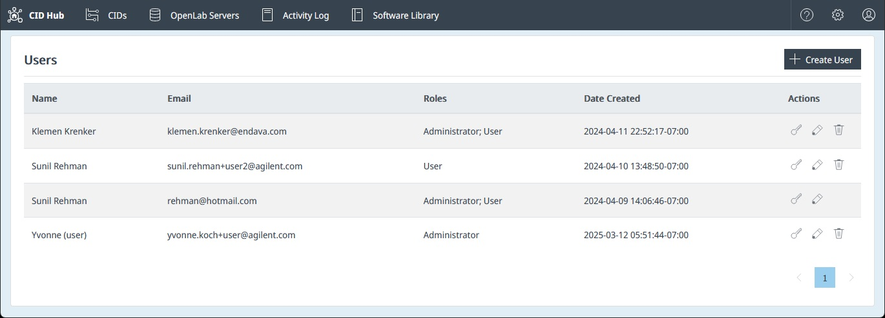

# Manage Users and Roles

## Overview

CID Hub allows administrators to manage user access by inviting new users and assigning them specific roles. This ensures that users only have permissions appropriate for their responsibilities. 

While customer administrators can invite additional users to the Hub, the initial organization account and primary customer administrators are established by Agilent administrators. If you are the first person in your organization to access the Hub, ensure your IT filters allow emails from **CID Hub** \<no-reply@hub.cid.agilent.com\>.

---

## Accessing the Users Page

To manage users for your account:
1.  Click the **Settings** (gear) icon in the top-right corner of the navigation bar.
2.  From the dropdown menu, select **Users**.

This will take you to the **Users** list page, where you can view, add, edit, or remove users.

---

## User Roles and Privileges

CID Hub defines two user roles with distinct sets of permissions: **Administrator** and **User**.

### Administrator
Administrators have full control over the CID Hub environment. Their privileges include:
- Managing OpenLab Server registrations (`Add`, `Edit`, `Delete`).
- Defining and updating software templates for servers and CIDs.
- Adding, editing, and deleting CIDs.
- Configuring CID network settings.
- Performing all administrative actions on CIDs (e.g., `Reset OpenLab CDS`, `Reboot System`).
- Managing other users (inviting new users, changing roles, deleting users).
- Editing company account details.

### User
The User role is designed for lab personnel who need to operate the CIDs but should not have administrative control. Their privileges are limited to:
- Viewing the list of CIDs and their status.
- Viewing server configurations without being able to change them.
- Launching the CDS Desktop for a CID.
- Granting or revoking remote access for support.
- Restarting or shutting down a CID.

Users **cannot** make software changes, modify network configurations, add/remove CIDs or servers, or manage other users.

---

## Managing Users

### Add a New User
1.  On the Users page, click the **+ Create User** button.
2.  In the "Create User" dialog, enter the user's **Full Name** and **Email** address.
3.  Select one or more roles (**Administrator** and/or **User**) to assign to them.
4.  Click **Save**.

The new user will receive an email invitation to join the CID Hub.

### Edit a User
To change a user's name or roles:
1.  Find the user in the list.
2.  Click the **Edit** (pencil) icon in the 'Actions' column.
3.  Make the necessary changes in the dialog and click **Save**.

### Reset a User's Password
If a user forgets their password:
1.  Find the user in the list.
2.  Click the **Reset Password** (key) icon in the 'Actions' column.
3.  This will trigger a password reset process for the user, typically by sending them an email with instructions.

### Delete a User
To remove a user's access to the CID Hub:
1.  Find the user in the list.
2.  Click the **Delete** (trash can) icon in the 'Actions' column.
3.  Confirm the deletion when prompted. The user will be immediately removed and will no longer be able to log in.

