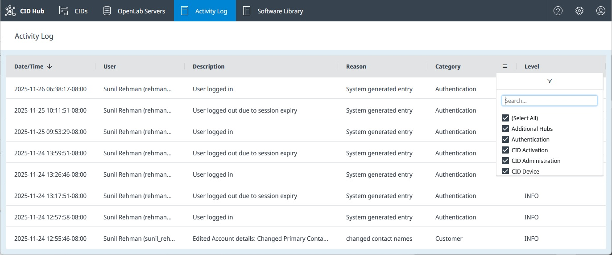
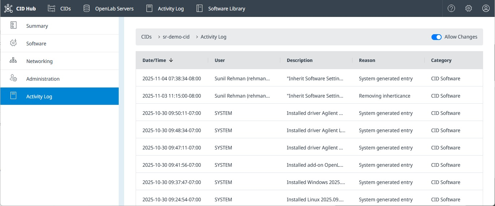
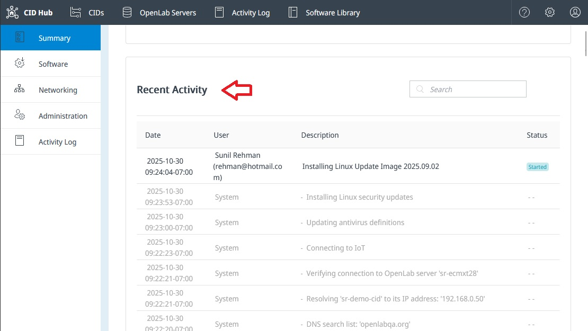

# View activity logs

The **Activity Log** is the historical record of actions taken in CID Hub. It captures who did what and when, across user management, CID configuration, software changes, server changes, remote access, and authentication events. Use it to trace a configuration change, gather evidence for a compliance review, or get context for a support investigation.

CID Hub keeps a single account-wide log. You can read it in two ways: a *Global Activity Log* that shows every event in your account, or a *CID-specific Activity Log* that filters the same data down to one device.

## Prerequisites

- You must have a CID Hub account and be signed in.

## Open the Global Activity Log

The Global Activity Log shows every event from your account in a single list.

1. In CID Hub, click **Activity Log** in the top navigation bar.

   

The log opens sorted by **Date/Time**, newest first. CID Hub loads 100 entries at a time and fetches more as you scroll.

## Open the Activity Log for one CID

When you only need history for a single CID, open its filtered view from the **CIDs** list.

1. In CID Hub, click **CIDs** in the top navigation bar.
2. Click the name of the CID you want to inspect.
3. Select the **Activity Log** tab in the left-hand navigation.

   

This view shows only the events that act on the CID you opened.

## Sort and filter the list

Both views use the same column controls.

- Click a column header to sort by that column.
- Click the chevron next to a column header to open that column's filter.

The available filters are:

- **Date/Time**. Filter by a start and end date. Dates use your local timezone.
- **User**. Case-insensitive text search; the column shows each user as "Full Name (USERID)". The literal value `SYSTEM` matches entries written by CID Hub itself rather than by a user.
- **Description**. Case-insensitive text search. The text you type must appear in the description exactly, including punctuation. For example, `created tom` does not match `Created new CID: tom-cid-1` because of the colon; `created` does.
- **Reason**. Case-insensitive text search over the reason a user typed when making a change. Entries written automatically by CID Hub show `System generated entry` in this column.
- **Category**. Select one or more categories to display.
  - `Additional Hubs`
  - `Authentication` (sign-in, sign-out, session expiry, role assignment)
  - `CID Activation`
  - `CID Administration`
  - `CID Device`
  - `CID Networking`
  - `CID Software`
  - `CID Summary`
  - `Customer` (account-level changes)
  - `OpenLab Server Software`
  - `OpenLab Server Summary`
  - `Software Library`
- **Level**. Filter by severity.
  - `INFO` for successful operations and user requests.
  - `WARNING` is reserved; no events currently use this level.
  - `ERROR` for failed downloads, installs, uninstalls, and commands.

## Activity Log compared to Recent Activity

CID Hub has two separate event feeds. They look similar but answer different questions.

- The **Activity Log**, described on this page, is for traceability. It records high-level user and system actions such as `Requested install driver Agilent Quadrupole LC/MS 3.2.725 for CID: sr-demo-cid` or `Installed driver Agilent Quadrupole LC/MS 3.2.725 for CID: sr-demo-cid`.
- The **Recent Activity** feed on a CID's **Summary** page is for troubleshooting. It shows low-level steps taken by the CID agent on the device itself, such as `Resolving 'hostname' to its IP address...`. See [Activate a CID](../onboarding/activate-a-cid) for an example of this feed in use during activation.

  

Activity Log entries persist after a CID is deleted, so the history for a removed CID stays readable.

## See also

- [View CIDs](view-cids): use the CIDs list to find the CID you want to inspect.
- [Configure software exceptions](../setup/configure-software-exceptions): a typical source of `CID Software` entries.
- [Traceability and compliance](../../security/traceability-and-compliance): what is captured in the Activity Log, retention, and tamper protection.

