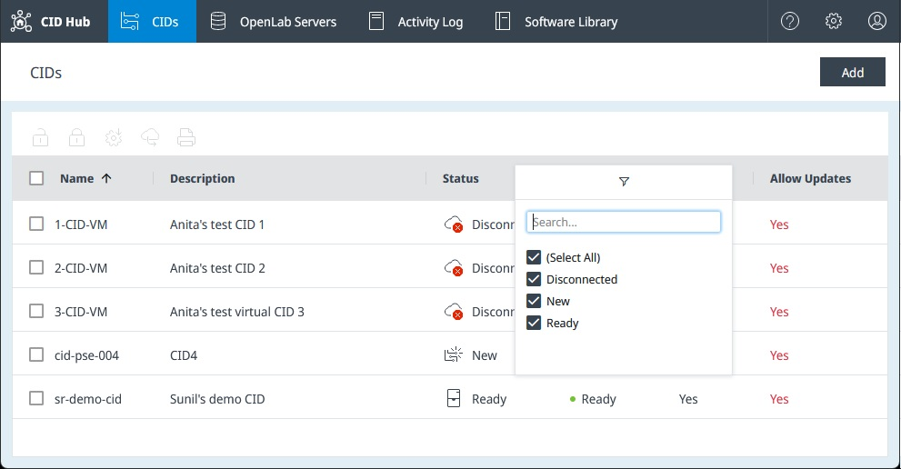
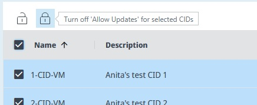
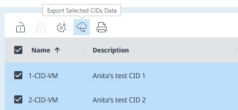
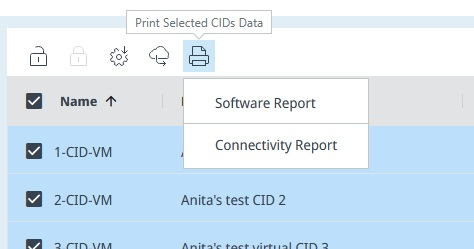

# View CIDs

Use the **CIDs** page to monitor CID readiness, identify devices that need attention, and launch list-level actions such as software updates, export, and printing. This page is for the lab administrator or IT operator who needs an operational view of the CIDs in CID Hub.

## Prerequisites

- *(Optional)* You need at least one CID added to your account to work with live data.

## Open the CIDs list

Open the list to see the CIDs in your account and their current operational state.

To open the CIDs list:

1. In CID Hub, click **CIDs** in the top navigation bar.

   The list opens at `/cids`. The columns show whether each CID is connected, whether software changes are pending, and whether the CID is following its server template.

- **Name:** The CID name shown in CID Hub. This is also the hostname of the physical CID, so CDS clients must be able to resolve it through DNS.
- **Description:** A user-provided description of the CID.
- **Status:** The current operating state of the CID.
  - **New:** The CID record exists, but the physical CID has not activated with it yet. Software updates cannot be applied in this state.
  - **Disconnected:** The CID is not connected to CID Hub. Software updates and most remote actions are unavailable while it is disconnected.
  - **CDS not running:** The CID is online, but the OpenLab Instrument Service in the Windows VM is not running. If this condition and **Server disconnected** occur at the same time, CID Hub shows **CDS not running**.
  - **Server disconnected:** The CID is online and the Windows VM is running, but the CID cannot reach its OpenLab Server.
  - **Ready:** The CID is online and available for maintenance. This is the recommended state for applying updates.
  - **In Use:** OpenLab CDS is active on the CID. Updates are possible, but Agilent recommends applying them only when the CID is not in use.
- **Updates:** Shows whether software changes are pending or in progress. CID Hub shows this column in priority order: **Updating**, **Downloading**, **Ready**, then blank.
  - Blank means no software changes are pending.
  - **Downloading** means one or more selected changes are still being downloaded.
  - **Ready** means all pending changes are downloaded and ready to install.
  - **Updating** means software is being installed or removed.
- **Inherit:** Shows whether the CID inherits software settings from the [server template](../setup/define-software-template) or uses its own [CID-level exceptions](../setup/configure-software-exceptions). A value of **No** is highlighted in red.
- **Allow Updates:** The list-view label for the CID's **Allow Changes** state (the two names refer to the same setting). Shows whether the CID currently permits changes. When this column shows that changes are not allowed, software changes and several administrative actions are blocked until a customer user turns them back on.
- **Server Name (FQDN):** The fully qualified domain name of the OpenLab Server the CID uses. In multi-server environments, use this column to filter the list to one server.
- **Date Created:** When the CID record was created.
- **Last Software Update:** When software was last successfully updated on the CID.

## Sort or filter the list

After you understand what each column shows, use sorting and filtering to narrow the list to the CIDs you need to review.

To sort or filter the list:

1. Click a column header to cycle through ascending, descending, and unsorted order.
2. Click the chevron next to a column header to open that column's filter options.

By default, CID Hub sorts the list by **Name** in ascending order.

## Use bulk actions

After you identify the CIDs you want to work with, you can run list-level actions from the toolbar above the table.

To use a bulk action:

1. Select one or more CIDs in the list.
2. Click the action you want to run above the table.

- **Turn on 'Allow Updates'** and **Turn off 'Allow Updates'** let you allow or disallow changes for several CIDs at once. (The toolbar labels say *Allow Updates*; this is the same **Allow Changes** setting that appears on each CID's detail page.)

  

  Customer administrators can use these buttons. Turning changes on requires a reason, which CID Hub records in the Activity Log for each affected CID. Turning changes off does not require a reason.

- **Apply Updates** starts software installation for the selected CIDs.

  

  Use this action when the selected CIDs are in a suitable state, ideally **Ready**, and their **Updates** column shows **Ready**.

- **Export CID Data** downloads information about the selected CIDs in JSON format.

  

  Use this export when you need CID summary, software, and networking information outside the portal.

- **Print Report** opens a printable report for the selected CIDs.

  

  - **Software Report:** Shows the CID overview and installed software versions.
  - **Connectivity Report:** Shows whether each CID is connected to CID Hub and whether its connected instruments pass the report's connectivity check.

## See also

- [Activate a CID](../onboarding/activate-a-cid): create a CID record and bring a physical CID into service.
- [Configure software exceptions](../setup/configure-software-exceptions): identify and manage CIDs that do not inherit the server template.
- [Apply updates](../updates/apply-updates): install downloaded software changes on one or more CIDs.
- [CID administration](../operations/cid-administration): reboot a CID, restart services, reset OpenLab CDS, and manage access.
- [View activity logs](./view-activity-logs): review the audit trail for bulk actions and other CID events.
