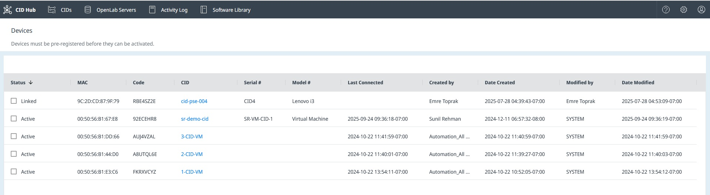

# View devices

The Devices page provides a comprehensive list of all physical CID devices registered to your account. <mark>Use this view for administrative and support purposes to track a device from its initial registration to its active state. It helps you confirm that a device connects to CID Hub and becomes active after it is registered.</mark>

## Prerequisites

- You must have an administrator role to view the **Devices** page.

## <mark>Open the Devices page</mark>

Open the page to see the physical devices registered to your account and their current states.

To open the Devices page:

1. Click the **Settings** (gear) icon in the top-right corner of the top navigation bar.
2. Select **Devices**.

   The Devices list opens.

## <mark>Columns on the Devices list</mark>

The columns show hardware details, connection status, and tracking information.

- **Status**. Indicates the current state of the device's registration and connection.
  - **Linked**. A record for the CID has been created in CID Hub using the unique PIN code from the device's QR code sticker, but the physical device has not yet connected.
  - **Active**. The physical CID has successfully booted, connected to CID Hub, and recognized its corresponding record.
- **MAC**. The MAC address for the CID's Corporate NIC.
- **Code**. The unique PIN code printed on the QR code sticker attached to the physical device. This code is used to link the hardware to its record in CID Hub.
- **CID**. The name assigned to the CID. Clicking the name navigates to the CID's summary page.
- **Serial #**. The serial number of the physical hardware.
- **Model #**. The model of the IoT hardware.
- **Last Connected**. The timestamp of the last communication from the device to CID Hub.
  - For a device that has not yet activated (such as a **New** or **Linked** device), this timestamp is updated regularly while the device is powered on and connected to the internet.
  - Once a device becomes **Active** by completing the activation process, this timestamp is no longer updated. Time tracking resumes only after a factory reset.
- **Created by / Date Created**. Shows which user created the device record and when.
- **Modified by / Date Modified**. Shows which user last modified the device record and when.

## <mark>Sort and filter</mark>

Sort and filter the list to narrow it to the devices you need to review.

To sort or filter the list:

1. Click a column header to cycle through ascending, descending, and unsorted order.
2. Click the chevron to the right of a column header to open that column's filter options.

The filter options work the same way as those on the [View CIDs](view-cids) page.

## <mark>See also</mark>

- [View CIDs](view-cids): monitor CID readiness and run list-level actions such as software updates and export.
- [Activate a CID](../onboarding/activate-a-cid): create a CID record and bring a physical CID into service.
- [CID administration](../operations/cid-administration): reboot a CID, restart services, reset OpenLab CDS, and manage access.
