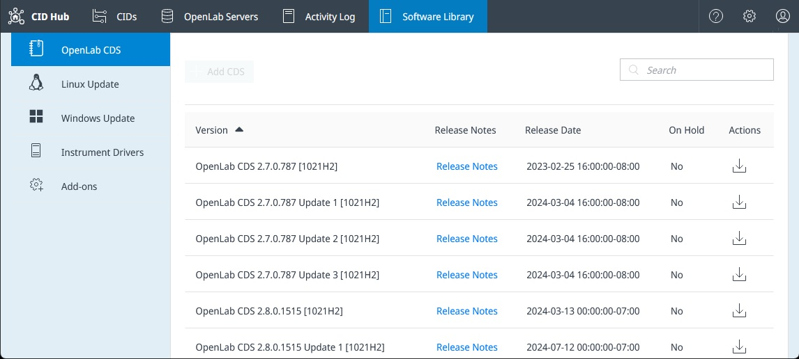
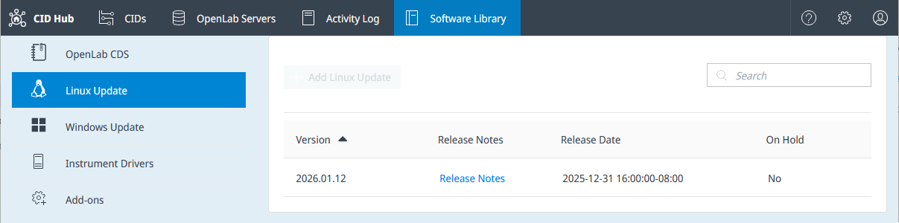
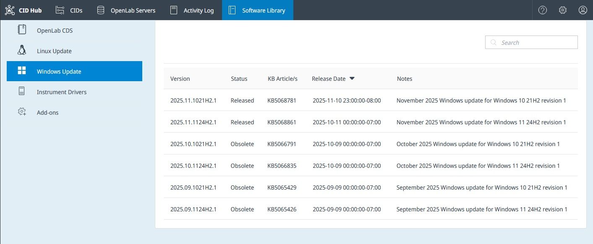
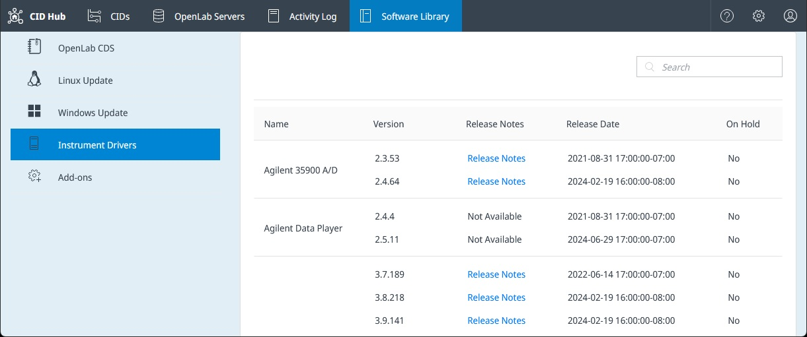
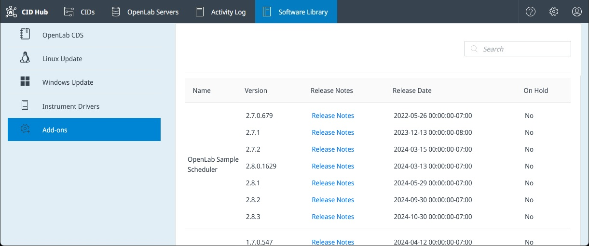

# View software library

The Software Library is the catalog of every software package available to CIDs in CID Hub: OpenLab CDS versions, Windows and Linux updates, instrument drivers, and add-ons. This page is for the lab administrator or IT operator who needs to look up which versions are available before assigning them. You can also use it to download a CDS KVM image for caching on a [registered server's network share](../setup/register-a-server).

The Software Library is read-only. You cannot install software or change CID software from this page. Use a [server's software template](../setup/define-software-template) for inheriting CIDs, or [configure software exceptions](../setup/configure-software-exceptions) for a single CID.

## Prerequisites

- You must have a CID Hub account and be signed in. Any signed-in user can view the **Software Library**.
- *(Optional)* You need write access to the CID Network Share configured on the OpenLab Server to download a CDS KVM image to it.

## Open the Software Library

Open the Software Library to look up the software versions available to your CIDs.

To open the Software Library:

1. In CID Hub, click **Software Library** in the top navigation bar.

   

Use the category menu to switch between categories. Use the search field to filter the entries in the current category.

The Software Library is organized into the following categories.

### OpenLab CDS

Lists every OpenLab CDS version available to install on a CID, including base versions, updates, and feature packs.

- **Version**. The full CDS version identifier. The bracketed code at the end identifies the Windows base OS that the KVM image ships with: `[1021H2]` is Windows 10 IoT Enterprise LTSC 21H2; `[1124H2]` is Windows 11 IoT Enterprise LTSC 24H2.
- **Release Notes**. Opens the release notes for that version. If release notes are not published for a version, **Not Available** is shown instead.
- **Release Date**. The date Agilent made the version available in CID Hub.
- **Actions**. Click the download icon to reveal the KVM image file (`.qcow2`) and its checksum file (`.sha256`). See [Download a CDS KVM image to a network share](#download-a-cds-kvm-image-to-a-network-share).

### Linux Update

Lists the cumulative Linux updates available for the Oracle Linux host that runs on every CID.

- **Version**. Release-date based identifier in `YYYY.MM.DD` format (for example, `2026.01.07`).
- **Release Notes**. Opens the release notes, which list package updates, security updates, and any Linux Agent changes included in the release.
- **Release Date**. The date the update was published to CID Hub.

### Windows Update

Lists the Windows security update available for the Windows VM that runs OpenLab CDS.

- **Version**. Version identifier in `YYYY.MM.<base_os>.N` format, for example `2026.05.1124H2.1`. The `<base_os>` segment identifies the Windows version (`1021H2` is Windows 10 IoT Enterprise LTSC 21H2; `1124H2` is Windows 11 IoT Enterprise LTSC 24H2).
- **Status**. The bundle's lifecycle state:
  - **Released**. The current production bundle for its Windows version. Offered as an installable option on CID and server software pages.
  - **Beta**. A pre-release bundle made available for evaluation. Offered as an installable option on CID and server software pages and visually highlighted to distinguish it from a Released bundle.
  - **Obsolete**. A previous bundle that has been superseded. Listed here for reference but not offered as an installable option.
- **KB Article**. One or more Microsoft Knowledge Base article numbers (comma-separated) describing the Microsoft updates included in the Agilent-tested bundle.
- **Release Date**. The date Agilent published the bundle to CID Hub.
- **Release Notes**. Opens the release notes for the bundle.

:::note
Only the latest **Released** Windows update for each Windows version is offered as an installable option on the CID software change dialog. When Agilent publishes a new monthly bundle, the previous month's bundle is marked **Obsolete**. Obsolete bundles still appear in this Software Library list (with **Status** set to **Obsolete**) but are no longer offered for selection. A CID that already has an Obsolete bundle installed continues to show that version as its installed Windows update until you upgrade it.
:::

### Instrument Drivers

Lists every Agilent instrument driver that has been tested and made available for CIDs.

- **Driver**. The driver name as it appears in Windows Add/Remove programs (for example, `Agilent GC`, `Agilent Quadrupole LC/MS`).
- **Version**. The driver version, which exactly matches the version Windows reports for the installed driver.
- **Release Notes**. Opens the driver's release notes. Drivers without published release notes show **Not Available**.
- **Release Date**. The date the driver version was published to CID Hub.

Driver compatibility is governed by OpenLab CDS version. When you select software for a server or a CID, only the drivers compatible with the selected CDS version are offered.

### Add-ons

Lists the optional add-on software currently available for CIDs:

- **OpenLab Sample Scheduler**. An OpenLab CDS add-on that gives lab staff a simple interface for managing their workload and sending samples to any instrument for analysis. It integrates with a Laboratory Information Management System (LIMS) to automate sample assignment and result entry.
- **GPC**. The Agilent GPC/SEC Software for OpenLab CDS add-on. It adds Gel Permeation Chromatography and Size Exclusion Chromatography calibrations and molecular-weight calculations to data acquired through OpenLab CDS.

Each add-on entry uses the same columns as **Instrument Drivers**. Like drivers, add-ons are filtered by CDS version compatibility when you assign software to a server or CID.

## Download a CDS KVM image to a network share

A CDS KVM image is about 25 GB. Manually downloading the image and placing it on the [CID Network Share](../setup/register-a-server) configured on an OpenLab Server lets every CID registered to that server pick up the image from the share instead of downloading 25 GB each from CID Hub.

To download a CDS KVM image and place it in the share:

1. Open the **OpenLab CDS** category in the Software Library.

2. In the **Actions** column for the version you want, click the download icon.

3. Download both files that appear:
   - the KVM image (`.qcow2`)
   - the checksum file (`.sha256`)

4. On the CID Network Share configured for the server, create a `downloads` subfolder if one does not exist.

5. Copy both files into the `downloads` subfolder.

The next time a CID registered to that server needs this version, it picks the files up from the share and skips the download from CID Hub. This applies to every CID registered to the server, whether it inherits the server's software template or runs its own software exceptions.

## See also

- [Define a software template](../setup/define-software-template): assign versions from the library to every CID on an OpenLab Server.
- [Configure software exceptions](../setup/configure-software-exceptions): assign versions from the library to a single CID that does not inherit.
- [Register an OpenLab Server](../setup/register-a-server): configure the CID Network Share that holds cached KVM images.
- [Apply updates](../updates/apply-updates): install software that a CID has downloaded.
