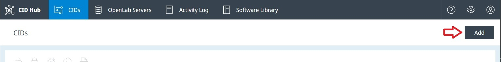
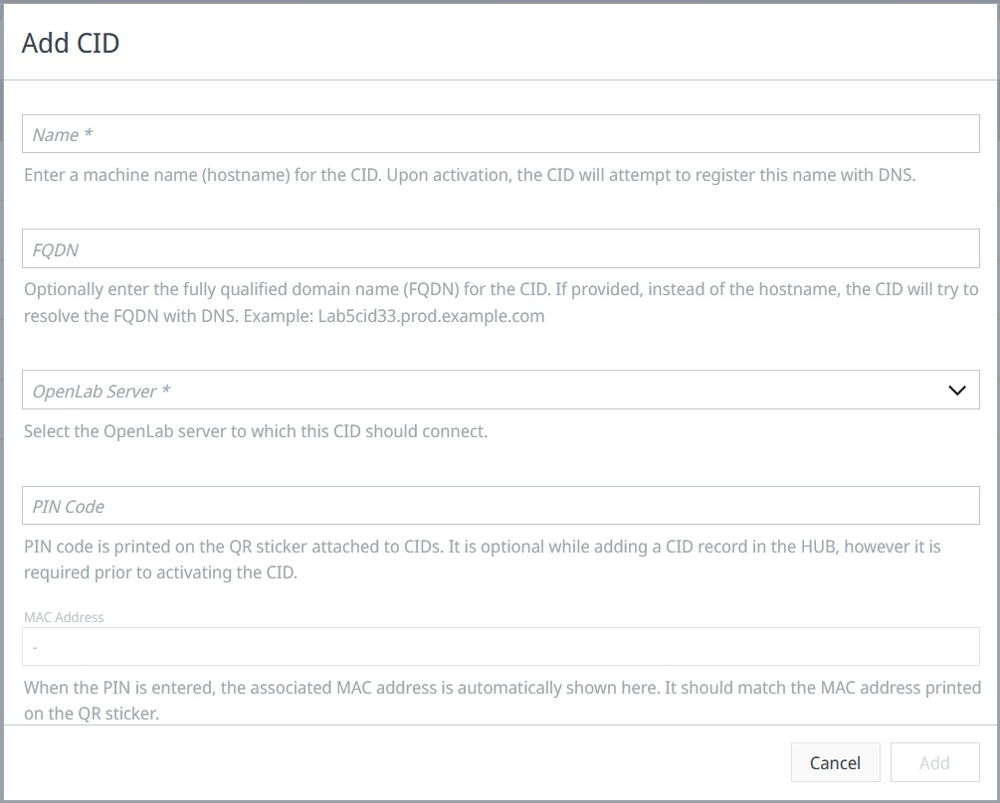
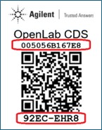

# Activate a CID

Each physical CID must have a matching record in CID Hub before it can be used. This page is for the lab administrator or IT operator who creates that record and monitors the device through activation. Activation is largely automatic: once you create the record with a valid PIN code, the CID detects it on the next contact attempt and begins installing OpenLab CDS.

## Prerequisites

- You must have an administrator role to activate a CID.
- You need a [registered OpenLab Server](../setup/register-a-server) for the CID to connect to.
- You need a [defined software template](../setup/define-software-template) on that server.
- You need the 8-character PIN code printed on the physical CID's QR sticker.
- The physical CID must be powered on and connected to your network through its Corporate NIC.

## Add a CID record

Creating a CID record in CID Hub links the physical device to the configuration it adopts during activation. To add a CID record:

1. In CID Hub, navigate to **CIDs** and click **Add**.

   

2. In the **Add CID** dialog, enter the fields described below.

   

3. Click **Add**.

   The record is created with status **New**. The next time the CID contacts CID Hub (every 5 minutes for an unactivated device), it finds the record by its PIN code and begins activation.

### Field descriptions

- **Name:** the machine name (hostname) for the CID. Use at most 15 lowercase alphanumeric characters for compatibility with all DNS servers. A naming pattern that distinguishes CIDs from AICs is recommended, for example `cid-1290lc-53`.
- **FQDN** *(optional):* set only if short-hostname resolution fails in your network. When set, the CID resolves this fully qualified domain name through DNS instead of the short hostname.
- **OpenLab Server:** the server this CID registers with. The server's software template provides the default CDS version, drivers, and OS update levels for the CID.
- **PIN Code:** the 8-character code printed on the QR sticker attached to the physical CID. The PIN links this record to the hardware. PIN codes use the characters A–Z (excluding I and O) and digits 2–9 to avoid transcription errors.

:::note
You can also scan the QR sticker on the device. The activation URL embedded in the QR code opens the **Add CID** dialog with the **PIN Code** field prepopulated.
:::

## What happens during activation

After the CID finds its record in CID Hub, it runs through the following steps. Monitor progress in the **Recent activity** section of the CID's **Summary** page.

1. Verifies network connection on the Corporate NIC.
2. Connects to CID Hub.
3. Retrieves the OpenLab Server information from the CID record.
4. Changes its hostname to **Name** if it differs from the current hostname.
5. Confirms DNS resolves the hostname to the IP address assigned by DHCP.
6. Confirms connectivity to AWS IoT Core.
7. Confirms connectivity to the OpenLab Server.
8. Installs the latest Linux update and antivirus definitions.
9. Downloads, installs, and starts the OpenLab CDS Windows VM.
10. Installs ECM 3.x APIs in the Windows VM if the OpenLab Server uses Enterprise Content Manager (ECM) as its backend.
11. Configures and registers the Windows VM as an Analytical Instrument Controller (AIC) with the OpenLab Server.
12. Installs Windows updates in the Windows VM.
13. Installs the selected drivers and add-ons.
14. Schedules antivirus scans.
15. Rotates the default passwords for the CID Linux subsystem and the Windows VM.

Activation typically takes 1–2 hours, depending on network speed and the size of the CDS download. The CID's status in CID Hub transitions from **New** to **Ready** when activation completes.

If the **Recent activity** panel shows an error, the CID beeps repeatedly, or the status remains **New** after 2 hours, see [Troubleshoot activation](../operations/troubleshoot-activation).

:::note[Image placeholder — `cid-summary-ready.jpg`]
CID Summary page after a successful activation, with the **Ready** status badge highlighted.
:::

## See also

- [Register an OpenLab Server](../setup/register-a-server): the prerequisite that supplies the activation target and default software template.
- [Define a software template](../setup/define-software-template): the software defaults the CID inherits during activation.
- [Configure network cards](./configure-network-cards): set up the Corporate NIC and Instrument NIC after activation.
- [View CIDs](../monitoring/view-cids): monitor CID status after activation completes.
- [View activity logs](../monitoring/view-activity-logs): review activation events for traceability and troubleshooting.
- [CID administration](../operations/cid-administration): reboot, factory reset, and other post-activation operations.
- [Troubleshoot activation](../operations/troubleshoot-activation): beep codes, Recent activity error messages, and recovery steps for stalled activations.
