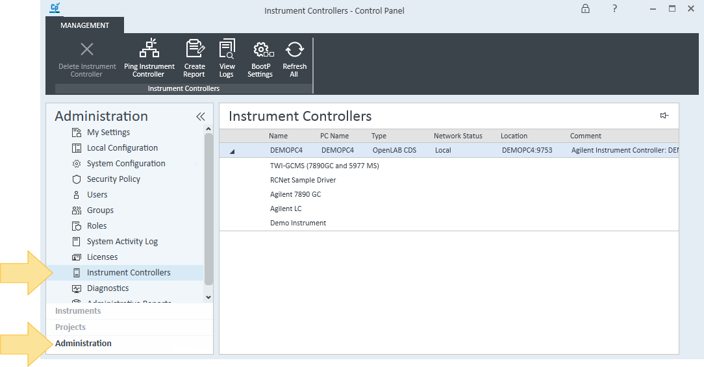
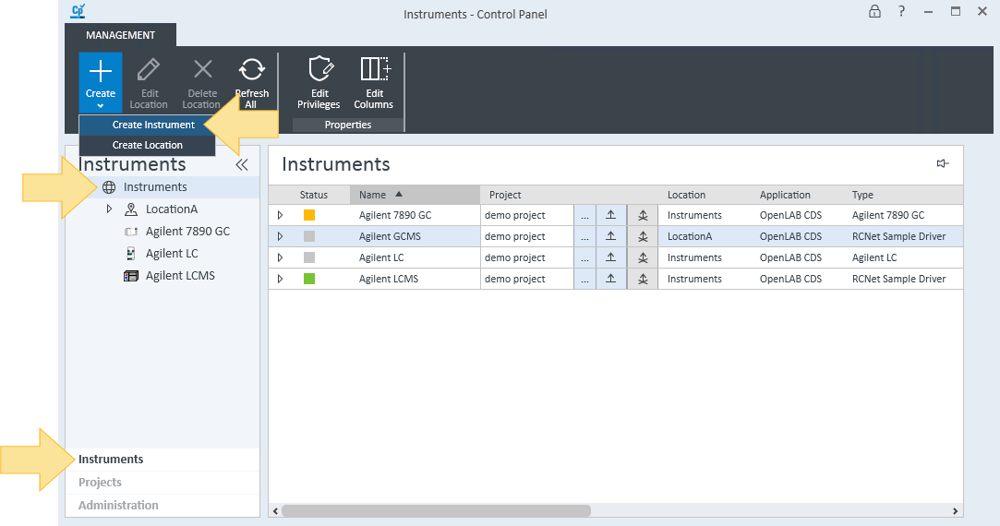

# <mark>Configure an instrument</mark>

After a CID has activated and registered with your OpenLab Server, it appears in OpenLab Control Panel as an Analytical Instrument Controller (AIC). This page is for the lab technician who is attaching a physical instrument to the CID and configuring it through OpenLab Control Panel. The procedure is identical to configuring an instrument on a conventional AIC; the work happens in OpenLab Control Panel, not in CID Hub.

## Prerequisites

- The CID must be activated and registered with the OpenLab Server. (The CID's name should appear in OpenLab Control Panel.)
- The physical instrument must be connected to the CID's Instrument NIC and powered on.
- You must have OpenLab Control Panel credentials with permission to add and configure instruments.

:::important
Each CID supports one instrument configuration. Do not attempt to add a second instrument to the same CID — the configuration is not supported and will fail.
:::

## Add and configure the instrument

To attach an instrument to a CID:

1. Open OpenLab Control Panel and sign in.

2. Confirm the CID is listed as an available instrument controller.

3. Add the instrument and assign the CID as its instrument controller. Follow the [Add an Instrument](https://openlab.help.agilent.com/en/index.htm#t=mergedProjects/ControlPanel/AddInstrument.htm) guide in OpenLab Help & Learning.

4. Configure the instrument's modules and settings. Follow the [Configure an Instrument](https://openlab.help.agilent.com/en/index.htm#t=mergedProjects/ControlPanel/Configure_instrument.htm) guide.

## How instrument status affects the CID

The CID's status in CID Hub reflects the state of the instrument you just configured:

- **In use:** at least one instrument session is open on the CID. Software updates and maintenance actions on the CID are blocked or discouraged in this state.
- **Ready:** all instrument sessions on the CID are closed. The CID is safe to update or service.

When you finish a session, [close the connection](https://openlab.help.agilent.com/en/index.htm#t=mergedProjects/ControlPanel/Close_connection.htm) in OpenLab Control Panel so your administrator can apply updates during scheduled maintenance windows.

## See also

- [Activate a CID](./activate-a-cid): the activation flow that must complete before an instrument can be attached.
- [Configure network cards](./configure-network-cards): set the Instrument NIC into the same subnet as the connected instrument.
- [Add an Instrument](https://openlab.help.agilent.com/en/index.htm#t=mergedProjects/ControlPanel/AddInstrument.htm): full OpenLab Control Panel procedure for adding an instrument.
- [Configure an Instrument](https://openlab.help.agilent.com/en/index.htm#t=mergedProjects/ControlPanel/Configure_instrument.htm): full OpenLab Control Panel procedure for configuring modules and settings.
- [Close a connection](https://openlab.help.agilent.com/en/index.htm#t=mergedProjects/ControlPanel/Close_connection.htm): how to release a CID for maintenance after a session.
