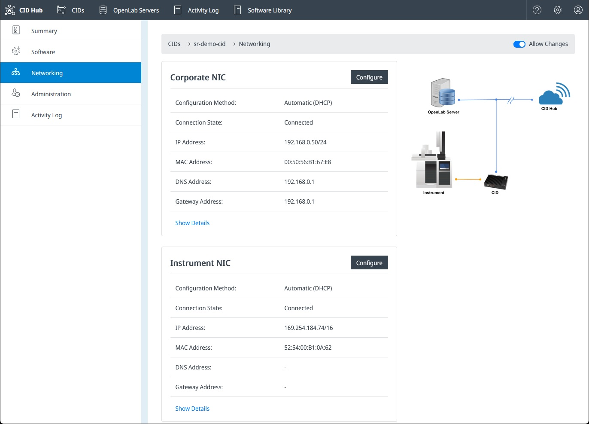
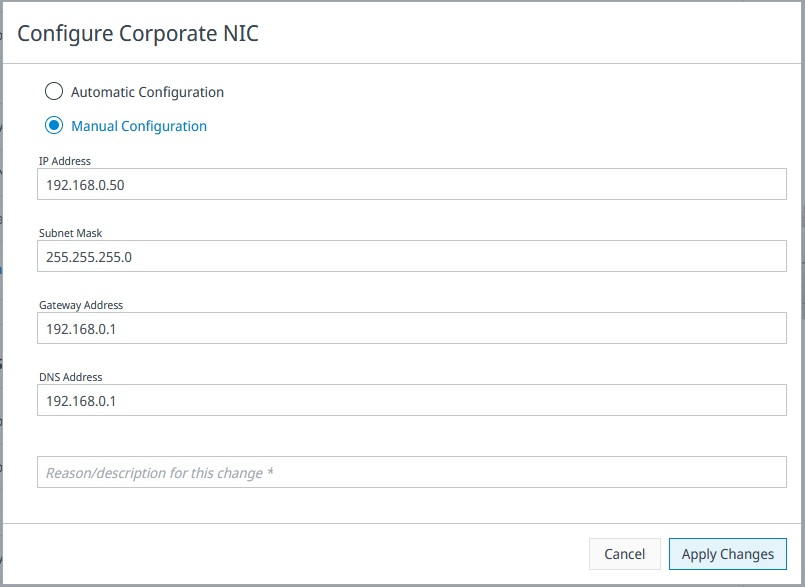
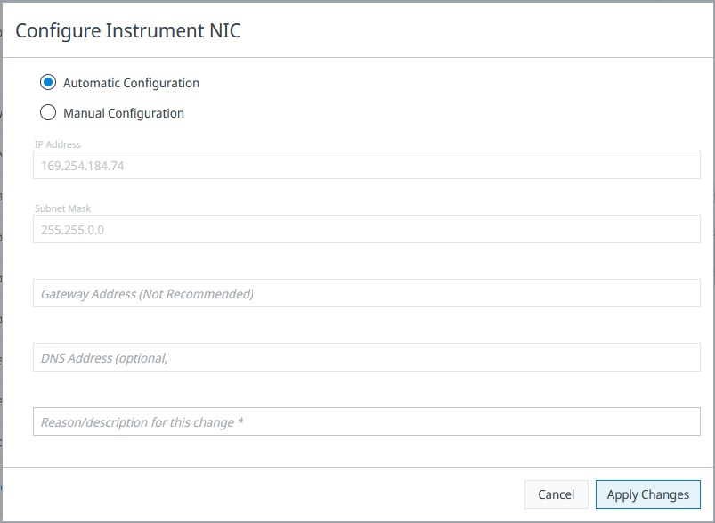

# Configure network cards

Each CID has two physical Network Interface Cards (NICs): a **Corporate NIC** for traffic to your lab network, CID Hub, and the OpenLab Server, and an **Instrument NIC** for the isolated instrument network.

This page is for the lab administrator or IT operator who reconfigures a NIC from CID Hub. The Corporate NIC normally runs on DHCP; the Instrument NIC is commonly set to a static IP so that the CID and the directly-connected instruments share a subnet.

## Prerequisites

- The CID is activated and connected to CID Hub. The **Configure** buttons are disabled until the CID reports as connected.
- The CID is unlocked. If **Allow Changes** is disabled on the CID, unlock it first.
- For manual configuration of either NIC: the IP address and subnet mask assigned by your network administrator. For the Corporate NIC, also collect the gateway address and one or more DNS server addresses.

## Open the Networking page

To view and change a CID's NIC configuration:

1. In CID Hub, open the CID's detail page and select the **Networking** tab.

   

   The page lists each NIC's configuration method (automatic or manual), connection state, IP address, MAC address, gateway, and DNS settings.

2. Click **Show Details** on a NIC to expand the underlying Linux interface information (connection name, UUID, device state, domain name).

3. Click **Configure** on a NIC to open its configuration dialog.

## Configure the Corporate NIC

The Corporate NIC is the only network path between the CID and CID Hub. An incorrect change here can disconnect the CID from the hub.

:::note
The CID requires DHCP on the Corporate NIC to activate. You can switch to a manual configuration only after the CID has activated and is connected to CID Hub. Make sure DHCP is available on the corporate network during the initial activation, even if you intend to assign a static address afterward.
:::

:::caution
Setting the wrong IP address, gateway, or DNS on the Corporate NIC can make the CID unreachable from CID Hub. CID Hub validates the new configuration after applying it and reverts automatically if it cannot reach the registration API after 5 retries, but the safety net cannot detect every misconfiguration. Coordinate Corporate NIC changes with your IT administrator.
:::

To configure the Corporate NIC:

1. On the **Networking** tab, click **Configure** under **Corporate NIC**.

   

2. Choose a configuration method:
   - **Automatic (DHCP):** the CID obtains its IP address, subnet mask, gateway, and DNS settings from your corporate DHCP server. This is the default and is recommended for most environments.
   - **Manual:** the CID uses the static values you supply. Use only when required by your IT policies.

3. For **Manual**, enter the network values:
   - **IP Address:** the static IPv4 address, for example `192.168.0.75`.
   - **Subnet Mask:** the dotted-quad subnet mask, for example `255.255.255.0`.
   - **Gateway Address:** the default gateway on the corporate network.
   - **DNS Address:** one or more DNS server addresses that can resolve the CID's own hostname and the OpenLab Server FQDN.

4. Enter a **Reason / description for this change**.

   This is recorded in the Activity Log for audit purposes.

5. Click **Apply Changes**.

   The CID applies the new configuration, then verifies it can still reach CID Hub. If the verification fails after 5 retries, the previous configuration is restored automatically and the failure is recorded in the Activity Log.

## Configure the Instrument NIC

The Instrument NIC connects the CID to your instruments. Most lab setups connect instruments directly to this NIC and assign the CID and the instruments static IP addresses in the same subnet so they can communicate. Changes to this NIC do not affect the CID's connection to CID Hub.

To configure the Instrument NIC:

1. On the **Networking** tab, click **Configure** under **Instrument NIC**.

   

2. Choose a configuration method:
   - **Manual:** the CID uses the static values you supply. Recommended for most instrument connections so that the CID and the instruments share a known subnet.
   - **Automatic:** the CID acquires an address from a DHCP server on the instrument network, or uses an Auto-IP address in the `169.254.x.x` range when no DHCP server is present. Use only when your instrument network already provides DHCP.

3. For **Manual**, enter the network values:
   - **IP Address:** the static IPv4 address, in the same subnet as the connected instruments.
   - **Subnet Mask:** the dotted-quad subnet mask, for example `255.255.255.0`.
   - **Gateway Address** *(not recommended):* leave blank. The instrument network does not route to the corporate network or the internet.
   - **DNS Address** *(optional):* leave blank unless your instrument vendor specifies a DNS server.

4. Enter a **Reason / description for this change**.

5. Click **Apply Changes**.

## Verify the configuration

After **Apply Changes** completes, the **Networking** tab refreshes with the new values. If the change failed and was reverted, the previous values are shown and the Activity Log records the failure with the reason you entered.

To confirm the CID is reachable on the new configuration, return to the CID's **Summary** page. The status should remain **Ready**.

## See also

- [Networking requirements](../../reference/system-requirements#networking-requirements): supported network speeds, DNS, and firewall port requirements.
- [Supported topologies](../../reference/system-requirements#supported-topologies): how to wire the CID into your lab and instrument networks.
- [Activate a CID](./activate-a-cid): the activation flow that uses the Corporate NIC to contact CID Hub.
- [View CIDs](../monitoring/view-cids): monitor CID connectivity status after a network change.
- [View activity logs](../monitoring/view-activity-logs): review the audit trail of NIC configuration changes.
