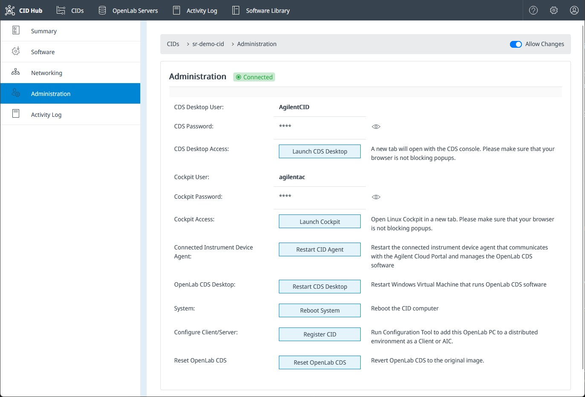

# Administer a CID

The Administration tab on a CID is where you retrieve the credentials needed to open the CDS Desktop or Linux Cockpit, restart the agent or the embedded CDS VM, and run the heavier recovery actions when something is wrong. This page is for the lab administrator or IT operator responsible for keeping a CID healthy.

The CID itself is a Linux host that runs an embedded Windows virtual machine. OpenLab CDS lives inside that VM; the CID agent, networking, and recovery tooling live on the Linux host. Most administrative actions target one or the other, so it helps to keep that split in mind when choosing an action below.

:::caution
Everything on this tab is for maintenance and troubleshooting. Do not use the CDS Desktop or Linux Cockpit access to install software, change system settings, or otherwise modify the Windows VM or the Linux host. Manual changes can put the CID into an unsupportable state, and any change made this way is wiped by a Reset OpenLab CDS, a CDS upgrade, or a factory reset. Use the Linux Cockpit only when explicitly directed by CID Hub Support.
:::

## Prerequisites

- You must have an administrator role on the account that owns the CID.
- The CID must be **Connected**. Restart and recovery buttons are disabled while the CID is **Disconnected** or **Not Installed**.
- **Allow Changes** must be on for the CID. While Allow Changes is off, every action on this tab is read-only.

## Open the Administration tab

To open the Administration tab:

1. From the main header, click **CIDs** and select the CID you want to manage.
2. In the sidebar, click **Administration**.

The credential blocks at the top are populated only while the CID is online. The restart, reboot, and recovery buttons enable or disable based on the prerequisites above.

## Retrieve device credentials

Two credentials are surfaced on this tab. They grant access to the CID itself, not to CID Hub.

- **CDS Desktop user**. Use this to sign in to the Windows VM console that hosts OpenLab CDS. Required when you launch the CDS Desktop from CID Hub.
- **Cockpit user**. Use this to sign in to the Linux Cockpit web console on the CID host.

Both passwords rotate automatically every 24 hours. The CDS Desktop password is also regenerated when the Windows VM is rebuilt by **Reset OpenLab CDS**, and both passwords reset during a factory reset. Copy the current password from this tab each time you need it; do not store it locally.

## Restart a service or the host

These actions clear stuck states without changing the installed software. Click the button on the Administration tab; if any instrument on the CID is active, CID Hub asks you to confirm before sending the restart.

All three commands are sent to the CID agent for execution. They only help when the agent itself is still running and reachable. If the CID shows as **Disconnected** in CID Hub or the agent is unresponsive to any of these actions, power-cycle the CID at the chassis.

| Action                  | Target             | When to use it                                                                                                                                     |
| ----------------------- | ------------------ | -------------------------------------------------------------------------------------------------------------------------------------------------- |
| **Restart CID Agent**   | CID software agent | The CID is **Connected** but is not picking up changes you made in CID Hub.                                                                        |
| **Restart CDS Desktop** | Windows VM         | OpenLab CDS is frozen or unresponsive but the rest of the CID still responds. Restarts only the embedded VM; the Linux host is unaffected.         |
| **Reboot System**       | Linux host         | The device is sluggish or unresponsive, or you need a clean boot of the whole CID. Restarts the Linux host, which in turn restarts the Windows VM. |

:::note
These buttons are temporarily disabled while the CID is busy with another administrative operation, or while a remote access session (CDS Desktop or Linux Cockpit) is open.
:::

## Reset OpenLab CDS

**Reset OpenLab CDS** drops the current Windows VM and rebuilds it for the CID's currently selected CDS version. Use it when the VM is in a state that a simple restart cannot recover, or when you want to clear local changes made inside the VM. If a remote access session (CDS Desktop or Linux Cockpit) is open on the CID, the button is disabled until the session ends.

To run the reset:

1. On the Administration tab, click **Reset OpenLab CDS**.
2. Confirm the action in the dialog.

:::important
The new VM starts fresh for the current CDS version. Use [Apply updates](../updates/apply-updates) afterward to reinstall your drivers, add-ons, and OS updates.
:::

## Factory reset the CID

A factory reset clears the CID's identity and configuration and returns the device to a state where it must be registered with CID Hub again before it can be used. Use a factory reset when the CID's host configuration has become corrupted, or when you are taking the device out of service for reassignment.

A factory reset:

- Clears IoT certificates, container volumes, cached downloads, and the previous CID Hub identity.
- Resets the CDS Desktop and Cockpit passwords.
- Preserves the installed CID agent, operating system, and hostname, so the device is ready to register again without a full reinstall.
- Removes the CDS VM image, along with any drivers and add-ons it contained. They are downloaded again as part of re-registration.

### Before you start

- Stop every acquisition running on the CID and disconnect any active instruments.
- Confirm that recently acquired data has reached your OpenLab Server. The CID does not store sample data locally, but anything in transit at the moment of the reset can be lost.
- You will need to register the CID again after the reset. Make sure you have the privilege to add a CID record in CID Hub and access to the PIN on the chassis.
- Note the current CDS Desktop and Cockpit passwords from the Administration tab before you delete the CID. They keep working until the CID reboots and runs the reset, but they can no longer be retrieved through CID Hub once the record is removed.

### Run the factory reset

1. Open the CID's **Summary** tab.
2. Click **Delete CID** and enter a reason when prompted. CID Hub records the deletion in the Activity Log. The CID keeps running normally until it reboots, so anyone using the device can finish what they are doing.
3. Power-cycle the CID at the chassis.

On the next boot the CID detects the deletion, runs the factory reset, and waits for a CID Hub record to register against. Create a new CID record in CID Hub and register the device using its PIN to bring it back into service. See [Activate a CID](../onboarding/activate-a-cid) for the registration steps.

:::note
The deleted CID's history stays in CID Hub for reference, and its original name is free to reuse on the new CID record.
:::

## Approve or end an Agilent support session

Agilent support cannot connect to a CID without explicit approval from a CID Hub user on the account that owns the CID. Pending requests and active sessions both appear as banners at the top of the CID's detail page and are visible from any sub-tab.

To approve or decline a pending request:

1. Open the CID's detail page by clicking the CID name on the **CIDs** list.
2. Read the banner at the top of the page. It identifies the Agilent requester by name and email, for example "Jane Doe (jane.doe@agilent.com) is requesting access to this CID."
3. Click **Accept** to grant the session, or **Decline** to reject the request.

To end an active support session:

1. Open the CID's detail page. While a session is in progress, the banner reads "Remote session in progress. Accessed by: \<requester email\>."
2. Click **Close Session**. The tunnel closes immediately.

The Agilent user can also close the session from their end. If the banner disappears before you act, the session has already been ended.

Every approval, decline, and session-close action is recorded in the CID's [Activity Log](../monitoring/view-activity-logs).

## See also

- [View activity logs](../monitoring/view-activity-logs): review the history of restarts, recoveries, deletions, and remote access approvals on a CID.
- [Apply updates](../updates/apply-updates): install pending software changes after a recovery.
- [Activate a CID](../onboarding/activate-a-cid): register the CID with CID Hub again after a factory reset.
- [Remote access and support tunnels](../../security/remote-access): trust model, approval flow, session termination, and traceability surface for the Agilent support tunnel.
