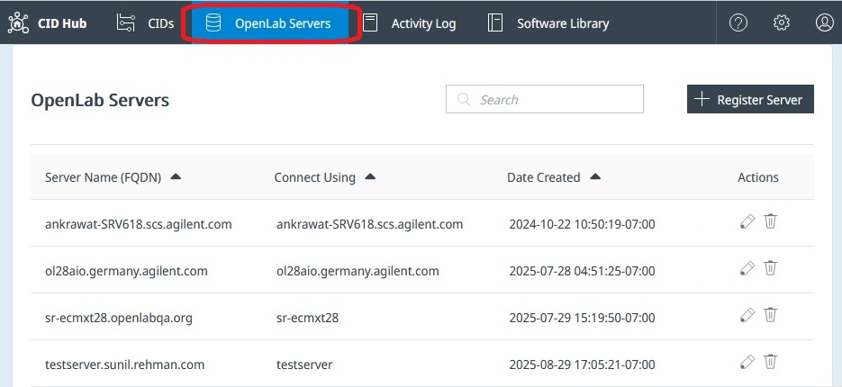

# OpenLab Server Registries in CID Hub

## Overview

You must store information about your OpenLab Server(s) in the CID Hub.  
When CID devices start up, they use this stored information to automatically register with the OpenLab Server.

You can add server details to CID Hub as soon as the information are available.  
The OpenLab Server does not need to be running or reachable at the time of registration.

:::info
CID Hub does not verify or connect to the server.
It simply stores this information so that CID devices can retrieve and use it later.
:::

---

## Register an OpenLab Server

Click **Register Server** to add a new OpenLab Server.  

#### Field Descriptions  

- **Server Name (FQDN)**  
  Enter the fully qualified domain name of the OpenLab Server (for example, `olserver.prod.example.com`).  
  For best compatibility with DNS systems, use **lowercase letters** when entering the FQDN.  

- **Connect to**  
  Specify how CIDs should connect to the server - by hostname or by FQDN.  
  :::caution[Important]
  You must use the same naming convention (hostname or FQDN) consistently across all CDS Clients, AICs, and CIDs to avoid functional issues.
  :::

- **Username / Password**
  Credentials used by CIDs during initial registration with the OpenLab Shared Services (OLSS).  
  Keep this information up to date and accessible because:
  - Certain drivers use these credentials during installation or upgrade to register with OLSS.  
  - They are also required for administrative functions such as **Register CID** and **Reset OpenLab CDS**.

- **CID Network Share** *(Optional but recommended)*
  A shared network path that allows CIDs to cache downloaded CDS versions, improving performance and reducing internet bandwidth usage.
  - When a CID downloads a CDS version (~25 GB) from the CID Hub, it caches a copy in a `downloads` subfolder under this share.
  - Other CIDs can then retrieve the cached files from the network share instead of downloading them again from the internet.
  - It is also possible to manually download CDS files from the CID Hub's Software Library and cache them in this share path.

- **Network Share Username / Password**  
  Required if anonymous access is not allowed. Depending on your setup, the username format can be:  
  - `user`  
  - `domain\user`  
  - `user@domain.com`

---

## Edit Existing Registries

To edit a registered OpenLab Server, click the 'pencil' icon under the 'Action' column.

If the server FQDN is updated, then all the CIDs connected to that server need to be re-registered. This can be done by clicking the **Register CID** button in the CID Administration page.

Updates to other information takes affect when the CIDs are restarted. CIDs can be restarted by clicking the **Reboot System** button in the CID Administration page.

---

## Delete Existing Registries

OpenLab Server Registries can be removed by clicking on the 'trashcan' icon under the 'Action' column. 

:::info 
Only unused Server Registries can be removed from the CID Hub. Servers cannot be removed when there are one or more CIDs associated with it.
:::
