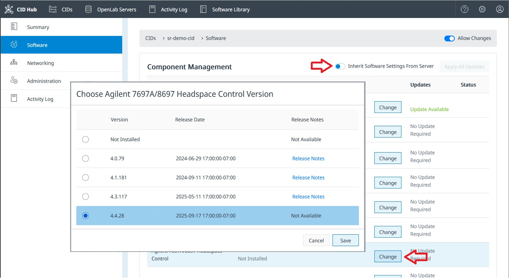

# Configure software exceptions

Each CID inherits its software versions from the [software template](./define-software-template) of the OpenLab Server it is registered with. This page is for the lab administrator or IT operator who needs one specific CID to run a different set of software, for example a CID that needs an Agilent Micro GC driver or an Agilent Headspace driver that the rest of the CIDs on the server do not need.

To give a CID its own software selections, you first turn off inheritance for that CID, then manage its versions directly on the CID's software page.

## Prerequisites

- You must have an administrator role to configure software exceptions.
- The CID must be registered, activated, and connected to CID Hub.
- The CID must allow changes. (If **Allow Changes** is off on the CID's detail page, turn it on first.)
- You need to know the OpenLab CDS, driver, and add-on versions installed on the CDS Client systems that will connect to this CID.

## Turn off inheritance

To turn off inheritance for a CID:

1. In CID Hub, open the CID's detail page and select the **Software** tab.

2. Locate the **Inherit Software Settings From Server** toggle and switch it off.

   

   The CID's current software versions stay as they are. CID Hub stops applying changes from the server's software template to this CID from this point on.

:::important
The **Inherit Software Settings From Server** toggle is disabled when:

- a software install, update, or reset is in progress on the CID. Wait for it to finish.
- the CID does not allow changes. Turn **Allow Changes** on first.
- the CID is disconnected. Wait for it to reconnect.
:::

## Select the CID's software versions

With inheritance off, the **Change** buttons on the CID's **Software** tab become active. You can now select the OpenLab CDS version, the Windows update, the Linux update, the drivers, and the add-ons for this CID independently of the server's software template.

The selection rules are the same as for the server's software template (see [Define a software template](./define-software-template)):

- Changing the OpenLab CDS version resets the Windows update, Linux update, and driver selections, and shows a warning before it commits.
- Mandatory drivers cannot be deselected.
- Optional drivers and add-ons offer **Not Installed** as a selectable option so you can leave a component uninstalled or remove one that is already installed.

:::caution
A non-inheriting CID is no longer kept in step with the server's software template. The CDS, driver, and add-on versions you select here must still match the versions installed on the CDS Client systems that connect to this CID. A mismatch prevents OpenLab CDS from functioning correctly.
:::

After you save a change, CID Hub queues any new components for download. Installation does not start automatically. Trigger it from the **Apply Updates** action on the CID's **Software** tab, or from the **Apply Updates** action on the CIDs list to install on several CIDs at once. See [Apply updates](../updates/apply-updates) for the full procedure.

## See which CIDs are non-inheriting

The [CIDs list](../monitoring/view-cids) shows an **Inherit** column for each CID. A value of **No** (highlighted in red) flags a CID that is managing its own software versions and is no longer tracking the server template. Use this column to keep track of which CIDs need individual attention when the server template changes.

## Turn inheritance back on

You can return a CID to the server's software template at any time:

1. On the CID's **Software** tab, switch **Inherit Software Settings From Server** back on.

2. CID Hub immediately replaces the CID's selections with the server's template, and discards any pending downloads or updates that have not been installed yet.

3. If the server template specifies versions the CID does not currently have, CID Hub queues those components for download. Installation must still be triggered manually.

## See also

- [Define a software template](./define-software-template): the server-level defaults that an inheriting CID receives.
- [Apply updates](../updates/apply-updates): install software that the CID has downloaded.
- [CID administration](../operations/cid-administration): turn **Allow Changes** on or off, reboot a CID, register the CID with the OpenLab Server, or reset OpenLab CDS.
- [View CIDs](../monitoring/view-cids): use the **Inherit** column to locate non-inheriting CIDs.
- [View activity logs](../monitoring/view-activity-logs): review the history of inheritance changes and software selections.
