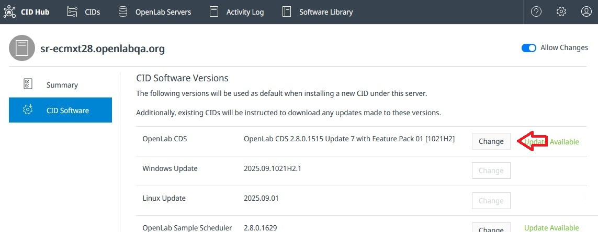
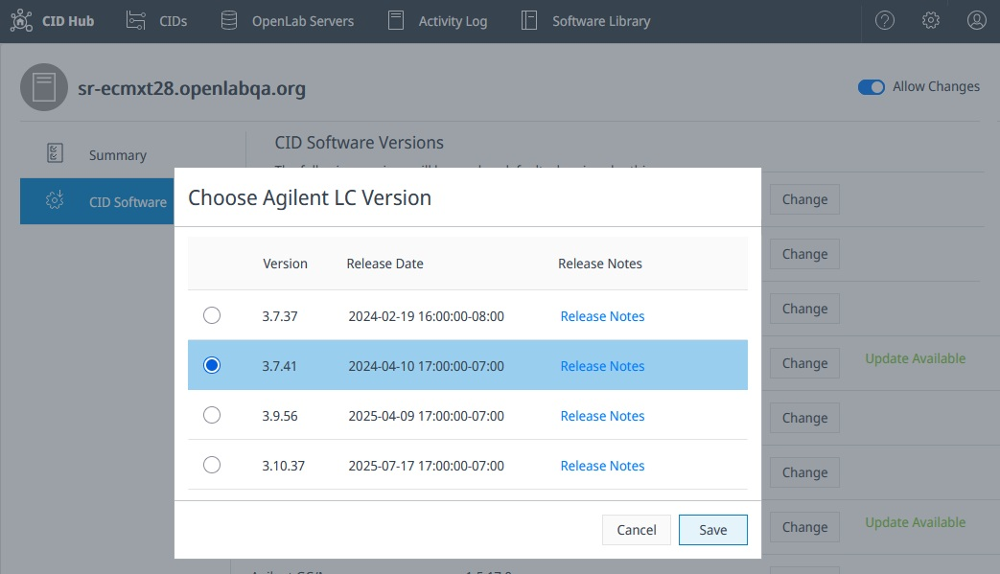

# Define a software template

A software template is the default set of software versions that every CID connected to a registered OpenLab Server uses. The template covers the OpenLab CDS version, the Windows and Linux updates, the instrument drivers, and any add-on software. This page is for the lab administrator or IT operator who sets that default. The same template applies to every CID on the server, unless a specific CID is configured with an exception (see [Configure software exceptions](./configure-software-exceptions)).

:::note
A software template is not a server-side configuration. It lives in CID Hub and is read by each CID. The OpenLab Server does not use it, does not install or hold any of the software listed in it, and is not aware that the template exists.
:::

## Prerequisites

- You must have an administrator role to define a software template.
- You need a [registered OpenLab Server](./register-a-server).
- You need to know the OpenLab CDS version installed on the OpenLab Server. (The server's version must be equal to or higher than the versions running on connected clients or CIDs.)
- You need to know the OpenLab CDS, driver, and add-on versions installed on the CDS Client systems. (The versions you select must match the client versions exactly.)

## Open the server's software template

To open the template:

1. In CID Hub, click **OpenLab Servers** in the top navigation bar.

2. Click the row for the server whose template you want to define.

3. Select the **CID Software** tab.

   The tab lists the OpenLab CDS version, the Windows and Linux updates, and the drivers and add-ons that make up the template, each with a **Change** button.

When a server is first registered, the template starts with the latest available OpenLab CDS version and its compatible default OS updates and drivers. You only need to edit the template if you want different versions.

## Select the OpenLab CDS version

The OpenLab CDS version is the anchor of the template. It sets the default Windows update, Linux update, and driver versions for the rest of the template.

To change the CDS version:

1. Next to **OpenLab CDS**, click **Change**.

   

2. Select a version and click **Save**.

   A warning is shown before the change is committed. Confirm to apply it.

:::important
Changing the CDS version resets the rest of the template. The Windows update and Linux update reset to the latest available updates for the new CDS version, and the driver and add-on versions reset to the defaults that ship with that CDS version. Reselect any specific versions you need after changing CDS.
:::

:::caution
The CDS version you select here will be installed on every inheriting CID on this server, and it must match the CDS version installed on the CDS Client systems that connect to those CIDs. Mismatched versions between a Client and the AIC or CID it talks to cause functional issues. The OpenLab Server's own CDS version must also be equal to or higher than the version you select. Coordinate any CDS version change with the rest of the OpenLab CDS environment before applying it.
:::

If only one CDS version is available, the **Change** button is disabled.

## OS updates

OS update selection is largely automatic and rarely needs your attention. CID Hub only keeps the latest active Windows update and the latest active Linux update selectable. Most of the time only one of each is available, so the **Change** button for **Windows Update** and **Linux Update** is disabled and the latest active version is shown as selected. CID Hub also re-selects the latest active update for you when the CDS version changes or when the currently selected update is retired.

If more than one selectable version is present, click **Change**, select a version, and click **Save**.

## Select drivers and add-on software

The driver list shows only the instrument drivers and add-ons that are compatible with the selected CDS version. Each row shows the version that will be applied to CIDs.

- Mandatory drivers are preselected with the default version that ships with the chosen CDS version. They cannot be deselected.
- Optional drivers and add-ons are not installed by default and show **Not Installed**. The version picker for an optional driver or add-on includes **Not Installed** as a selectable option alongside the available versions; selecting it leaves the component uninstalled, or removes it from CIDs that already have it.

To change a driver or add-on version, or to remove an optional one:

1. Next to the driver or add-on, click **Change**.

   

2. Select a version, or select **Not Installed** for an optional driver or add-on, and click **Save**.

An **Update Available** badge appears next to a component when a newer compatible version is available in CID Hub. For OpenLab CDS, only newer versions within the same release train are flagged this way; a jump across major versions is treated as a deliberate CDS change, not as an available update.

:::caution
The driver and add-on versions you select here must match the versions installed on the CDS Client systems that connect to these CIDs. A mismatch prevents OpenLab CDS from functioning correctly. Coordinate any change with the rest of the OpenLab CDS environment before applying it.
:::

## What happens next

Once the template is saved, every CID on this server that is set to inherit from the server compares the template against its currently installed software and queues any new components for download. Downloads start automatically. Installation does not. An administrator must trigger the install from the **Apply Updates** action on the CID's **Software** tab, or from the **Apply Updates** action on the CIDs list to install on several CIDs at once. See [Apply updates](../updates/apply-updates) for the full procedure.

## See also

- [Register an OpenLab Server](./register-a-server): the prerequisite that creates the server record this template belongs to.
- [Configure software exceptions](./configure-software-exceptions): override the template for a specific CID.
- [Apply updates](../updates/apply-updates): install software that CIDs have downloaded against the template.
- [View software library](../monitoring/view-software-library): browse the CDS, OS update, driver, and add-on versions available in CID Hub.
- [View activity logs](../monitoring/view-activity-logs): review the audit trail of template changes.
