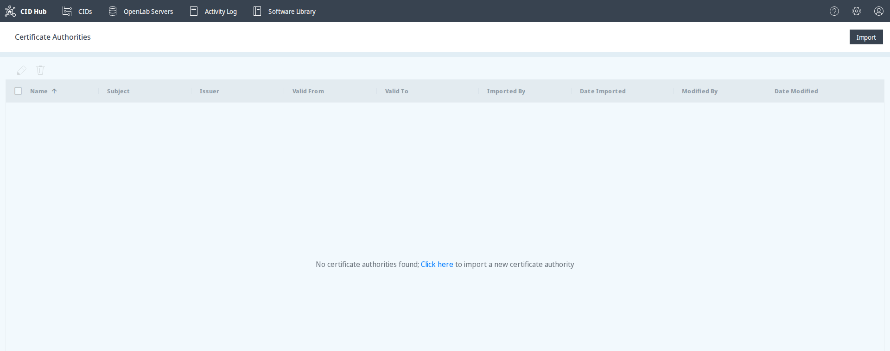
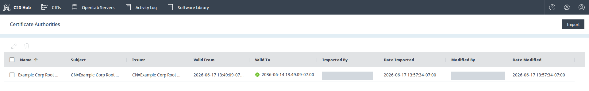
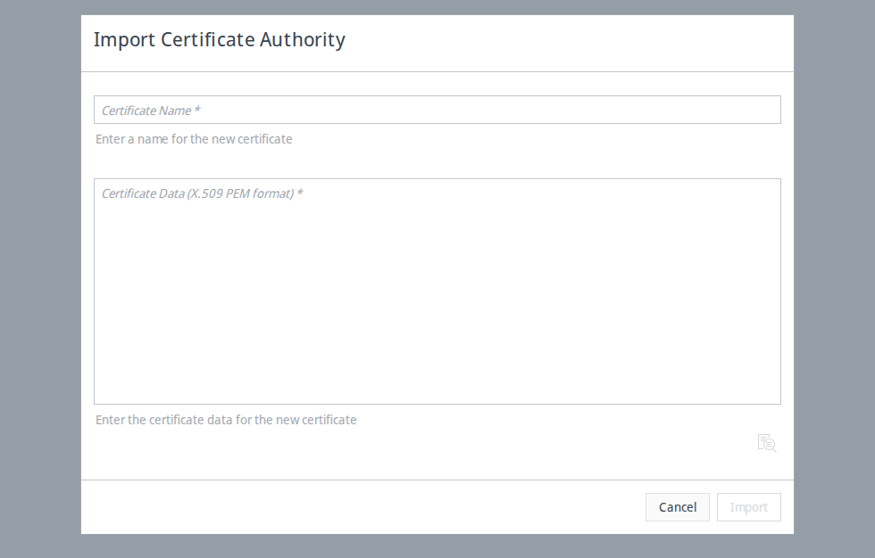
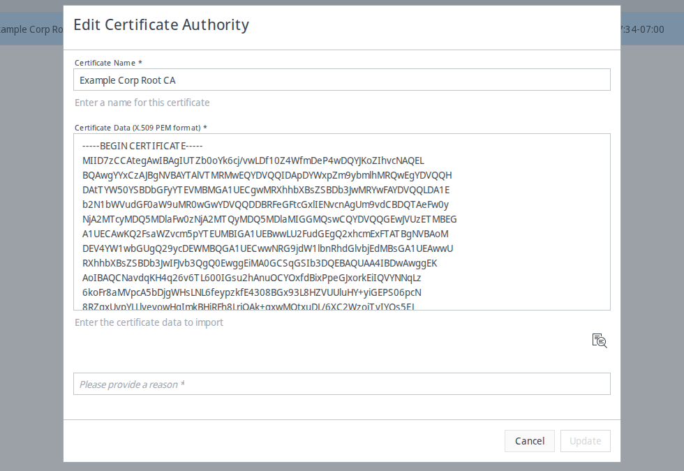
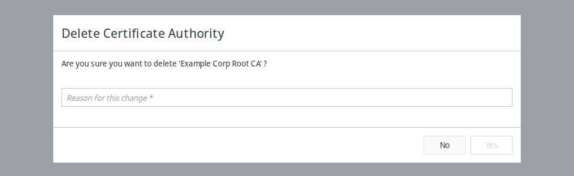

# Manage certificate authorities

Use the **Certificate Authorities** page in CID Hub to import your organization's trusted certificate authorities (CAs) and distribute them to every CID in your account. CIDs use these CAs to trust corporate or self-signed server certificates, such as those on an OpenLab Server or an OpenLab ECM 3.x server, so that registration and OpenLab CDS connections succeed. This page is for the lab administrator or IT operator who manages certificate trust for the account.

:::tip
Import your root and intermediate CAs, not individual server certificates. Your CAs validate every server certificate they signed, so importing them once covers all the OpenLab Server and OpenLab ECM servers in your organization. Import an individual server certificate only for a standalone certificate that is not issued by any CA.
:::

For which server certificates require a CA import, see the [SSL certificate requirements](../../reference/system-requirements#ssl-certificate-requirements) section of System requirements.

## Prerequisites

- You must have the **Administrator** role to view, import, edit, or delete certificate authorities.
- You need each certificate authority in PEM format (the root certificate and any intermediate certificates), without private keys.

## Open the Certificate Authorities page

The Certificate Authorities page lists the CAs trusted by your account.

1. Click the **Settings** (gear) icon in the top-right corner of the top navigation bar.
2. Select **Certificate Authorities**.

   The Certificate Authorities list opens. The toolbar above the list has **Edit** (pencil) and **Delete** (trash) icons, and an **Import** button sits at the top right.

   

The **Certificate Authorities** menu item is available to Administrators. When the list is empty, it shows the message `No certificate authorities found; Click here to import a new certificate authority`.

## Understand the certificate list

Each imported CA appears as a row with the following columns.

- **Name**. The name you assigned when you imported the CA.
- **Subject**. The full Distinguished Name (DN) of the certificate's subject.
- **Issuer**. The full DN of the authority that issued the certificate. A root CA is self-issued, so its Subject and Issuer match.
- **Valid From** and **Valid To**. The start and end of the certificate's validity period.
- **Imported By** and **Date Imported**. Who added the CA, and when.
- **Modified By** and **Date Modified**. Who last changed the CA, and when.

Subject and Issuer show the full DN; the cell truncates long values, so hover or widen the column to read the rest. Click a column header to sort by that column, and use the column filters to narrow the list, the same as on the other CID Hub list pages.

## Import a certificate authority

Importing adds a CA to your account and queues it for distribution to your CIDs.

1. On the Certificate Authorities page, click **Import**. (When the list is empty, you can instead click the **Click here** link in the empty-list message.)
2. In the **Import Certificate Authority** dialog, enter a name in **Certificate Name**.
3. Paste the certificate content into **Certificate Data (X.509 PEM format)**. To import a full chain, paste the root and intermediate certificates together. CID Hub creates a uniquely named entry for each certificate, based on the name you provided.
4. *(Optional)* Click the preview icon below the certificate field to review the parsed certificate details before you import.
5. Click **Import**.

   The CA appears in the list, and the import is recorded in the Activity Log.

   

The **Import** button stays disabled until both fields are filled. If the content is not valid PEM, or if it includes a private key, CID Hub rejects the import and displays a validation error describing what to fix. Certificates imported into CID Hub must never contain a private key.

## Edit a certificate authority

You can rename a CA or replace its certificate content.

1. Select a single CA in the list.
2. Click the **Edit** (pencil) icon in the toolbar.

   The **Edit** icon is enabled only when exactly one CA is selected.

3. In the **Edit Certificate Authority** dialog, update **Certificate Name**, **Certificate Data (X.509 PEM format)**, or both.
4. Enter a reason for the change. CID Hub requires a reason before **Update** becomes available.
5. Click **Update**.

   The change is recorded in the Activity Log.

   

## Delete certificate authorities

1. Select one or more CAs in the list.
2. Click the **Delete** (trash) icon in the toolbar.
3. In the **Delete Certificate Authority** dialog, review the name shown and enter a reason in **Reason for this change**.
4. Click **Yes** to confirm.

   The CAs are removed, queued for removal from your CIDs, and the deletion is recorded in the Activity Log.

   

Deleting a CA removes only the entries you selected. If you imported a full chain and then select only the root, the intermediate entries remain in the list until you delete them too.

## How certificate authorities reach your CIDs

After you import or remove a CA, CID Hub distributes the change to every CID in your account. Each CID synchronizes its trusted CAs at these times:

- On every CID boot.
- At least once every 24 hours.
- Before any action that re-registers the CID, such as an OpenLab CDS version change or **Reset OpenLab CDS**.

A CID installs the CAs into both its Linux subsystem and its Windows VM, so the connection checks that each performs succeed. You can follow the synchronization in the **Recent activity** section of the CID's **Summary** page, where the CID reports messages such as `Installing Certificate Authority` and `Removing Certificate Authority`. CA synchronization is not written to the account Activity Log.

Because synchronization is periodic, a newly imported CA can take up to 24 hours to reach a running CID, unless you reboot the CID or run an action that re-registers it first.

## See also

- [Register an OpenLab Server](./register-a-server): record the server a CID registers against during activation.
- [SSL certificate requirements](../../reference/system-requirements#ssl-certificate-requirements): which server certificates require you to upload a CA.
- [Manage users and roles](../account/manage-users-and-roles): the roles that can manage certificate authorities.
- [View activity logs](../monitoring/view-activity-logs): review CA import, edit, and delete events.
- [OpenLab Server unreachable](/troubleshooting/openlab-server-unreachable): resolve registration failures caused by an untrusted server certificate.
