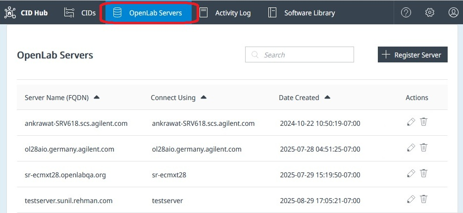
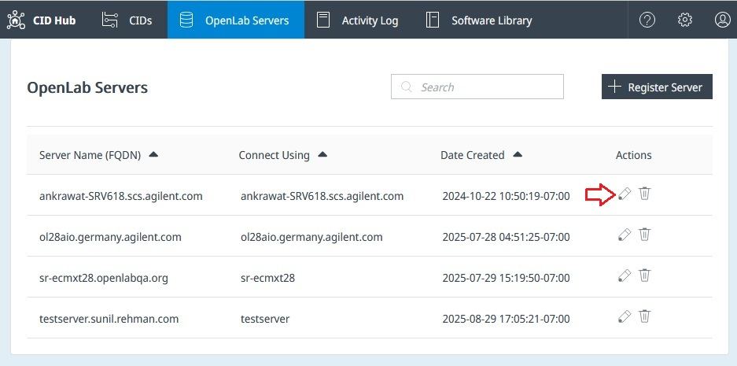
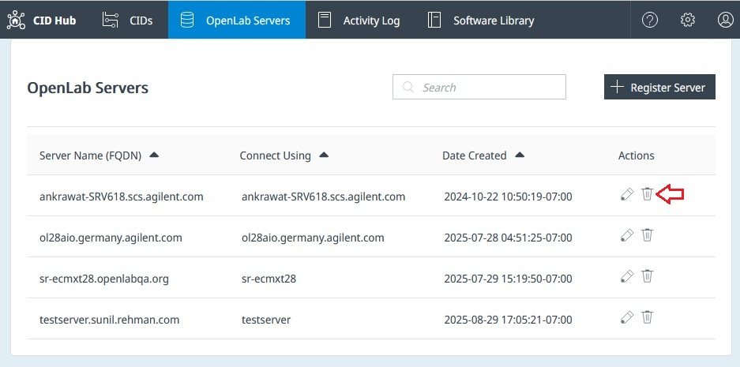

# Register an OpenLab Server

Each CID activates against an OpenLab Server and inherits its software template. This page is for the lab administrator or IT operator who records the server's connection details in CID Hub so that CIDs can register with it during activation.

You can register a server in CID Hub before the physical server is online.

:::note
CID Hub and the OpenLab Server are independent systems and do not communicate with each other. The values you enter here, including the software template you later assign, are read by the CID itself when it registers with OpenLab Shared Services (OLSS) as an instrument controller. The server is not modified in any way.
:::

## Prerequisites

- You must have an administrator role to register an OpenLab Server.
- You need the fully qualified domain name (FQDN) of the OpenLab Server.
- You need an OpenLab admin username and password for the CID to present to OLSS during registration. (These are reused when running **Register CID** or **Reset OpenLab CDS**.)
- *(Optional)* You need the SMB path and credentials for a network share used to cache OpenLab CDS KVM images.

## Register a server

To add an OpenLab Server to CID Hub:

1. In CID Hub, click **OpenLab Servers** in the top navigation bar.

   

2. Click **Register Server**.

3. In the **Register Server** dialog, enter the following fields:

   - **Server Name (FQDN):** the fully qualified domain name of the OpenLab Server, for example `olserver.prod.example.com`. Use lowercase letters for best compatibility with DNS resolvers.
   - **Connect to:** whether CIDs address the server by **Hostname** or by **FQDN**. In most environments the server is reachable either way, but every CDS Client, AIC, and CID that connects to this server must use the same convention. Mixed conventions cause functional issues, particularly with the OpenLab CDS failover workflow.
   - **Username** and **Password:** OpenLab admin credentials. A CID uses these to register itself with OLSS during activation, and CID Hub passes them to the CID again when an administrator runs **Register CID** or **Reset OpenLab CDS**. Some driver installers also use them to register with OLSS. CID Hub itself never authenticates to the server with these values. Once every CID is registered, the stored value only matters the next time one of those administrative actions runs.
   - **CID Network Share** *(optional, recommended):* an SMB path where CIDs cache OpenLab CDS KVM images. Each image is about 25 GB; caching it on a share lets later CIDs copy it from the share instead of re-downloading from CID Hub. You can also place KVM images in the share manually after downloading them from the CID Hub Software Library.
   - **Network Share Username** and **Network Share Password:** credentials for the share. Use the `user@domain.com` or `user` format. Anonymous SMB access is not recommended. The `DOMAIN\user` format fails on the Linux subsystem of the CID and is not supported.

4. Click **Register**.

   The server appears in the OpenLab Servers list and is immediately available to assign to a CID.

## Edit a registered server

To edit a server:

1. On the **OpenLab Servers** page, click the **Edit** (pencil) icon in the **Actions** column for the server.

   

2. Update the fields you need to change.

3. Click **Save**.

   Each changed field is recorded in the Activity Log.

:::important
An edit changes only the record in CID Hub. The connected CIDs still hold the previous values until they pick up the new ones:

- If you changed **Server Name (FQDN)**, run **Register CID** from the [CID administration](../operations/cid-administration) page for each CID that uses this server, so the CID re-registers against the new name.
- Changes to credentials, **Connect to**, or share details take effect on each CID the next time it is rebooted.
:::

## Remove a registered server

A server can be removed only after every CID that uses it has been removed first.

To remove a server:

1. On the **OpenLab Servers** page, click the **Delete** (trash) icon in the **Actions** column.

   

2. Confirm the deletion.

   The server is removed from the list and recorded in the Activity Log.

If the server still has CIDs associated with it, CID Hub blocks the deletion and lists the affected CIDs. Remove each listed CID first, then delete the server.

## See also

- [Activate a CID](../onboarding/activate-a-cid): the activation flow that uses a registered OpenLab Server.
- [Define a software template](./define-software-template): set the default OpenLab CDS, driver, and OS update versions a CID inherits from this server.
- [CID administration](../operations/cid-administration): run **Register CID** or **Reset OpenLab CDS** after credential or FQDN changes.
- [View CIDs](../monitoring/view-cids): confirm CIDs reconnect after a server edit.
- [View activity logs](../monitoring/view-activity-logs): review the audit trail for server registration, edits, and removals.
