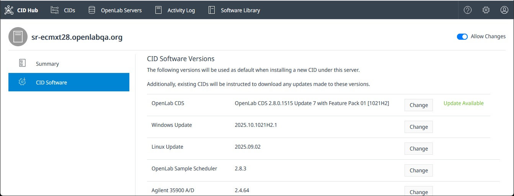

# Update or upgrade OpenLab CDS

CID Hub publishes new versions of OpenLab CDS as Agilent releases them. This page is for the lab administrator or IT operator who selects a CDS version for CIDs to install. The selection is made in CID Hub; the installation itself is covered by [Apply updates](./apply-updates).

CID Hub distinguishes two kinds of version change:

- **Update.** A move within the same release train, for example **CDS 2.8** to **CDS 2.8 Update 1**. The **Update Available** label appears next to the component on the **Software** tab when a newer version in the same train is published.

  

- **Upgrade.** A move across major or minor versions, for example **CDS 2.7** to **CDS 2.8**. Upgrades are never flagged by the **Update Available** label; they require deliberate selection through the **Change** button so that the version change is intentional.

The selection mechanism is the same in both cases. The difference is which version you choose and what compatibility checks apply.

## Prerequisites

- You must have an administrator role to change CDS version selections.
- For an inheriting CID, change the version on the [server's software template](../setup/define-software-template). The new selection then applies to every CID that inherits from the server.
- For a non-inheriting CID, change the version on that CID's [Software exceptions](../setup/configure-software-exceptions).
- For an upgrade to **OpenLab CDS 2.8 Update 9** or later, each CID that will run the new version must have a **Windows 11** license sticker on the chassis. Earlier CDS versions run on Windows 10 IoT; from CDS 2.8 Update 9 onward the CDS VM is Windows 11 IoT.
- The CDS version installed on the OpenLab Server must be equal to or higher than the version you select for the CIDs. Confirm the server version with your OpenLab administrator before changing the selection.
- Every CDS Client that connects to the affected CIDs must be on a CDS version that matches the selection. A Client/CID mismatch prevents OpenLab CDS from functioning correctly. Coordinate the change with your CDS Client administrators before applying it.

## Select a CDS version

Selection happens on the **Software** tab of either the server (for inheriting CIDs) or a specific CID (for non-inheriting CIDs).

To change the selected CDS version:

1. Open the **Software** tab on the server or CID where you want to change the version.

2. Next to **OpenLab CDS**, click **Change** to open the version picker.

   

   The picker lists every available CDS version with its release date and a link to the release notes. Use it to compare versions in place before committing to the change.

3. Select the version you want to install and click **Save**.

   A confirmation dialog summarizes the change. Review it carefully because changing the CDS version resets other selections (see below).

4. Confirm the change.

   The new selection is recorded immediately. CIDs that inherit from this server (or this CID, if you changed it directly) begin downloading the new version in the background.

:::important
Changing the CDS version resets all driver, add-on, and OS update selections to the defaults that ship with the new CDS version. If your deployment requires specific driver, add-on, or update versions, reselect them on the same **Software** tab after the CDS change is saved. Apply the result with [Apply updates](./apply-updates) so the CID installs the CDS change together with your driver and update selections.
:::

## Install the new version

Saving the selection does not install the new version. Each affected CID downloads it in the background and waits for an administrator to start the install.

When the **Updates** column shows **Ready** for the CID, install the change using one of the methods on [Apply updates](./apply-updates):

- Update several CIDs at once from the **CIDs** list.
- Apply all pending changes to a single CID from its **Software** tab.
- Install OpenLab CDS on its own from the **Software** tab when you want to stagger the rollout.

## See also

- [Define a software template](../setup/define-software-template): set CDS, drivers, OS updates, and add-ons at the server level for inheriting CIDs.
- [Configure software exceptions](../setup/configure-software-exceptions): override the CDS selection for a single CID.
- [View activity logs](../monitoring/view-activity-logs): review the history of template and CID-level CDS selection changes.
