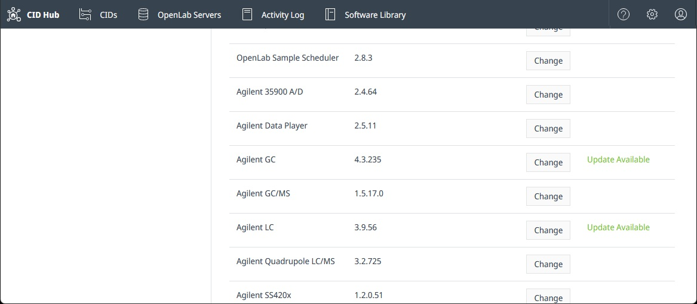

# Update drivers and add-ons

Each OpenLab CDS version ships with a set of instrument drivers and add-ons. CID Hub lets a lab administrator or IT operator pin a different version, or add an optional driver or add-on, without changing the CDS version itself. The selection is made in CID Hub; the installation itself is covered by [Apply updates](./apply-updates).

CID Hub distinguishes two categories on the **Software** tab:

- **Drivers**. Instrument drivers for the CDS version currently selected on the CID. Some drivers are mandatory and cannot be deselected; the rest are optional and only install when explicitly selected. The **Update Available** label appears next to a driver when a newer compatible version is published.

  

- **Add-ons**. Supplementary CDS components in the **Add-ons** category on the **Software** tab, such as **OpenLab Sample Scheduler** and **GPC (Agilent GPC/SEC Software for OpenLab CDS)**. Some add-ons ship with a pre-installed base version (Sample Scheduler), while others must be explicitly selected before they are installed (GPC). The **Update Available** label appears for an add-on only if the add-on is installed.

The selection mechanism is the same in both cases. The difference is which row you change on the **Software** tab and what compatibility constraints apply.

## **Prerequisites**

Before you change a driver or add-on selection, confirm these prerequisites.

- You must have an administrator role to change driver or add-on selections.
- You need to change the selection on the [server's software template](../setup/define-software-template) if you want the new selection to apply to every CID that inherits from the server.
- You need to change the selection on that CID's [Software exceptions](../setup/configure-software-exceptions) if the CID does not inherit from the server.
- The driver or add-on version you want must be compatible with the CDS version currently selected for the CID. Incompatible versions are not offered in the picker.

## Select a driver or add-on version

Selection happens on the **Software** tab of either the server (for inheriting CIDs) or a specific CID (for non-inheriting CIDs).

To change a driver or add-on selection:

1. Select the **Software** tab on the server or CID where you want to change the version.

2. Next to the driver or add-on you want to change, click **Change** to open the version picker.

   

   The picker lists every compatible version with its release date and a link to the release notes. Use it to compare versions in place before committing to the change.

3. Select the version you want.

   For an optional driver or add-on, select **Not Installed** if you want to remove it the next time you apply updates.

4. Click **Save**.

   A confirmation dialog summarizes the change.

5. Confirm the change.

   The new selection is recorded immediately. CIDs that inherit from this server (or this CID, if you changed it directly) begin downloading the new version in the background.

:::important
Changing the OpenLab CDS version resets every driver and add-on selection to the defaults that ship with the new CDS version, and any optional driver that is not compatible with the new CDS version is marked for removal. If your deployment requires specific driver or add-on versions, reselect them on the same **Software** tab after the CDS change is saved.
:::

## Install the new version

Saving the selection does not install the new version. Each affected CID downloads it in the background and waits for an administrator to start the install.

When the **Updates** column shows **Ready** for the CID, install the change using one of the methods on [Apply updates](./apply-updates):

- Update several CIDs at once from the **CIDs** list.
- Apply all pending changes to a single CID from its **Software** tab.
- Install a single driver or add-on from the **Software** tab when you want to stagger the rollout.

## What to expect during the install

Drivers and add-ons install one at a time, in the [installation order](./apply-updates#installation-order) shown on the Apply updates page. Mandatory drivers install before optional drivers and add-ons, and optional items install in the order shown on the **Software** tab.

- **A failed driver or add-on install leaves the previous version in place**. Drivers and add-ons do not roll back automatically to an earlier version; the existing install keeps working and the failure is reported on the **Software** tab and in the [activity log](../monitoring/view-activity-logs). Address the cause and reapply.
- **Other components are not affected**. A failure on one driver or add-on does not stop the rest of the install; the remaining components in the queue still install.

For the full failure-handling picture across all components, see [What happens on failure](./apply-updates#what-happens-on-failure) on the Apply updates page.

## See also

- [Apply updates](./apply-updates): trigger the install for one CID or for many.
- [Update or upgrade OpenLab CDS](./apply-cds-updates): selecting a new CDS version resets driver and add-on selections.
- [Define a software template](../setup/define-software-template): set driver and add-on defaults at the server level for inheriting CIDs.
- [Configure software exceptions](../setup/configure-software-exceptions): override driver or add-on selections on a single CID.
- [View activity logs](../monitoring/view-activity-logs): review the history of driver and add-on selection changes, installs, and failures.
