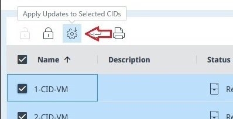
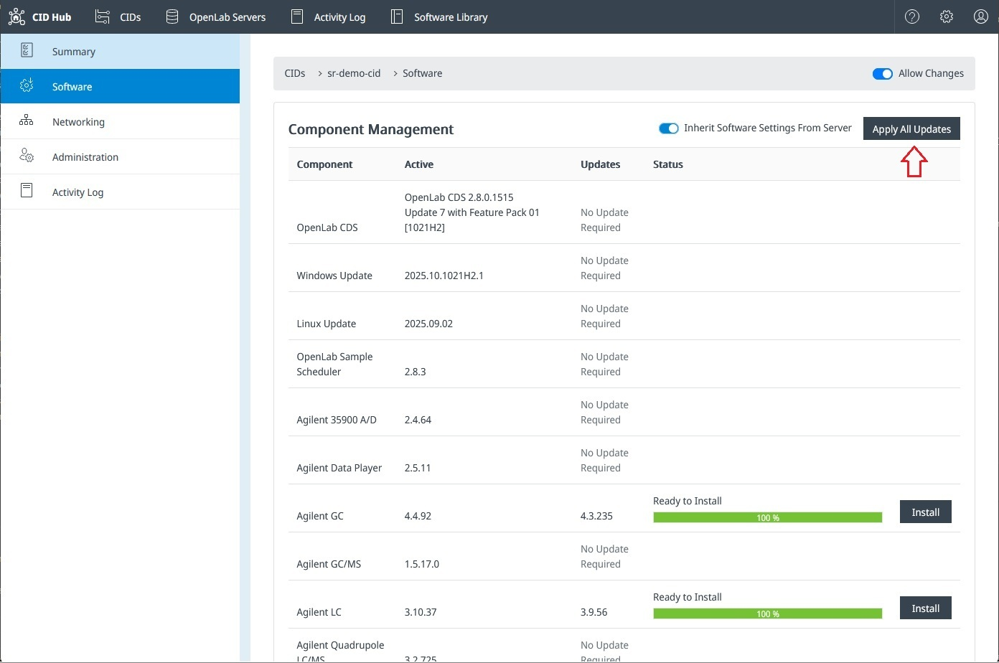
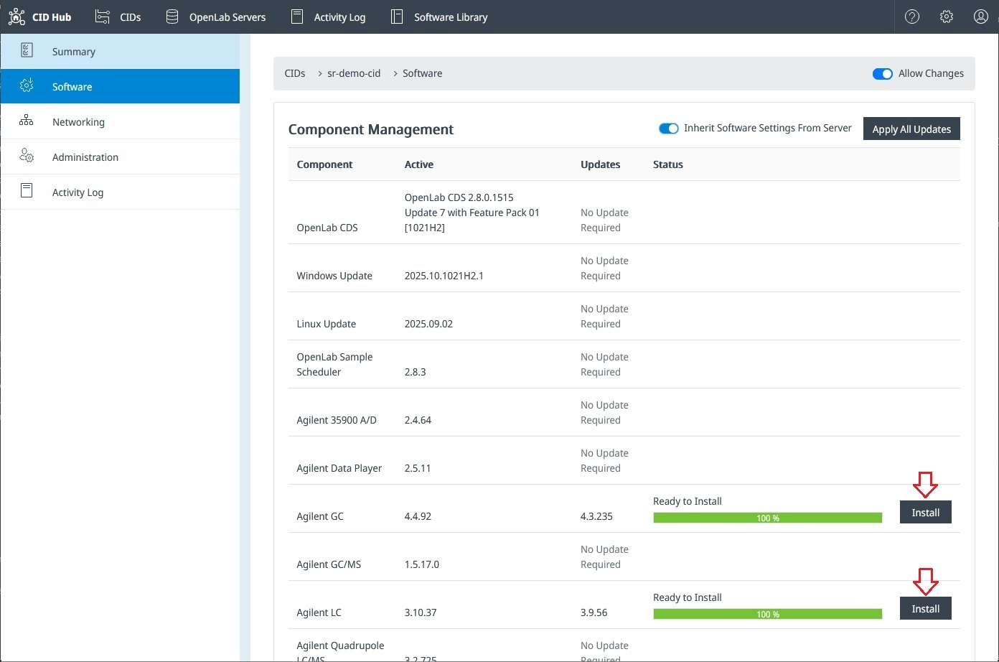

# Apply Software Updates

## <mark>Overview</mark>

All software on a CID — the Linux host, the embedded Windows VM, the instrument drivers and add-ons, and OpenLab CDS — is updated through the CID Hub.

Updates are delivered in a two-step process: **Download** and **Installation**.

1. **Download:** When updates are assigned to a CID, they download automatically in the background, so the install itself is fast and low-bandwidth.
2. **Installation:** Updates are **not installed automatically**. A CID administrator must initiate the installation from the CID Hub, which lets you perform installations at convenient times (for example, outside of production hours) to avoid interrupting any ongoing work.

These updates are covered by dedicated procedures in this section:

- [Update/Upgrade CDS](./apply-cds-updates) — OpenLab CDS version upgrades.
- [Install OS Updates](./install-os-updates) — Linux host and Windows VM patches.
- [Update Drivers & Add-ons](./apply-driver-updates) — instrument driver and add-on updates.

---

## Installation Methods

The CID Hub provides three ways to apply pending updates:

- **Method 1: Apply Updates to Multiple CIDs (Bulk Action):** Apply all pending updates to *multiple CIDs* at once.  
- **Method 2: Apply All Updates on a Single CID:** Apply all pending updates to *one specific CID*.  
- **Method 3: Apply Individual Updates on a Single CID:** Apply a *single, specific update* on one CID.

---

## Method 1: Apply Updates to Multiple CIDs (Bulk Action)

Use this method to efficiently update several CIDs at once from the main list.

1. Navigate to the **CID List** page.  
2. Select the checkboxes for CIDs that have **Status = Ready** and **Updates = Ready**.  
3. Click the **Apply Updates** (gear icon) button in the toolbar.

:::info[Important]
Pay attention to the values for [**Status**](/howto/monitoring/view-cids#column-descriptions) and [**Updates**](/howto/monitoring/view-cids#column-descriptions) columns. Agilent recommends to only apply updates for CIDs for which both columns show `Ready`.
:::

---

## Method 2: Apply All Pending Updates on a Single CID

Use this method to apply all available updates for one specific CID.

1. On the **CID List** page, click the CID name to open its details page.  
2. Navigate to the **Software** tab.  
3. Click **Apply All Updates** to install all pending updates for that CID.

---

## Method 3: Apply a Specific Update on a Single CID

Use this method to apply a single update, for example during troubleshooting or when you want to stagger larger updates.

1. Navigate to the CID’s **Software** tab (same as Method 2).  
2. Locate the update you want to install in the list. The progress bar shows its current status (for example, *Downloading* or *Ready to Install*).  
3. Click **Install** for that specific update.

