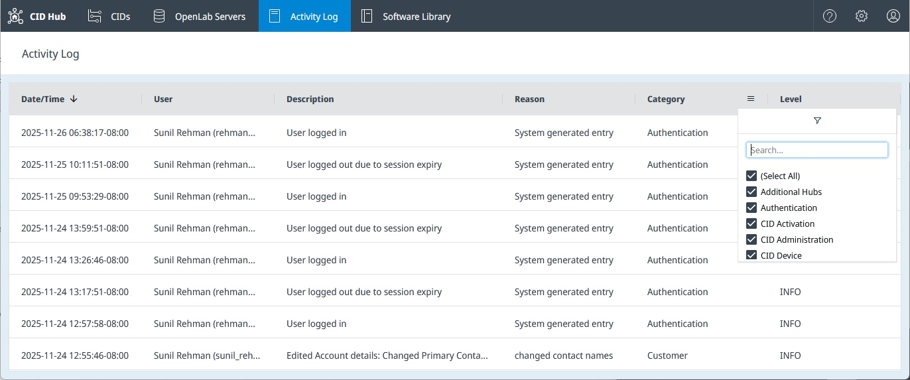

# View Activity Logs

## Overview

The Activity Log provides a detailed, searchable record of all actions performed within the CID Hub, both by users and by the system itself. These logs are essential for traceability and auditing purposes, capturing high-level events related to user management, CID configuration, software changes, and more.

All events are recorded in a single, account-wide log. For convenience, this log can be viewed in two ways:
- The **Global Activity Log** shows all events across your account.
- The **CID-Specific Activity Log** is a filtered view that shows only the events related to a single device.

---

## Global Activity Log

The Global Activity Log displays all events from across your CID Hub account in a single list.

To access the Global Activity Log, click the **Activity Log** tab in the main navigation bar at the top of the page.

---

## CID-Specific Activity Log

If you need to see the history for a particular CID, you can access its dedicated activity log.

1.  Navigate to the **CIDs** list page.
2.  Click on the name of the CID you want to inspect.
3.  Select the **Activity Log** tab from the left-hand navigation menu.

---

## Sorting and Filtering

Both log views offer powerful sorting and filtering tools to help you find specific events quickly.

-   **Sorting**: Click on any column header to sort the list by that column.
-   **Filtering**: Click the chevron next to a column header to open a filter menu.
    -   **Date/Time**: Filter by a specific date range.
    -   **User**, **Description**, **Reason**: Filter using a text search (contains).
    -   **Category**: Select one or more categories to display:
        -   `Authentication` (user logins, role changes, etc.)
        -   `CID Activation`
        -   `CID Administration`
        -   `CID Device`
        -   `CID Networking`
        -   `CID Software`
        -   `CID Summary`
        -   `Customer` (account-level changes)
        -   `OpenLab Server Software`
        -   `OpenLab Server Summary`
    -   **Level**: Filter by the severity of the log entry:
        -   `DEBUG`
        -   `ERROR`
        -   `INFO`
        -   `WARNING`

---

## Activity Log vs. Recent Activity

It is important to understand the difference between the **Activity Log** and the **Recent Activity** feed.

-   **Activity Log**: This is for **auditing and traceability**. It captures high-level actions performed by users (e.g., "Requested install driver Agilent Quadrupole LC/MS 3.2.725 for CID: sr-demo-cid") and the system (e.g., "Installed driver Agilent Quadrupole LC/MS 3.2.725 for CID: sr-demo-cid").

-   **Recent Activity**: This feed, found on a CID's **Summary** page, is for **troubleshooting**. It shows detailed, low-level actions performed by the CID agent software on the device itself (e.g., "Resolving 'hostname' to its IP address..."). It provides a much more granular view of the CID's internal processes. See "[Recent Activities](activate-a-cid#recent-activities)" for more details.

