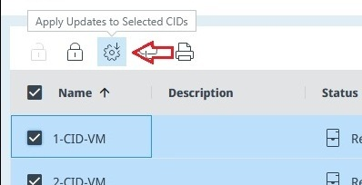
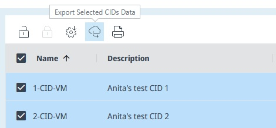

# View List of CIDs

The CIDs list page is the "Home" page of CID Hub and is shown after you log in. You can also open it by clicking the "CIDs" tab in the top navigation bar.

By default the list is sorted by CID name in descending order. Click a column header to change the sort to ascending, descending, or unsorted.

You can filter one or more columns. Click the chevron to the right of a column header to open a filter popup.

### Name
The CID name displayed in CID Hub, which is also the hostname for the physical CID. CDS clients must resolve the CID's IP address using this name.

### Description
A user-provided description of the CID.

### Status
Current state of the CID:
- `New`: The CID record exists but the physical CID has not activated with it yet. Updates cannot be applied in this state.  
- `Disconnected`: The CID is not connected to CID Hub. Updates cannot be applied while disconnected.  
- `CDS not running`: The CID is online but the OpenLab CDS VM is not running. Updates cannot be applied while CDS is stopped.  
- `Server disconnected`: The CID is online and the OpenLab CDS VM is running, but the CID cannot connect to the OpenLab Server. Applying updates in this state is not recommended.  
- `Ready`: The CID is online and the OpenLab CDS VM is running, but the CDS acquisition software is not running. This is the recommended state for applying updates.  
- `In Use`: CDS is currently active on the CID. Applying updates while the CID is in use is discouraged, but not technically blocked.

### Updates
Shows whether updates are required and their current state:
- *(blank)*: No pending updates.  
- `Downloading`: The CID is downloading one or more updates.  
- `Ready`: All pending updates have been downloaded and are ready to install.  
- `Updating`: Updates are currently being applied to the CID.

### Inherit
Indicates whether the CID inherits its software settings from the [server](/howto/define-software-template) or has individual [CID-level exceptions](/howto/configure-software-exceptions).

### Allow Updates
Shows whether the CID is locked against changes. When updates are disallowed, no changes can be applied. After making required changes you can lock a CID to prevent accidental modifications. Changes can only be applied after someone unlocks the CID to allow updates.

### Server Name (FQDN)
The fully qualified domain name of the server the CID is connected to. In multi-server environments you can filter CIDs by server to act on a specific set.

### Date Created
The date and time when the CID record was originally added to CID Hub.

### Last Software Update
The date and time when any software update was last applied to the CID.

### Turn on/off "Allow Updates"
Use the "Turn on 'Allow Updates'" (unlock icon) and "Turn off 'Allow Updates'" (lock icon) buttons above the table to allow or disallow updates for one or more CIDs at once.

### Apply Updates
Use the "Apply Updates" (gear icon) button to initiate updates on one or more selected CIDs.

### Export CID Data
Use the "Export CID Data" (cloud download icon) button to download information about the selected CIDs in JSON format.

### Print Software & Connectivity Reports
Use the "Print Report" (printer icon) button to print information about the selected CIDs.

- Software Report: Summary information for the CID including IP address and installed software versions.  
- Connectivity Report: Shows whether the CID is connected to its instrument and the CID Hub IoT services.

// ...existing code...