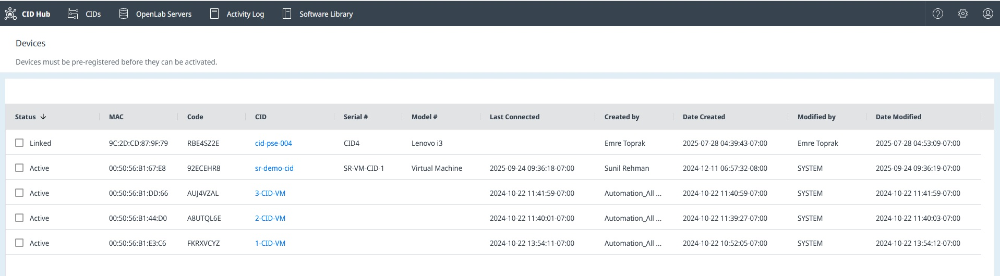

# View Devices

## Overview

The Devices page provides a comprehensive list of all physical CID devices registered to your account. This view is primarily used for administrative and support purposes to track devices from their initial registration to their active state.

To access the Devices page:
1.  Click the **Settings** (gear) icon in the top-right corner of the navigation bar.
2.  From the dropdown menu, select **Devices**.

---

## Sorting and Filtering

The devices list can be sorted by clicking on a column header to cycle through ascending, descending, and unsorted states. You can also filter the list by clicking the chevron to the right of a column header to open a filter popup, similar to the functionality on the [View CIDs](view-cids) page.

---

## Column Descriptions

- **Status**: Indicates the current state of the device's registration and connection:
    -   `Linked`: A record for the CID has been created in the Hub using the unique PIN code from the device's QR code sticker, but the physical device has not yet connected.
    -   `Active`: The physical CID has successfully booted, connected to the CID Hub, and recognized its corresponding record.

- **MAC**: The MAC address for the CID's **House/Corporate NIC**.

- **Code**: The unique PIN code printed on the QR code sticker attached to the physical device. This code is used to link the hardware to its record in the CID Hub.

- **CID**: The name assigned to the CID. Clicking the name navigates to the CID's summary page.

- **Serial #**: The serial number of the physical hardware.

- **Model #**: The model of the IoT hardware (e.g., Lenovo i3).

- **Last Connected**: The timestamp of the last communication from the device to the CID Hub.
    -   For a device that has not yet activated, this timestamp is updated every 5 minutes while the device is powered on and attempting to connect.
    -   Once a device becomes **Active** by completing the activation process, this timestamp is no longer updated.

- **Created by / Date Created**: Shows which user created the device record and when.

- **Modified by / Date Modified**: Shows which user last modified the device record and when.

