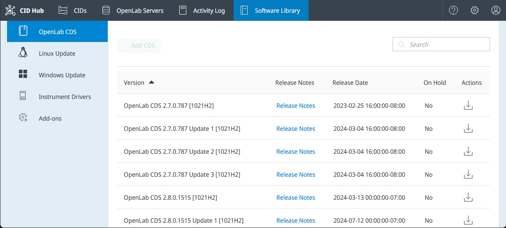
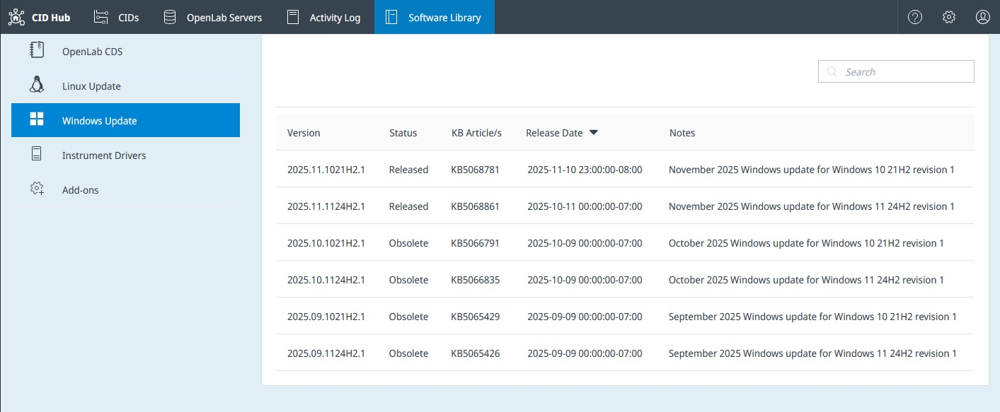
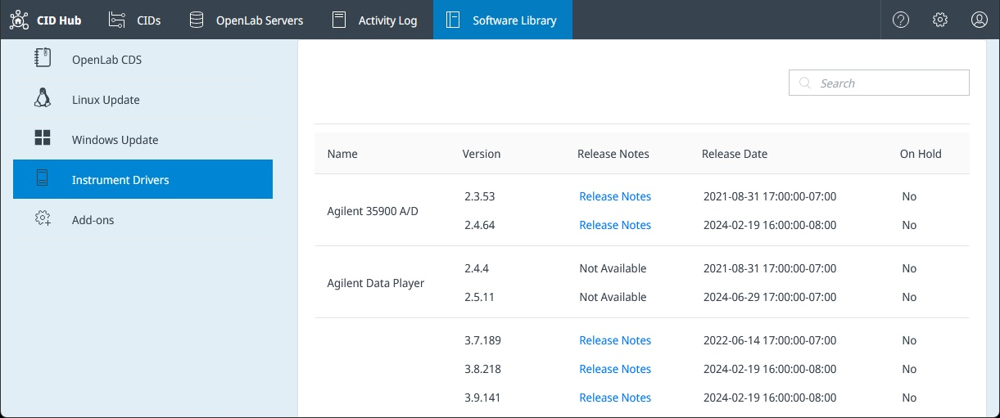

# View Software Library

## Overview

The Software Library is the central catalog in CID Hub for all available software packages. It provides a read-only view for administrators to see available versions of OpenLab CDS, OS updates, instrument drivers, and add-ons.

While this section is for informational purposes, the actual assignment of software to CIDs is managed through [Server Software Templates](./define-software-template) or by configuring [CID-level exceptions](./configure-software-exceptions).

To access the library, click the **Software Library** tab in the top navigation bar.

---

## Navigating the Library

Use the menu on the left to browse through the different software categories. A search bar at the top-right of the content pane allows you to filter the list for a specific package.

### OpenLab CDS

This section lists all available base versions, updates, and feature packs for OpenLab CDS.

- **Release Notes**: Provides a link to the release notes for that specific version.
- **Actions**: Clicking the download icon reveals the KVM image file (`.qcow2`) and its checksum (`.sha256`) which can be downloaded into a [CID Network Share](./register-a-server#cid-network-share-optional-but-recommended). This step is optional but highly recommended when managing numerous CIDs to conserve internet bandwidth. To pre-populate the share, download both files and place them into a `downloads` subfolder on the share.

### Linux and Windows Updates

- **Linux Update**: Shows available cumulative updates for the CID's underlying Oracle Linux operating system.
- **Windows Update**: Lists security updates for the Windows VM that runs OpenLab CDS. It includes the corresponding Microsoft Knowledge Base (KB) article number for reference.

### Instrument Drivers

This section contains a list of all Agilent instrument drivers that have been tested and made available for CIDs. You can view the version, release notes, and release date that are available in the CID Hub.

### Add-ons

This section lists optional add-on software and updates that can be installed on CIDs, such as those for OpenLab Sample Scheduler and GPC software.

