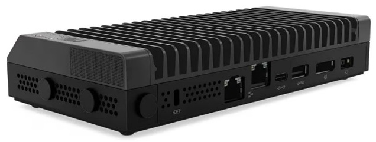
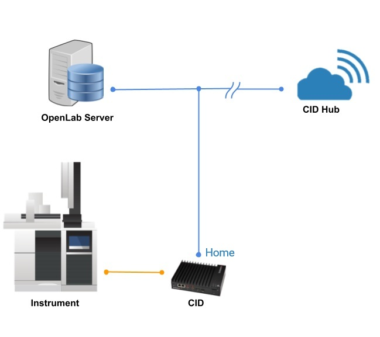

# Introduction

The Agilent Connected Instrument Device (CID) is a pre-configured instrument controller for OpenLab CDS. Each CID ships ready to configure for your lab; the OpenLab Instrument Controller, instrument drivers, and add-ons for your specific instrument are deployed through CID Hub. Your CDS clients connect to the CID over the corporate network to operate the attached instrument, and you manage every CID centrally from CID Hub. Each CID controls one instrument; the 1:1 pairing keeps the tested factory configuration intact for the life of the deployment.

CID Hub is an invitation-only web application. When your organization purchases CIDs, Agilent creates your account and registers the initial administrators. Those administrators receive an email invitation from CID Hub \<no-reply@hub.cid.agilent.com\> to activate their accounts and set their passwords; from there they can invite additional administrators and users who need access.

## Deployment and lifecycle

Each CID arrives as a tested, ready-to-configure bundle. The hardware, the base operating system, and the CID agent are supplied and pre-installed by Agilent. You then configure the CID for your lab through CID Hub by selecting from provisioned options in a software template (the OpenLab Instrument Controller version, the instrument drivers, and the add-ons for your specific instrument).

In practice, the only thing that changes for a CID between the factory and your lab is the *environment around it*: the network connections from the CDS clients to the CID, from the CID to the OpenLab Server, and from the CID outbound to the Hub. You only need to ensure the network is configured to support those connections plus the CDS workflows you actually run. The base CID and the software it loads from the Hub are tested by Agilent as a unit, so the software inside the CID does not need re-checking.

Throughout the CID's lifecycle this property carries forward. The CID core configuration remains, and each update published by Agilent is tested and verified against the same configuration in the factory.
