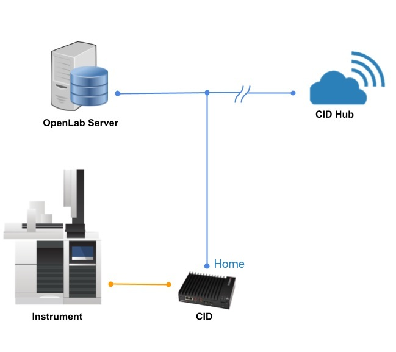

# Introduction

The **Agilent Connected Instrument Device (CID)** for **OpenLab Chromatography Data System (CDS)** is a pre-configured IoT solution that includes the OpenLab Instrument Controller software, drivers, and add-ons. CDS client systems connect to the CID over the corporate network (intranet) to operate the attached instruments. Software configuration and management for the CID are centralized through a web application called **CID Hub**.

