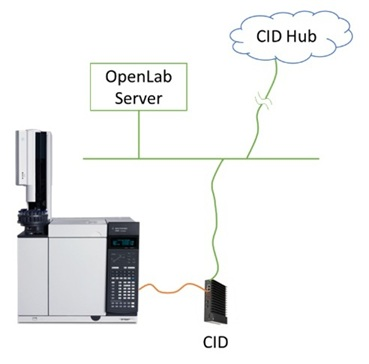

# Quick Start

## 1. Verify DNS/DHCP Requirements
If your DHCP servers do not support dynamic DNS registration (RFC 2136) for Linux clients, you must use the MAC address printed on the CID's QR code to explicitly register its hostname in DNS and reserve its IP in DHCP. See "[DHCP and DNS Requirements](system-requirements#dhcp-and-dns-requirements)" for details.

---

## 2. Verify Internet Requirements
Make sure that your firewall allows CIDs to connect to websites hosted by Agilent and Microsoft for activation and software updates. See "[Internet Requirements](system-requirements#internet-requirements)" for details.

---

## 3. Connect the CID
Connect the CID to the instrument and your corporate network, then power it on. See "[Supported Topologies](system-requirements#supported-topologies)" for details on making these connections.

- Connect the port labeled “Home” to the corporate network. This connects the CID to the OpenLab Server and the internet.
- Connect the network port labeled “Instrument” directly to the instrument or to an instrument-only network (LAN/VLAN).
-	Connect the power cable and turn on the CID.
-	On bootup, the CID connects to the CID Hub via the internet. If successful, it will beep three times every 30 seconds until the CID is [added to the Hub](#6-add-the-cid-to-the-cid-hub). See the troubleshooting tips in "[Internet Requirements](system-requirements#internet-requirements)" for other beep codes.

---

## 4. Register OpenLab Server
Register your OpenLab Server information in the CID Hub.
- Login to the CID Hub at https://hub.cid.agilent.com/.
- Click on “OpenLab Servers” in the navigation bar.
- Click on “Register Server”.
- Provide details about your server in the pop-up dialog and click **Save**.

See "[Register an OpenLab Server](howto/register-a-server)" for details.

---

## 5. Define Software Requirements
Define the software configuration to apply to the CIDs.
- Click on your server’s entry in the list of OpenLab Servers.
- Click on “CID Software” tab on the left side.
- Select the CDS version you want to use.
- Select the specific driver and add-on versions you want on the CIDs.

See "[Define a Software Template](howto/define-software-template)" for details.

:::info[Important]
The CDS and Driver versions you select for CIDs must match what is installed on the CDS clients.
:::

---

## 6. Add the CID to the CID Hub
Add a record for your CID in the CID Hub.
- Click on the “CIDs” tab in the top navigation bar.
- Click on “Add”.
- Provide information about your CID in the pop-up dialog and click **Save**.
  - It is recommended to use 15 or fewer lowercase alphanumeric characters to name your CIDs (e.g., `cid-gc35`).
  - The PIN code is the 8-character alphanumeric code on the QR code sticker on the CID. Enter it without the dash (`-`).
- Shortly after the CID is added, it will recognize that a linked record exists in the CID Hub, stop beeping, and begin the activation process.
  - The “Recent Activity” section of the CID’s summary tab will show logs of events occurring on the CID.
-	When activation is complete, its status will show as “Ready” in the CIDs list.

---

## 7. Configure the Instrument in OpenLab Control Panel
- Follow the instructions in the “OpenLab CDS - Client AIC Guide” to "[add an instrument](https://openlab.help.agilent.com/en/index.htm#t=mergedProjects%2FControlPanel%2FAddInstrument.htm)" and "[configure it](https://openlab.help.agilent.com/en/index.htm#t=mergedProjects%2FControlPanel%2FConfigure_instrument.htm)".

:::info[Note]
Using multiple instruments on a single CID is not supported.
:::
