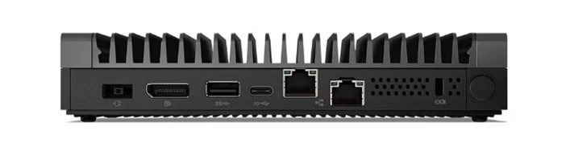
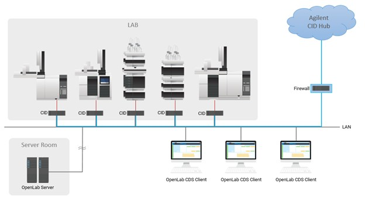
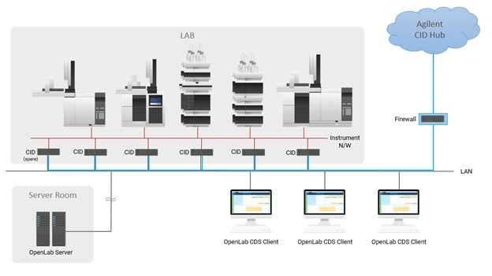

# System requirements

This page lists the network, internet, DNS, certificate, and security requirements for a CID deployment. Each CID controls one instrument; the requirements below apply per device. Sections follow the deployment flow: rack and cable, identify the device, address it on the network, choose a topology. Optional services and firewall rules follow, with customer security obligations summarized at the end.

## Networking requirements

Each CID is equipped with two network interfaces:

- *House NIC:* connects to the corporate LAN and provides access to the OpenLab Server and the internet.
- *Instrument NIC:* connects to analytical instruments, either directly or via a dedicated instrument LAN/VLAN.

The traffic each NIC must carry is summarized below; the firewall rules behind the outbound internet entries are detailed under [Internet requirements](#internet-requirements). In the tables below, *outbound* and *inbound* are from the CID's perspective.

### House NIC: corporate LAN and internet

| Direction | Intranet (corporate LAN) | Internet |
| --- | --- | --- |
| Outbound | DHCP, DNS; HTTPS 443 (OpenLab Shared Services (OLSS), OpenLab Server REST APIs, Sample Scheduler, Data Collection); TCP 6570 (OpenLab Licensing API); HTTP/HTTPS to ECM 3.x; SMB (optional network share). | See [Internet requirements](#internet-requirements) below. |
| Inbound | HTTPS (Acquisition Server, diagnostics); SSH and ICMP (troubleshooting, optional). | None required. |

### Instrument NIC: instrument network

| Direction | Intranet (instrument LAN/VLAN) | Internet |
| --- | --- | --- |
| Outbound | Acquisition Server to instrument (instrument-specific ports); isolated and unrestricted communication is recommended. | None required. |
| Inbound | Instrument to Acquisition Server (instrument-specific ports); isolated and unrestricted communication is recommended. | None required. |

See [Security model: Two-NIC trust topology](../security/security-model#two-nic-trust-topology).

---

## Device identification (MAC and PIN)

Every CID ships with a QR code sticker on the chassis carrying two identifiers used during network setup and activation:

- The 12-character House NIC MAC address, used to reserve a DHCP lease or register a static DNS record for the device.
- The 8-character PIN, used during activation to link the physical CID with its record in CID Hub.

---

## DHCP and DNS requirements

The CID uses DHCP by default on both interfaces. After activation, you can apply a static configuration to either network.

- **House network**
    - When first connected, the CID's House network uses DHCP to acquire an IP address, DNS servers, and DNS search strings. After activation, a static configuration can be applied.
    - On activation, the CID updates its hostname from the factory default (`agilent-cid`) to the name specified in CID Hub, then reboots.
    - If your DHCP servers support dynamic DNS registration (RFC 2136) for Linux systems, the DHCP server registers the CID hostname automatically with the DNS server.
    - Otherwise, the desired CID hostnames must be explicitly registered in DHCP and DNS using the device's House MAC address (printed on the QR code label).
    - During activation, the CID validates name resolution using `nslookup <hostname>`.
    - CDS clients must resolve CID hostnames to their IP addresses for proper operation.
- **Instrument network**
    - By default, instrument networks are also configured to use DHCP. After activation, a static configuration can be applied to the instrument network.

---

## Supported topologies

Two network topologies are supported for connecting an instrument to the CID.

### Direct instrument connection

- The House NIC connects to the corporate LAN.
- The Instrument NIC connects directly to the instrument.
- Example: the instrument is set to a static IP of `192.168.1.2`, and the CID Instrument NIC is set to `192.168.1.3`.

### Instrument LAN/VLAN connection

- The House NIC connects to the corporate LAN.
- Instruments and the CID are placed on a dedicated LAN or VLAN.
- Instrument IP assignment may be DHCP or static.

---

## Optional network share

CIDs optionally support using an SMB (Server Message Block) share accessible over the local LAN. In environments with many CIDs, this helps optimize performance and reduce internet bandwidth requirements.

The SMB share must be reachable from the device with at least read permissions to fetch required files. If write access is granted as well, the device can automatically copy downloaded files into the share, making them available for other devices and avoiding repeated downloads.

- *Full access (recommended):* cache downloaded CDS VM images for other CIDs to use.
- *Read access:* use cached CDS VM images from the network share instead of downloading them from CID Hub.

This is configurable during OpenLab Server registration or later via CID Hub.

:::note
After making changes to server settings, CIDs must be rebooted for the changes to take effect. The User Principal Name (UPN) format is recommended for usernames (for example, `username@domain.com`).
:::

---

## SSL certificate requirements for HTTPS

CIDs validate the server certificate of every HTTPS endpoint they connect to. Which certificate authorities are accepted depends on the server type.

### ECM 3.x

To successfully run an ECM 3.x server over HTTPS in an environment with CIDs, you must use a publicly trusted SSL certificate. Certificates issued by internal, corporate, or self-signed certificate authorities (CAs) are not recognized by CIDs.

### ECM XT / OpenLab Server

Certificates issued by internal, corporate, or self-signed certificate authorities (CAs), as well as publicly trusted certificates, may be used for running ECM XT / OpenLab Servers over HTTPS in an environment with CIDs.

:::note
Self-generated certificates (internal/corporate CAs and self-signed) must include the Authority Information Access (AIA) extension with URLs that provide access to the root and any intermediate certificates. Self-generated certificates without proper AIA configuration may not function correctly.

Enterprise PKI infrastructure such as Microsoft AD CS, commercial PKI management platforms (for example, Venafi or DigiCert), or cloud-based solutions (for example, AWS ACM Private CA) can be configured to include AIA extensions automatically.

Publicly trusted certificates do not require AIA, because their roots are pre-installed in the CID's trust stores.
:::

---

## Internet requirements

:::important
Your firewall must be configured to allow outbound communication from CIDs to the domains listed below.
:::

CIDs require a continuously available internet connection, not only at activation but for the life of the deployment. The CID uses it to apply security updates, sync time, refresh trusted certificate authorities, report status to CID Hub, and accept on-demand support sessions. OpenLab CDS does not require internet access for its core function of acquiring and processing data from instruments. If the internet path is interrupted, local CDS acquisition and processing continue, and only Hub-mediated functions become unavailable.

All internet traffic is outbound and CID-initiated. Every domain listed below is contacted by the CID over an outbound TLS session that the CID opens; no inbound internet connection is required for the CID to function.

### CID Hub and AWS services

| Domain | Direction | Port (Protocol) | Purpose |
|---|---|---|---|
| `*.agilent.com` | Outbound | 443 (HTTPS, WSS) | Registration API contacted by the CID at activation, and the CloudFront distribution at `files.cid.agilent.com` from which the CID fetches CID images, driver packages, and CDS installers. |
| `*.iot.us-east-1.amazonaws.com` | Outbound | 443 (HTTPS, WSS / MQTT-over-WSS) | AWS IoT Core endpoint (device shadow, command/job channel, and telemetry between the CID and CID Hub). The CID currently connects to `a3cb4mwmdz2oep-ats.iot.us-east-1.amazonaws.com`. Because this hostname can change, Agilent recommends allow-listing the wildcard for a stable, long-lived rule. |
| `data.tunneling.iot.us-east-1.amazonaws.com` | Outbound | 443 (WSS) | AWS IoT Secure Tunneling data plane. The CID joins as the tunnel destination endpoint when a Hub user starts a Windows VM console or Linux Cockpit session, and disconnects when the session ends. See [Remote access](../security/remote-access). |
| `agilent-aws-prd-51-ac-images.s3.amazonaws.com` | Outbound | 443 (HTTPS) | Legacy image fetch path. CIDs on a Linux Update older than 2026.01.12 download CID images from this S3 bucket. Newer CIDs use the CloudFront distribution under `*.agilent.com`. |
| `*.s3.us-west-2.amazonaws.com` | Outbound | 443 (HTTPS) | Linux package mirror used by the CID's Oracle Linux host (ClamAV antivirus definitions and the OL8 third-party RPM repository). The CID currently connects to `agilent-aws-sbx-51-yum-rpm-repo.s3.us-west-2.amazonaws.com`. Because this hostname can change, Agilent recommends allow-listing the wildcard for a stable, long-lived rule. |

**Single production region.** CID Hub runs in AWS `us-east-1`. Every CID and Hub user connects to one predictable region for AWS IoT Core, Secure Tunneling, and data residency. The only outbound traffic that leaves `us-east-1` is the Linux package mirror in `us-west-2` (antivirus definitions and OL8 packages, listed separately above).

**Image delivery transitioned to CloudFront.** Linux Update 2026.01.12 introduced CloudFront-based image delivery. CIDs on this update or newer fetch CID images, drivers, and CDS installers through `files.cid.agilent.com` (covered by `*.agilent.com`). If your fleet includes any CID still on an older Linux Update, also keep `agilent-aws-prd-51-ac-images.s3.amazonaws.com` reachable so those devices can fetch images.

### Windows Update

| Domain | Direction | Port (Protocol) | Purpose |
|---|---|---|---|
| `*.microsoft.com` | Outbound | 443 (HTTPS) | Windows Update service. |
| `*.cloudfront.net`, `*.trafficmanager.net`, `*.azurefd.net`, `*.blob.core.windows.net` | Outbound | 443 (HTTPS) | CDN, traffic-management, and binary-blob endpoints used by Windows Update and the PowerShell Gallery. |
| `*.oneget.org`, `*.powershellgallery.com` | Outbound | 443 (HTTPS) | PowerShell package sources used by the embedded Windows VM. |

The Windows VM reaches these endpoints through the Linux host via NAT on the House NIC; the VM has no separate egress path.

**Endpoint set evolves.** Microsoft adds and rotates CDN, Azure Front Door, and binary-delivery hosts continuously. The wildcards above remain stable for firewalls that filter by FQDN or SNI. Firewalls that filter by IP must refresh the rule set periodically against Microsoft's authoritative published list. To identify which specific hostnames the CID's Windows VM is contacting at a given time, monitor outbound DNS from the VM.

### Time synchronization

| Domain | Direction | Port (Protocol) | Purpose |
|---|---|---|---|
| `*.pool.ntp.org` | Outbound | 123 (Network Time Protocol (NTP), UDP) | Public NTP pool used by the CID's chrony service. Accurate time is required for TLS certificate validation, AWS IoT Core authentication, and audit-log timestamps. |

**Pool peers rotate.** `pool.ntp.org` returns rotating A records, and the underlying servers and IPs change continuously. The wildcard remains stable for firewalls filtering by FQDN. For firewalls filtering by IP, permitting UDP/123 to the wildcard FQDN is preferred over maintaining a list of pool IPs. To see the peers the CID has currently selected, run `chronyc sources` on the CID.

### Behavior when an endpoint is blocked

The CID does not fail silently; the symptom depends on which endpoint is unreachable.

- **`*.agilent.com` unreachable at boot.** The CID emits boot-time beep codes (2 beeps when the registration API cannot be reached at activation; 4 beeps for an activated CID that cannot reach the API on bootup). See [`CID-BOOT-01`: Beep codes on startup](/cid-boot-01).
- **AWS IoT Core unreachable.** CID Hub shows the device as **Disconnected**. Hub-initiated commands and configuration changes cannot reach the CID until connectivity is restored. Local CDS data acquisition and processing continue unaffected.
- **AWS IoT Secure Tunneling unreachable.** Windows VM console and Linux Cockpit sessions initiated from CID Hub cannot be opened, or fail mid-session. The device itself stays connected to AWS IoT Core, and local CDS operation is unaffected.
- **S3 or CloudFront unreachable.** Image, driver, and CDS package downloads fail with a network error surfaced in the Hub's job and activity log. The CID continues to run with the software it already has.
- **Microsoft Update endpoints blocked.** Windows Update fails inside the VM. The CID continues to run but stops receiving Windows security patches.
- **NTP blocked.** Time drift accumulates; eventually TLS handshakes, AWS IoT Core authentication, and CDS client/server setup against the OpenLab Server start failing. See [`CID-NET-04`: NTP time-sync failure](/cid-net-04).

For symptoms and connectivity tests, see [**CID-NET-00** — Verify CID internet connectivity](/cid-net-00) (`CID-NET-00..06`).

---

## Security requirements

Security on a CID deployment is a shared responsibility between Agilent and the customer. The list below is the customer-facing half: the concrete security obligations a customer organization must satisfy for the deployment to be sound. For the full Agilent-owns / customer-owns split and the reasoning behind it, see [Security model: Shared responsibility](../security/security-model#shared-responsibility).

- **Network firewall and segmentation.** Configure the corporate firewall to permit the outbound domains under [Internet requirements](#internet-requirements), and isolate the Instrument NIC's LAN/VLAN from the corporate WAN and the internet.
- **Physical security of the CID.** Restrict physical access to the device. Full-disk encryption is not applied on the CID, so physical and network controls are the primary at-rest protection on the device itself.
- **Hub user lifecycle.** Invite and remove CID Hub users, assign roles, and offboard users when they leave the organization.
- **Active Directory and corporate identity.** Manage AD or IdP configuration for CDS clients and other customer-managed Windows PCs. The CID's embedded Windows VM does not join AD.
- **Update authorization.** Authorize when Agilent-delivered updates (Linux, Windows, drivers, CDS) are applied within your change-management window, and confirm via the activity log that they landed.
- **CDS client PCs and traditional AICs.** OS patching, anti-malware, screen-lock policy, password-cache policy, accurate system clock, and physical access: CID Hub does not manage these systems.
- **Sample-data retention and backup.** The true record of sample data lives on the OpenLab CDS Server, which is customer-operated and customer-backed-up. Agilent does not back up CID-local CDS data.
- **Audit-log review.** Incorporate the CID Hub activity log into your own monitoring, review, or SIEM workflow.
- **Approval of Agilent support requests.** When an Agilent engineer requests remote access to a CID for troubleshooting, a Hub user at the customer site must approve or decline the request and close the session when work is complete.
