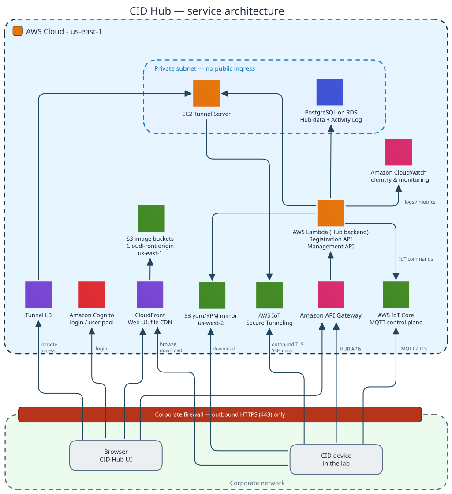

# CID Hub architecture

The CID Hub is the Software-as-a-Service (SaaS) control plane that activates CIDs, distributes software and configuration, mediates Agilent-support tunnels, and stores the Activity Log of administrative actions. Agilent hosts and operates the Hub as a fully managed service, and access is included with your CID purchase, so there is no Hub software for you to install, host, patch, or maintain. The Hub is not offered as installable software for on-premise or private-cloud deployment. This page describes the Hub's AWS service inventory, multi-tenant isolation model, and region / residency posture.

## AWS service inventory

The Hub is composed of the following AWS services. All are managed by Agilent; customers do not provision or operate any of them.

**Directly accessed by the CID or the customer browser**. These endpoints terminate CID- or browser-initiated outbound Transport Layer Security (TLS) sessions, and are the ones that appear in the CID firewall allow-list or in users' browsers.

| Service | Role in the Hub | Customer-visible domain |
|---|---|---|
| **Amazon Cognito** | User directory and authentication for the Hub Web UI. One user pool per environment, partitioned per tenant at the application layer. | `*.agilent.com` |
| **CloudFront (Web UI, file CDN)** | Front-end delivery for the Hub Web UI (static site on S3) and the content-delivery network (CDN) for software images and bundles delivered to CIDs. | `*.agilent.com` |
| **Amazon API Gateway** | Front door for the Hub REST APIs, routing requests to the Lambda backend. | `*.agilent.com` |
| **AWS IoT Core** | Message Queuing Telemetry Transport (MQTT) control plane for CIDs. CID ⇄ Hub commands, shadow state, status telemetry. | `*.iot.us-east-1.amazonaws.com` |
| **S3 yum/RPM mirror** | Linux package mirror in `us-west-2`: OL8 third-party RPMs and ClamAV antivirus definitions for the CID's Oracle Linux host. Carries only Agilent-built OS packages, no customer or device data. Pulled directly by the CID's Linux host over HTTPS, not via CloudFront or the Hub. | `*.s3.us-west-2.amazonaws.com` |
| **Tunnel LB** | Public entry point for browser-based remote console sessions. Terminates TLS, validates the session cookie, and forwards to the EC2 Tunnel Server in the private subnet. | `*.agilent.com` |
| **AWS IoT Secure Tunneling** | Data plane for on-demand support tunnels to Linux Cockpit / Windows VM console. The CID joins this endpoint outbound as the tunnel destination when a Hub user starts a session; the EC2 Tunnel Server is the source side. Agilent-support sessions require approval from your organization. | `*.iot.us-east-1.amazonaws.com` |

**Note:** The domains above are the wildcards used in the CID firewall allow-list; for the exact hostnames and the required ports, see the [Internet requirements](../reference/system-requirements#internet-requirements) section of System requirements.

**Internal, reached only through another Hub service**. These are not directly reachable from the CID or a browser; each sits behind one of the endpoints above or inside the private subnet.

| Service | Role in the Hub | Reachability |
|---|---|---|
| **AWS Lambda (Hub backend)** | Serverless backend behind API Gateway: the Registration API (called by CIDs at activation) and the Management API (called by the Web UI). | Behind API Gateway |
| **S3 image buckets** | Origin storage (`us-east-1`) behind CloudFront for the software images and bundles delivered to CIDs. | Behind CloudFront |
| **Amazon CloudWatch** | Operational telemetry and monitoring for the Hub: collects logs, metrics, and alarms from the Lambda backend and the other Hub services. Used by Agilent operations to observe service health; it does not store customer business data. | Internal only (Agilent operations) |
| **EC2 Tunnel Server** | Companion service for the support-tunnel join flow, in the private subnet. One instance per environment, reachable only through the Tunnel LB (browser sessions) and the Management API's internal load balancer; its security group permits only the load-balancer ports. It joins the CID's tunnel outbound via AWS IoT Secure Tunneling. | Internal only (private subnet) |
| **PostgreSQL on RDS** | Authoritative store for Hub state: customer accounts, users, CID records, software templates, and Activity Log. Encrypted at rest, deployed in a private subnet, not reachable from the public internet. | Internal only |

## Software delivery from the Hub

Beyond identity, control, and traceability, the Hub is the channel through which Agilent delivers a tested software stack to every CID in the field. Updates are produced and validated centrally and then made available through the Hub:

- **Linux and Windows OS updates**. Microsoft KB articles for the embedded Windows 11 VM and Linux package updates for the Oracle Linux host are vetted by Agilent against the CID stack. Approved updates are provisioned for customer environments through the Hub.
- **OpenLab CDS releases**. New CDS releases are published to the Hub after testing the corresponding Windows VM image on standard CID hardware in a laboratory setting.
- **Instrument drivers and add-ons**. Instrument drivers and CDS add-ons are published to the Software Library after compatibility testing against the CID stack.

Each update is tested against the same hardware-and-software target that the receiving CID runs, so every payload has already been exercised on the device stack it lands on.

## Service availability

The CID Hub carries a contractual service level of 99% annual System Availability, defined in the CID Hub end-user license agreement.

## Multi-tenancy and isolation

The Hub is a *multi-tenant SaaS* platform: many customer organizations share one set of AWS services, with each organization isolated as a separate *customer account* (tenant) at the application layer:

- **Database scoping**. Every business object (users, CIDs, software templates, Activity Log entries) carries a tenant identifier linked to the owning customer account. Backend APIs and the Web UI scope every query by the authenticated user's tenant; queries return only the calling tenant's data.
- **AWS IoT topic scoping**. IoT topic rules and message queues are scoped per environment. CID shadow updates are routed by the IoT Thing name, which is unique to each CID. Each CID record is linked in the Hub database to its owning customer account, so a CID's IoT traffic resolves to a single tenant.
- **Cognito**. A single user pool per environment is partitioned per tenant by a tenant attribute on the user record. A user from one tenant cannot enumerate, view, or act on resources in another tenant.
- **Agilent-internal roles**. A dedicated internal role exists for Agilent support staff. Agilent users have view-only access across tenants, cannot register CIDs or servers on a customer's behalf, and cannot approve remote-access requests.
- **Activity Log scoping**. Customer users see only their own tenant's Activity Log.

The CID device itself does not hold customer-account identifiers in cleartext beyond the operational metadata needed for registration and authentication. User names and emails live on the Hub side in Cognito. See [Data flow and privacy](./data-flow-and-privacy) for the device-side data inventory.

## Region and data residency

The production CID Hub is hosted in a single AWS region:

- **Primary region: `us-east-1` (N. Virginia)**. All Hub services that touch customer or device data (Cognito, IoT Core, IoT Secure Tunneling, Registration API, Management API, the PostgreSQL data store, the Tunnel Server EC2, and the image bucket origin) run in `us-east-1`.
- **Image delivery via CloudFront**. Software images and the Web UI are fronted by Amazon CloudFront (`files.cid.agilent.com`); the origin remains `us-east-1`.
- **Linux package mirror: `us-west-2` (Oregon)**. The CID Linux update channel is served from an S3 bucket in `us-west-2`. This bucket carries only Agilent-built OS packages; it does not hold any customer or device data.

The CID's network reach is constrained to these endpoints by the firewall allow-list in the [Internet requirements](../reference/system-requirements#internet-requirements) section of System requirements. See [Data flow and privacy](./data-flow-and-privacy) for the categories of data that travel each path.

## Encryption posture

- **Data in transit**. All CID ⇄ Hub traffic is TLS-encrypted: HTTPS for REST and file transfer, MQTT-over-TLS for the IoT control plane, TLS for IoT Secure Tunneling.
- **Data at rest**. The PostgreSQL RDS instance is encrypted at rest. S3 buckets behind CloudFront use server-side encryption. Cognito stores its credential material under AWS-managed encryption.
- **Sensitive fields**. Hub-managed sensitive values (OpenLab Server passwords, rotated device credentials) are encrypted end-to-end: at rest, in the AWS IoT shadow, and in transit. They are masked (`****`) in management-API responses and Activity Log views.

## Operational boundary

The Hub services above are Agilent-operated. Customers do not need to deploy, patch, scale, or back up the Hub, and do not need to stand up any of this infrastructure in their own environment, whether on-premise, private cloud, or another public-cloud account. The Hub runs only in Agilent's AWS account as a managed service. AWS account ownership, Identity and Access Management (IAM), networking, OS patching of EC2 (Tunnel Server), and database administration are inside Agilent's operational boundary. The customer-side responsibilities (corporate-firewall egress, CDS clients, OpenLab Server, instrument LAN) are summarized in the [Shared responsibility](./security-model#shared-responsibility) section of Security model.

## See also

- [Security model](./security-model): trust boundaries between corporate LAN, CID, and Hub; device identity (X.509) and user identity (Cognito).
- [Data flow and privacy](./data-flow-and-privacy): nine-category inventory of what crosses the CID ⇄ Hub boundary, retention, and what does not transit the Hub.
- [Remote access](./remote-access): Windows console, Linux Cockpit, and the Agilent-support tunnel flow that uses AWS IoT Secure Tunneling.
- [Traceability and compliance](./traceability-and-compliance): Activity Log retention, integrity, and the CID's relationship to 21 CFR Part 11 and EU GMP Annex 11.
- [System requirements](../reference/system-requirements): the customer-facing firewall allow-list and the shared-responsibility table.
