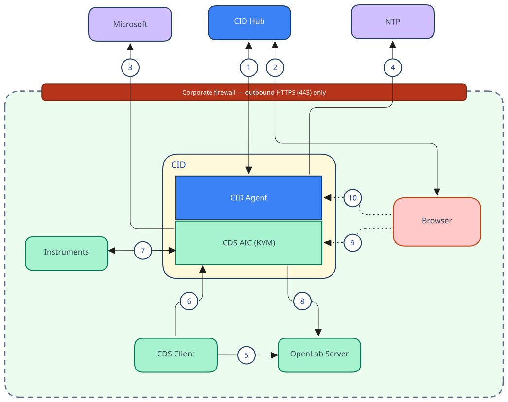

# Data flow and privacy

This page describes the data flows in a CID solution. It covers what moves between the CID, your local OpenLab systems, the CID Hub, and external services; what stays on your local network; how data is protected in transit; and where and for how long the Hub stores it. It is written for IT and security teams reviewing a CID deployment.

## Data-flow paths

The diagram below shows every path that carries data to or from a CID, grouped by where it goes. Inside the corporate firewall the CID runs two parts: the *CID Agent* (the Linux host and its services) and the *CDS AIC VM* (the Windows virtual machine that runs the OpenLab CDS Analytical Instrument Controller, or AIC).

**Crosses the corporate firewall (outbound, TLS):**

1. **CID Agent ↔ CID Hub:** operational metadata, configuration, commands, software downloads, and credentials.
2. **Browser ↔ CID Hub:** managing CIDs (registration, software, configuration, and administrative actions), monitoring device health, and managing users.
3. **CDS AIC VM → Microsoft:** Windows and PowerShell updates.
4. **CID Agent → NTP:** time synchronization.

**Stays on your local network:**

5. **CDS Client → OpenLab Server:** projects, methods, results, authentication, and configuration.
6. **CDS Client → CDS AIC VM:** online instrument control and real-time monitoring.
7. **Instruments ↔ CDS AIC VM:** instrument control and raw data acquisition.
8. **CDS AIC VM → OpenLab Server:** transferring acquired data to central storage.

**Remote access (customer-controlled):**

9, 10. Browser-based access to the Windows VM console and Linux Cockpit, relayed through the Hub. See [Remote access](./remote-access).

## At a glance

The CID exchanges only operational metadata, configuration, and credentials with the CID Hub. Your laboratory data stays on your local network.

- No PHI (Protected Health Information) is transmitted between the CID and the Hub.
- No PII (Personally Identifiable Information) is transmitted beyond the names and email addresses of the users you choose to invite to administer your tenant. Those identifiers are stored in AWS Cognito on the Hub side; they are not stored on the CID device itself.
- No laboratory data, sample data, chromatograms, or analytical results are transmitted to the Hub. Those remain on your local network and are handled by [OpenLab CDS](https://www.agilent.com/en/product/software-informatics/analytical-software-suite/chromatography-data-systems/openlab-cds).
- All traffic that leaves your network is encrypted in transit with TLS.

## Encryption in transit

Every path that crosses the corporate firewall (lines 1–4 in the diagram) is encrypted with TLS. REST calls and file transfers use HTTPS; the IoT control plane uses MQTT over TLS. No CID traffic leaves your network unencrypted.

## What stays on your local network

The CID hosts the CDS AIC VM and manages the CDS installation and its updates, but the CID Agent and the CID Hub have no insight into what CDS does with your data. The OpenLab CDS data flows (lines 5–8) run entirely within CDS and your local network. Neither the CID Agent nor the Hub sees, routes, or stores any of this content; to the CID management plane, CDS data handling is a black box.

For reference, the local CDS path works as follows. Instruments connect to the CDS AIC VM, which controls them and acquires the raw data (line 7). CDS clients connect to the AIC for online instrument control and real-time monitoring during a run (line 6), and to the OpenLab Server for projects, methods, results, authentication, and configuration (line 5). The AIC transfers acquired data to the OpenLab Server, which provides central storage through OpenLab Shared Services and Content Management (line 8).

The following are handled entirely by OpenLab CDS:

- Chromatograms, mass spectra, UV/DAD spectra, and all other instrument acquisition data.
- Sample sequences, methods, processed results, and reports.
- Electronic records and signatures governed by 21 CFR Part 11 / EU GMP Annex 11 (these are CDS responsibilities; deploying CDS on a CID does not change the documented CDS Part 11 posture).
- LIMS / ELN integration traffic between CDS and your informatics systems.

## What the CID exchanges with the Hub

Lines 1 and 2 carry everything that crosses the CID to Hub boundary. The table below is the authoritative inventory: line 1 is the CID Agent talking to the Hub, and line 2 is the browser-driven administration recorded on the Hub (the User Actions row).

### Data categories

The Visible in Hub UI column indicates whether you, subject to your assigned role, can inspect that data category in the CID Hub portal. Security material such as device-identity certificates and private keys is never displayed. Trusted CAs that you import are public certificates and are visible on the [Certificate Authorities page](../howto/setup/manage-certificate-authorities).

| Data category        | Direction     | Contains sensitive data           | Transport               | Visible in Hub UI |
| -------------------- | ------------- | --------------------------------- | ----------------------- | ----------------- |
| Device Registration  | CID → Hub     | No                                | HTTPS / TLS             | Yes               |
| IoT Credentials      | Hub → CID     | Yes (X.509 certificates)          | HTTPS / TLS             | No                |
| Agent-Reported State | CID → Hub     | No                                | MQTT / TLS (IoT shadow) | Yes               |
| Hub Commands         | Hub → CID     | Sometimes (configuration data)    | MQTT / TLS              | Yes               |
| Software Downloads   | Hub → CID     | No                                | HTTPS / TLS             | Yes               |
| Password Updates     | Hub → CID     | Yes (rotated credentials)         | MQTT / TLS              | Yes               |
| Activity Logs        | CID → Hub     | No                                | HTTPS / TLS             | Yes               |
| Configuration Data   | Bidirectional | Partial (IP addresses, hostnames) | HTTPS or MQTT / TLS     | Yes               |
| User Actions         | Browser → Hub | No                                | HTTPS / TLS             | Yes               |

### Field-level inventory

The fields below are the complete set the CID Agent reports to the Hub. Every field travels CID to Hub only. Only customer-friendly identifiers are surfaced; low-level instrument-network metadata is not sent. Most fields are operational identifiers classified Low; the fields touching network or service-account identity are classified Medium.

| Field / category | Description | Sensitivity |
|---|---|---|
| `mac_address` | Device MAC address used for registration | Low (device identifier) |
| `identity` / `platform` | Host OS type (for example, oracle-linux) | Low |
| `acImageVersion` / `acImageId` | CID agent image version | Low (operational) |
| `aicImageVersion` / `aicImageId` | Windows VM (AIC) image version | Low (operational) |
| `driverIds` | Installed CDS instrument driver versions | Low (operational) |
| `windowsUpdateIds` | Applied Windows updates | Low (operational) |
| `ac_client.version` | Agent client version | Low |
| `ac_update.version` | Update utility version | Low |
| `instruments_info[]` | Connected instrument metadata (model, serial, status); no sample or analytical data | Low |
| `network_cards` | Linux host NIC configuration (IP, VLAN) | Medium (infrastructure) |
| `aic_network_cards` | Windows VM NIC configuration (IP, VLAN) | Medium (infrastructure) |
| `agent` | Daemon status, uptime | Low |
| `cid_connectivity` | Connectivity status, last check, type | Low |
| `aic.olss_server_fqdn` | OpenLab Server hostname | Medium (infrastructure) |
| `aic.olss_connection_type` | Connection type to OpenLab Server | Low |
| `aic.olss_username` | OpenLab service-account username | Medium (internal-user identifier) |
| `command` | Command name, status, progress, parameters | Low (operational) |
| `name` (thing name) | Device hostname | Low |
| `windows_vm` | VM state, uptime | Low |
| `certificate_authorities` | Trusted CA list, sync status | Low |
| `downloads[]` | Download progress (presigned URL stripped before send) | Low |
| `recent_cid_actions[]` | Event-log entries (installs, reboots, configuration changes) | Low (operational) |
| `reported_date` | ISO 8601 timestamp of the report | Low |
| `version` | Incrementing state-version number | Low |

**Sanitized before transmission or storage**. Secrets such as account passwords, private keys, and service credentials are stripped on the device before any state is reported. They are never transmitted to the Hub or stored there.

## What the CID fetches from external services

Beyond the Hub, the CID reaches two kinds of external service directly (lines 3 and 4). Software and time come in; no customer or device data goes out.

- **Microsoft (line 3)**. Windows and PowerShell updates for the CDS AIC VM.
- **NTP (line 4)**. Time synchronization.

See [Internet requirements](../reference/system-requirements#internet-requirements) for the corresponding firewall allow-list.

## Administration through the Hub

Administrators reach the Hub only through its web UI in a browser (line 2); the browser never connects directly to a CID. Sign-in is handled by AWS Cognito, and the only personal data involved is the administrator names and email addresses. Actions taken in the portal are sent to the Hub and recorded as the User Actions described in the [data categories](#data-categories) table.

Remote access (lines 9 and 10) is the one path where the browser reaches into a CID, relayed through the Hub. See [Remote access](./remote-access).

## What the Hub stores and for how long

All CID to Hub traffic lands in AWS `us-east-1`. This includes the Registration API, the Management API, AWS IoT Core, AWS IoT Secure Tunneling, Cognito, and content delivery. Image delivery is fronted by Amazon CloudFront (`files.cid.agilent.com`); the origin remains `us-east-1`.

- **Activity Logs and action history**. The Activity Logs row, plus the recorded history of User Actions and Hub Commands, is retained online for at least 7 years. There is no user-accessible export path to a customer Security Information and Event Management (SIEM) system at this time.
- **Agent-reported state**. The AWS IoT device shadow holds only the latest reported document per device. On the Hub side the reported state is also persisted to the database in two forms: a most-recent snapshot that is overwritten on each update, and a versioned history that keeps prior reported-state versions for at least 7 years.
- **Device registration records**. Device Registration, IoT Credentials, and Configuration Data persist for the life of the CID's enrollment in the tenant.
- **Removal on device deletion**. When a CID is removed from the tenant, its registration record, reported-state history, and Activity Log entries are deleted together.
- **Software-download artifacts**. These are immutable, version-tagged objects; the CID retains only the version currently installed and the prior version available for rollback.

## See also

- [Security model](./security-model): overview of the CID security architecture.
- [Traceability and compliance](./traceability-and-compliance): Activity Log surface, capture cadence, and review workflow.
- [Internet requirements](../reference/system-requirements#internet-requirements): firewall allow-list for CID to Hub connectivity.
