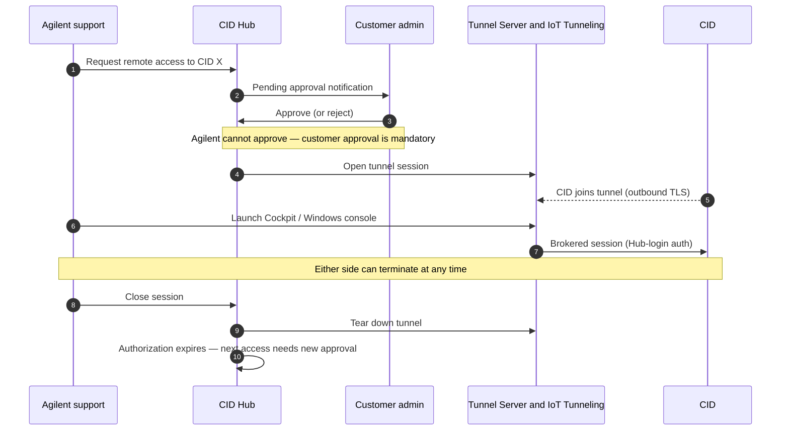

# <mark>Remote access</mark>

The CID has three remote-access surfaces: the **Windows VM console**, the **Linux Cockpit**, and the **CID Hub Web UI**. Day-to-day CDS work does not use the Windows console or Cockpit. Operators run OpenLab CDS from their own CDS-client workstations against the CID over the customer LAN.

The Windows console is a break-glass desktop reserved for CDS-failover scenarios. The Linux Cockpit is a host-OS troubleshooting surface for Agilent support or customer IT. The CID Hub Web UI is the SaaS control plane that activates, configures, and patches every CID.

All three surfaces require authentication. The two on-CID surfaces (Windows console, Linux Cockpit) are further protected by daily-rotated credentials issued from the Hub. Any session that reaches a CID from outside the customer LAN flows through AWS IoT Secure Tunneling, is on-demand, and requires customer approval for every session.

The trust model that governs these surfaces is in [Security Model — Trust boundaries](./security-model#trust-boundaries) and [Security Model — Attack surface](./security-model#attack-surface). The AWS services they rely on are catalogued in [CID Hub Architecture — AWS service inventory](./cid-hub-architecture#aws-service-inventory).

## Remote-access surfaces

### Windows VM console

The embedded Windows 11 IoT Enterprise LTSC VM hosts OpenLab CDS on the CID. In normal operation, CDS operators connect to the CID from their own CDS-client workstations over the customer LAN. They do not use the Windows console as their daily working surface.

The Windows console is a break-glass surface for CDS-failover scenarios. Specifically, when a network outage interrupts the path between a CDS client and the CID, or between the CID and the OpenLab Server, an authorized user opens the browser-based console directly on the CID and continues acquisition until normal connectivity is restored. The customer-facing procedure is in [How-to — Perform CDS failover](../howto/operations/perform-cds-failover).

Because it is a break-glass surface, the console is protected by the same controls that bound the rest of the CID's administrative attack surface:

- It is reached as a browser-based remote desktop, served only through the CID's local reverse proxy. The console has no public-internet listener.
- Login uses the daily-rotated `agilentac` Windows password, retrieved by an authorized customer user from the CID Hub **Administration** tab. The password is regenerated every day; a stale credential captured during one failover cannot be reused the next day.
- Use of the console is recorded in the Hub Activity Log (who launched the console, against which CID, and when), so failover use is auditable after the fact.

Session-level rules for the console:

- **From inside the customer LAN.** Authorized customer users open the CID Hub Web UI, select the CID, and launch the Windows console. The session is brokered to the CID over the customer LAN and opens directly at the Windows login screen.
- **From outside the customer LAN (Agilent support).** A support tunnel must be established first; see [Agilent support approval flow](#agilent-support-approval-flow).
- **Concurrency.** One Windows console session per CID. A second connection displaces the first.
- **Session liveness.** A 30-second keep-alive heartbeat runs while the tab is open. If the browser tab is closed without an explicit logout, the session auto-terminates within 60 seconds.

### Linux Cockpit

Cockpit is the host-OS administration UI for the Linux side of the CID. It exists exclusively as a troubleshooting surface for Agilent support or customer IT staff. It is not used for day-to-day CDS work and is not a configuration surface.

- **Listener.** Cockpit is exposed only through the CID's local reverse proxy with a strict allowed-origins policy. It has no public-internet listener.
- **Credentials for an activated CID.** The `agilentac` Cockpit password is rotated daily and retrieved from the CID Hub **Administration** tab.
- **Credentials for an unactivated CID.** Pre-activation access uses the factory-default password issued via Agilent support. On activation, the credential is replaced and rotated.
- **Configuration changes are not supported through Cockpit.** Any CID configuration change must go through the CID Hub so it is captured in the audit trail. Cockpit is a diagnostic and observation surface only.

### CID Hub Web UI

The Hub Web UI is the SaaS control plane, reached at `hub.cid.agilent.com` from any browser over HTTPS. It is not tunneled; it is a public TLS endpoint authenticated by AWS Cognito. Session, MFA, federation, and token-lifetime details are in [Security Model — User identity and authentication](./security-model#user-identity-and-authentication).

The Hub Web UI is also the launchpad for sessions to the Windows console and Linux Cockpit on every CID you have access to. You log in to the Hub, select a CID, retrieve the rotated `agilentac` credential, and open the corresponding console.

## AWS IoT Secure Tunneling

When a remote-access session must traverse the public internet, it is carried over AWS IoT Secure Tunneling rather than an inbound port opened on the CID's firewall. Every Agilent-support session uses this mechanism. The relevant properties:

- **On-demand, not persistent.** A tunnel exists only while an approved session is active. It is created at the start of the session and torn down at the end.
- **Outbound-initiated.** The CID joins the tunnel by an outbound TLS connection to the AWS IoT tunneling endpoint. No inbound ports are opened on the CID's firewall. The required endpoint is listed in [System Requirements — Internet requirements](../reference/system-requirements#internet-requirements).
- **Approval-gated.** A tunnel is created only after a customer user explicitly approves the access request in the Hub UI. Agilent users cannot approve their own requests.
- **Brokered.** A companion service mediates the Agilent-side join to Cockpit or the Windows console. See [CID Hub Architecture — AWS service inventory](./cid-hub-architecture#aws-service-inventory).
- **Concurrency cap.** A maximum of 10 concurrent tunnel sessions are permitted per environment across all CIDs.

Because the tunnel is on-demand, outbound-initiated, and approval-gated, the CID's attack surface from the public internet remains zero between sessions. See [Security Model — Attack surface](./security-model#attack-surface).

## Agilent support approval flow

Agilent CID support personnel have view-only access to your CIDs by default. To open the Windows console or Linux Cockpit on a specific CID, an Agilent user must request a session, and that request must be approved by an authorized customer user.

The rules behind this flow:

- **Customer approval is mandatory for every session.** There is no standing grant of access to Agilent. Each new session requires a new approval.
- **Either side can terminate.** You can terminate an in-progress Agilent session at any time from the Hub. The Agilent user can also close their own session.
- **Closure expires authorization.** When a session closes, the authorization to access that CID is automatically expired. Re-access requires a fresh approval cycle.
- **Tunnel authentication uses Hub login.** The session opened over the tunnel is authenticated with the Agilent user's CID Hub login, not a local credential.
- **Agilent users cannot approve.** An Agilent user cannot approve their own remote-access request, and cannot approve another Agilent user's request. The approval must come from a customer-side user with the appropriate role.

The procedure for approving or rejecting these requests is in [How-to — CID administration](../howto/operations/cid-administration).

## Session controls summary

| Control | Value |
|---|---|
| Tunnel persistence | On-demand only; closed when session ends |
| Concurrent tunnel sessions | 10 per environment, across all CIDs |
| Windows console concurrency | 1 active session per CID |
| Windows console auto-logout | Within 60 seconds of tab close (30-second keep-alive) |
| Approval expiry | Authorization expires on session close |
| Credential rotation | `agilentac` Windows and Linux passwords rotated daily |

## Audit trail

Every step of an Agilent support session is recorded in the CID Hub Activity Log:

- Remote-access request created (by which Agilent user, targeting which CID).
- Approval or rejection (by which customer user, with timestamp).
- Session start and the surface accessed (Windows console or Linux Cockpit).
- Session termination, and which side terminated it.
- Authorization expiry.

The Activity Log is scoped per tenant. Customer users see their own tenant's entries. Retention, export, and entry-integrity details are in [Audit and compliance](./audit-and-compliance).

## See also

- [Security Model](./security-model) — trust boundaries, attack surface, device and user identity.
- [CID Hub Architecture](./cid-hub-architecture) — Tunnel Server and AWS IoT Secure Tunneling in the broader Hub topology.
- [Audit and compliance](./audit-and-compliance) — Activity Log retention and export.
- [Data flow and privacy](./data-flow-and-privacy) — what does and does not cross the CID-to-Hub boundary outside support sessions.
- [System Requirements — Internet requirements](../reference/system-requirements#internet-requirements) — the firewall allow-list that includes the IoT tunneling endpoint.
- [How-to — CID administration](../howto/operations/cid-administration) — procedure for approving and revoking Agilent sessions.
