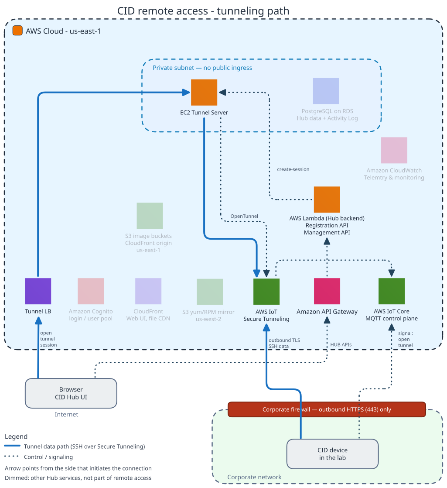

# Remote access

This page explains how remote access to a CID works and how it is controlled. It is for IT and security reviewers assessing session boundaries, approvals, and traceability, and for the CID Hub administrators and Agilent support users who operate within them.

The CID exposes three remote-access surfaces: the CID Hub Web UI, the Windows VM console, and Linux Cockpit. None is used for day-to-day analytical work. CDS users work from their own CDS-client systems over the corporate network.

This page is organized by access path, because the network boundary a session crosses determines the controls that apply to it. Sessions that originate inside your corporate network are handled differently from sessions that cross the public internet. The trust model behind these boundaries is in the [Trust boundaries](./security-model#trust-boundaries) and [Attack surface](./security-model#attack-surface) sections of Security model.

## Remote-access surfaces

The CID Hub Web UI is a public endpoint reached over HTTPS from any network. The Windows VM console and Linux Cockpit run on the CID itself and are reached by one of the two access paths described later on this page. Each is defined once below.

### CID Hub Web UI

The CID Hub Web UI is the Software-as-a-Service (SaaS) control plane. It is used to activate, configure, and update CIDs, and it is the launchpad from which an authorized user opens a session to a CID's Windows VM console or Linux Cockpit. It is reached at `hub.cid.agilent.com` over HTTPS from any browser and is authenticated by AWS Cognito. It is a public Transport Layer Security (TLS) endpoint and is not tunneled. Authentication, session, and token-lifetime details are in the [CID Hub user identity](./security-model#cid-hub-user-identity) section of Security model.

### Windows VM console

The embedded Windows 11 IoT Enterprise LTSC VM hosts OpenLab CDS on the CID. The Windows VM console is reserved for CDS-failover situations: a network outage that interrupts the path between a CDS client and the CID, or between the CID and the OpenLab Server. Samples already running or queued on the CID run to completion regardless of server connectivity, and their data transfers to the OpenLab Server once the connection is restored. During such an outage, the console is needed only to submit or queue new samples. An authorized user opens the browser-based console directly on the CID and runs OpenLab CDS in failover mode. See [Run OpenLab CDS in failover mode](../howto/operations/perform-cds-failover) for the procedure.

The console is served only through the CID's local reverse proxy and is not exposed to the public internet. One console session is active per CID at a time; a second connection displaces the first. You are expected to log out of Windows when you finish a session. If you instead close the browser tab, the console's keep-alive heartbeat stops and you are logged out automatically.

### Linux Cockpit

Cockpit is the host-OS administration UI for the Linux side of the CID, the standard Linux web console. It is a troubleshooting surface for Agilent support or your IT staff, used to inspect host health and investigate activation or connectivity issues. It is not a day-to-day working surface and not a routine configuration surface once the CID is operational. It is served only through the CID's local reverse proxy under a strict allowed-origins policy and is not exposed to the public internet. All CID configuration changes are made through the CID Hub instead; Cockpit is used for diagnosis and observation only.

SSH is not a remote-access surface in the model described on this page. It is addressed in the attack-surface model: see the [Attack surface](./security-model#attack-surface) section of Security model.

## Access from inside your corporate network

When a user's workstation is on the same corporate network as the CID, the Windows VM console and Linux Cockpit are reached directly, without crossing the public internet.

- **Launched from the Hub**. An authorized user opens the CID Hub Web UI, selects the CID, and launches the console. The session is brokered to the CID over your corporate network and opens at the console's own sign-in screen.
- **Direct connection**. The console is served over HTTPS by the CID's local reverse proxy. No inbound port is opened to the internet for LAN access.
- **Rotated credentials**. Sign-in uses the daily-rotated local credential (shown in CID Hub as the **CDS Desktop user** and **Cockpit user**), retrieved from the CID Hub **Administration** tab. A credential captured during one session cannot be reused the next day.
- **Authentication survives a Hub outage**. If the Hub is unreachable during an outage, the console remains reachable on the LAN at the CID's address, but it still requires the current rotated credential. The credential is obtained from CID Hub through another internet-connected device. Loss of the Hub does not remove authentication.
- **Logged**. A console login is recorded in the CID's own operating-system logs, the same way any Windows or Linux computer records a sign-in. Sessions launched from the CID Hub **Administration** tab are additionally captured in the centralized CID Hub Activity Log.

## Access from outside your corporate network

When a session must reach a CID from outside your corporate network, it does not require any inbound port to be opened in your corporate firewall. It is carried over AWS IoT Secure Tunneling.

In the diagram, thick blue lines trace the tunnel data path through the Tunnel load balancer and EC2 Tunnel Server, and dotted lines trace the control flow that opens the tunnel through API Gateway, Lambda, and IoT Core. Each arrowhead points away from the side that initiates the connection.

### AWS IoT Secure Tunneling

AWS IoT Secure Tunneling is the AWS service that carries an outside-the-network session to the CID over the CID's own outbound connection. The same path serves authorized users on your account and Agilent support. The controls below apply to every session; Agilent sessions carry one extra requirement: your approval.

- **No inbound exposure**. The CID joins the tunnel by an outbound TLS connection to the <mark>AWS IoT Secure Tunneling</mark> endpoint, so no inbound port or firewall rule is required, and the CID has no inbound internet exposure between sessions. The endpoint is listed in the [Internet requirements](../reference/system-requirements#internet-requirements) section of System requirements; the broader model is in the [Attack surface](./security-model#attack-surface) section of Security model.
- **On-demand**. A tunnel exists only while a session is active. It is created at the start of the session and torn down at the end.
- **Authenticated**. A tunnel session can only be requested by an authorized user signed in to CID Hub, and the session opened over the tunnel is authenticated with that Hub login, not a local credential.
- **Approved (Agilent support only)**. Agilent support has view-only access to your CIDs by default. Opening a Windows VM console or Cockpit session on a CID requires an Agilent request and approval from an authorized user on your account; authorized users on your account need no approval.
  - There is no standing grant: each session requires a new approval, scoped to the one selected CID.
  - An Agilent user cannot approve any request, including their own; approval comes only from your account.
  - You can end an in-progress Agilent session at any time from the Hub, and the Agilent user can close their own.
  - Closing a session expires the authorization; re-access requires a fresh approval.
- **Recorded**. Every request, approval, session, and termination is recorded in the CID Hub Activity Log, scoped per tenant. See [Traceability and compliance](./traceability-and-compliance) for retention, export, and entry-integrity details.
- **Brokered**. The browser never connects to the CID directly. An Agilent-operated service in the Hub joins the tunnel on the browser's behalf and relays the session to the Windows VM console or Cockpit. That service runs in a private subnet and is described in the [AWS service inventory](./cid-hub-architecture#aws-service-inventory) section of CID Hub architecture.

The steps for approving or ending a session are in the [Approve or end an Agilent support session](../howto/operations/cid-administration#approve-or-end-an-agilent-support-session) section of Administer a CID.

## If the remote-access path is blocked

If your firewall blocks AWS IoT Secure Tunneling, or the service is temporarily unavailable, remote console access stops cleanly. It does not fail silently, and there is no fallback that opens an inbound path into your network. The effects are contained:

- **Console sessions stop**. A Windows VM console or Cockpit session launched from CID Hub either fails to open or, if one is already running, drops. There is no alternate route in.
- **Hub management continues**. Remote console access and Hub management use different endpoints. As long as AWS IoT Core stays reachable, the CID remains connected in CID Hub even while console access is blocked.
- **Local access is unaffected**. Acquisition and local CDS operation continue on your corporate network, and the failover console reached directly on the CID over the LAN keeps working, because neither path uses the tunnel.

For the symptoms of blocking each endpoint, see the [Behavior when an endpoint is blocked](../reference/system-requirements#behavior-when-an-endpoint-is-blocked) section of System requirements.

## See also

- [Security model](./security-model): trust boundaries, attack surface, device and user identity.
- [CID Hub architecture](./cid-hub-architecture): Tunnel Server and AWS IoT Secure Tunneling in the broader Hub topology.
- [Traceability and compliance](./traceability-and-compliance): Activity Log retention and export.
- [Data flow and privacy](./data-flow-and-privacy): what does and does not cross the CID-to-Hub boundary outside support sessions.
- [Internet requirements](../reference/system-requirements#internet-requirements): the firewall allow-list that includes the <mark>AWS IoT Secure Tunneling</mark> endpoint.
- [Administer a CID](../howto/operations/cid-administration): procedure for approving and ending Agilent sessions.
