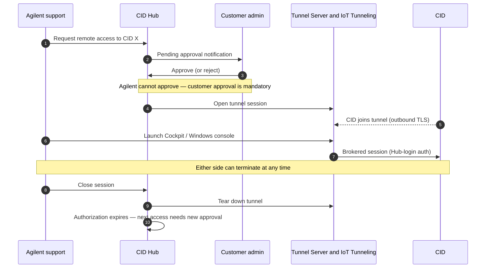

# <mark>Remote Access</mark>

The CID has three remote-access surfaces: the **Windows VM console** (a break-glass desktop into the embedded Windows 11 IoT VM, reserved for CDS-failover scenarios), the **Linux Cockpit** (the host-OS admin UI, reserved for Agilent support and customer IT troubleshooting), and the **CID Hub Web UI** (the SaaS control plane that activates, configures, and patches every CID). Day-to-day CDS work does **not** use the Windows console — operators run OpenLab CDS from their own CDS-client workstations against the CID. The console is opened only when the normal CDS-client path is unavailable. All three surfaces require authentication; the two on-CID surfaces (Windows console, Linux Cockpit) are further protected by **daily-rotated credentials** issued from the Hub. Anything that reaches a CID from outside the customer LAN — Agilent support sessions in particular — flows through **AWS IoT Secure Tunneling**, is **on-demand**, and requires a **customer approval** for every session. This page describes how each surface is reached, the tunnel mechanism behind support sessions, and the approval and audit-trail rules that bound an Agilent-side session.

The trust model that puts these surfaces inside their respective boundaries is in [Security Model → Trust boundaries](./security-model#trust-boundaries) and [Security Model → Attack surface](./security-model#attack-surface); the AWS services they rely on are catalogued in [CID Hub Architecture → AWS service inventory](./cid-hub-architecture#aws-service-inventory).

## Remote-access surfaces

### Windows VM console

The embedded Windows 11 IoT Enterprise LTSC VM hosts OpenLab CDS on the CID. In normal operation, CDS operators connect to the CID from their own **CDS-client workstations** over the customer LAN; they do **not** use the Windows console as their daily working surface.

The Windows console is a **break-glass surface for CDS-failover scenarios** — specifically, when a network outage interrupts the path between a CDS client and the CID, or between the CID and the OpenLab Server. In those cases an authorized user opens the browser-based console directly on the CID and continues acquisition from the embedded desktop until normal connectivity is restored. The customer-facing procedure is in [How-to → Perform CDS Failover](../howto/operations/perform-cds-failover).

Because it is a break-glass surface, the console is protected by the same controls that bound the rest of the CID's administrative attack surface:

- It is reached as a **browser-based remote desktop** (VNC over websockify), served only through the CID's reverse proxy at the nginx `/aic-windows-desktop/` location — the console has no public-internet listener of its own.
- Login uses the **daily-rotated `agilentac` Windows password**, retrieved by an authorized customer user from the CID Hub Administration tab. The password is regenerated every day (10 characters, mixed case, digits, special characters); a stale credential captured during one failover cannot be reused the next day.
- Use of the console is **recorded in the Hub Activity Log** (who launched the console, against which CID, when), so failover use is auditable after the fact.

Session-level rules for the console:

- **From inside the customer LAN.** Authorized customer users open the CID Hub Web UI, select the CID, and launch the Windows console; the session is brokered to the CID over the customer LAN. The console opens directly at the Windows login screen.
- **From outside the customer LAN (Agilent support).** A support tunnel must be established first; see [Agilent support approval flow](#agilent-support-approval-flow) below.
- **Concurrency.** One Windows console session per CID. A second connection displaces the first.
- **Session liveness.** A 30-second keep-alive heartbeat runs while the tab is open. If the browser tab is closed without an explicit logout, the session auto-terminates within 60 seconds.

### Linux Cockpit

Cockpit is the host-OS administration UI for the Linux side of the CID. It exists **exclusively as a troubleshooting surface for Agilent support or the customer's IT staff**; it is not used for day-to-day CDS work and is not a configuration surface.

- **Listener.** Cockpit binds to `127.0.0.1:9090` on the CID and is exposed only through the CID's reverse proxy, with a strict allowed-origins list (the tunnel-server FQDN and the CID's `customer-br0` IP).
- **Login title.** "CID Dashboard".
- **Credentials for an activated CID.** The `agilentac` Cockpit user's password is **rotated daily** (10 characters, mixed case, digits, special characters) and retrieved from the CID Hub Administration tab.
- **Credentials for an unactivated CID.** Pre-activation access uses the factory-default password issued via Agilent support; on activation the credential is replaced and rotated.
- **Configuration changes are not supported through Cockpit.** Any CID configuration change must go through the CID Hub so it is captured in the audit trail. Cockpit is a diagnostic and observation surface, not a configuration surface.

### CID Hub Web UI

The Hub Web UI is the SaaS control plane and is reached at `hub.cid.agilent.com` from any browser that can reach it over HTTPS. It is **not** tunneled; it is a public TLS endpoint authenticated by AWS Cognito. Session, MFA, federation, and token-lifetime details are in [Security Model → User identity and authentication](./security-model#user-identity-and-authentication).

The Hub Web UI is also the **launchpad** for sessions to the Windows console and Linux Cockpit on every CID a user has access to. Operationally, a user logs in to the Hub, picks a CID, retrieves the rotated `agilentac` credential, and opens the corresponding console.

## AWS IoT Secure Tunneling

When a remote-access session has to traverse the public internet — every Agilent-support session does — it is carried over **AWS IoT Secure Tunneling**, not an inbound port opened on the CID's firewall. The relevant properties of this mechanism:

- **On-demand, not persistent.** A tunnel exists only while an approved session is active; it is created at the start of the session and torn down at the end.
- **Outbound-initiated.** The CID joins the tunnel by an outbound TLS connection to `data.tunneling.iot.us-east-1.amazonaws.com`.
- **Approval-gated.** A tunnel is created only after a customer user explicitly approves the access request in the Hub UI. Agilent users cannot approve their own requests.
- **Brokered by the Tunnel Server.** A companion EC2 service (`hub-ac-tunnel.cid.agilent.com`, one instance per environment, fronted by an ALB) mediates the Agilent-side join to Cockpit or the Windows console. See [CID Hub Architecture → AWS service inventory](./cid-hub-architecture#aws-service-inventory).
- **Concurrency cap.** A maximum of **10 concurrent tunnel sessions** are permitted per environment across all CIDs. Stale sessions are cleaned up hourly.
- **Recreation cooldown.** After a tunnel session closes, the same session cannot be recreated for **90 seconds**. This prevents rapid re-open loops and ensures clean teardown of credentials before the next request.

Because the tunnel is on-demand, outbound-initiated, and approval-gated, the CID's *attack surface from the public internet remains zero between sessions* — see [Security Model → Attack surface](./security-model#attack-surface).

## Agilent support approval flow

Agilent CID support personnel have **view-only** access to a customer's CIDs by default. To open the Windows console or Linux Cockpit on a specific CID, an Agilent user must request a session, and that request must be approved by an authorized customer user. The flow:

The rules behind that flow:

- **Customer approval is mandatory for every session.** There is no standing grant of access to Agilent. Each new session requires a new approval.
- **Either side can terminate.** The customer can terminate an in-progress Agilent session at any time. The Agilent user can also close their own session.
- **Closure expires authorization.** When a session closes — whether by the Agilent user, the customer, or a timeout — the authorization to access that CID is **automatically expired**. Re-access requires a fresh approval cycle.
- **Cockpit tunnel auth uses Hub login.** The Cockpit session opened over the tunnel is authenticated with the Agilent user's CID Hub login, not a local Cockpit credential bypass.
- **Agilent users cannot approve.** An Agilent user cannot approve their own remote-access request, and cannot approve another Agilent user's request. The approval must come from a customer-side user with the appropriate role.

The customer-facing procedure for approving or rejecting these requests is in [How-to → CID Administration](../howto/operations/cid-administration).

## Session controls summary

| Control | Value |
|---|---|
| Tunnel persistence | On-demand only; closed when session ends |
| Concurrent tunnel sessions | 10 per environment, across all CIDs |
| Stale tunnel cleanup | Hourly |
| Tunnel recreation cooldown | 90 seconds after close |
| Windows console concurrency | 1 active session per CID |
| Windows console auto-logout | Within 60 seconds of tab close (30-second keep-alive) |
| Approval expiry | Authorization expires on session close |
| Credential rotation | `agilentac` Windows + Linux passwords rotated daily |
| Credential update cooldown | 24 hours between forced credential updates |

## Audit trail

Every step of an Agilent support session is recorded in the CID Hub **Activity Log**:

- Remote-access request created (by which Agilent user, targeting which CID).
- Approval or rejection (by which customer user, with timestamp).
- Session start and the surface accessed (Windows console vs Linux Cockpit).
- Session termination, and which side terminated it.
- Authorization expiry.

The Activity Log is scoped per tenant — customer users see their own tenant's entries; Agilent users with the appropriate privilege see a global view, also recorded. Retention, export, and entry-integrity details live in [Audit & Compliance](./audit-and-compliance).

## See also

- [Security Model](./security-model) — trust boundaries, attack surface, device and user identity.
- [CID Hub Architecture](./cid-hub-architecture) — Tunnel Server EC2 and AWS IoT Secure Tunneling in the broader Hub topology.
- [Audit & Compliance](./audit-and-compliance) — Activity Log retention and Agilent-performed export.
- [Data Flow & Privacy](./data-flow-and-privacy) — what does and does not cross the CID ⇄ Hub boundary outside support sessions.
- [System Requirements → Internet Requirements](../reference/system-requirements#internet-requirements) — the firewall allow-list that includes the IoT tunneling endpoint.
- [How-to → CID Administration](../howto/operations/cid-administration) — customer-side procedure for approving and revoking Agilent sessions.
