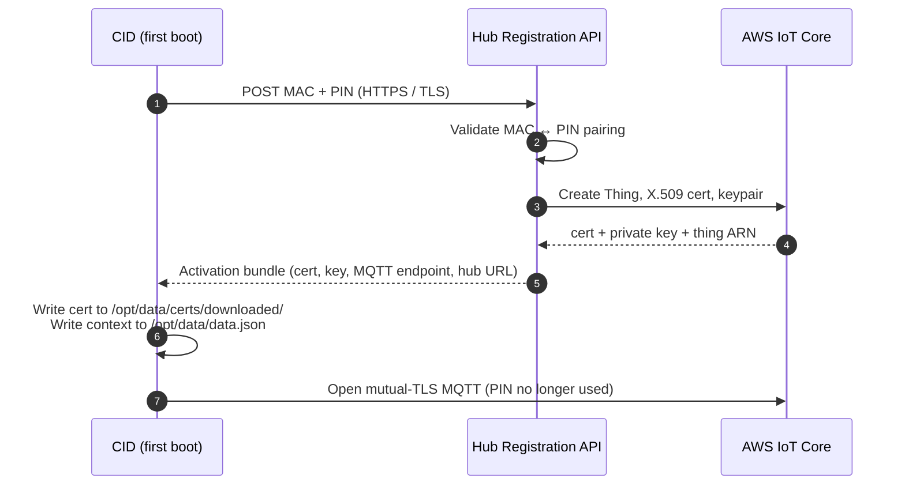
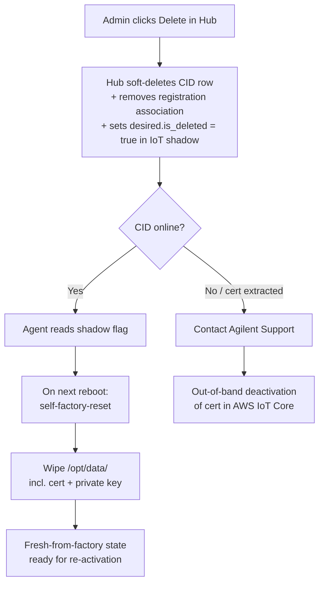
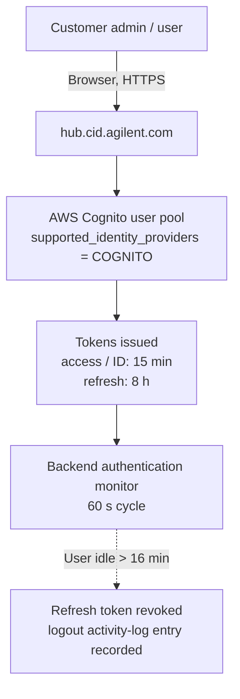

# <mark>Security Model</mark>

This page describes the CID's trust boundaries, attack surface, device identity, and user identity — the answers an IT reviewer needs to evaluate the CID against a domain-controlled lab PC. Procedures live in the [How-to](../howto/onboarding/activate-a-cid) pages and authoritative network details live in [System Requirements](../reference/system-requirements). This page explains *why* those mechanisms add up to a defensible posture.

## Trust boundaries

:::note[Diagram placeholder — `trust-boundaries.svg`]
Show the four boundaries as concentric / adjacent zones: Corporate LAN, CID Linux host (single House-NIC IP, TCP 443 + reverse proxy), embedded Windows VM (no LAN IP, behind proxy on the KVM bridge `192.168.122.11`), V-NIC bridge to the Instrument LAN (no default gateway), and an outbound TLS arrow to AWS endpoints in `us-east-1` (Hub, IoT Core, Secure Tunneling). Mark the four boundaries listed below.
:::

The CID is a Linux appliance that hosts an embedded Windows 11 IoT Enterprise LTSC virtual machine. Four trust boundaries shape everything else on this page:

- **Corporate LAN ⇄ Linux host.** The Linux host is the only thing exposed to the corporate LAN. A network scan of the CID's House-NIC IP shows TCP 443 open (HTTPS / WSS for CDS clients and admin UIs) and, on non-productive systems only, TCP 22. All other ports are closed. No inbound connection from the public internet is required or accepted on either NIC.
- **Linux host ⇄ Windows VM.** The Windows VM has no IP address on the corporate LAN. It sits behind the CID's nginx **reverse proxy**, which terminates TLS on the House-NIC and forwards selected paths inward over the Linux host's KVM bridge (`192.168.122.11`). Anything not explicitly routed by the proxy — RDP, SMB, WinRM, file shares — is not reachable from the corporate LAN.
- **Windows VM ⇄ Instrument LAN.** A second virtual NIC (V-NIC) bridges the Windows VM directly onto the Instrument LAN through the Linux host's `instrument-br0` bridge. The Instrument NIC has **no default gateway by design** — the Hub UI labels the gateway field "Gateway Address (Not Recommended)" — so instrument-network traffic cannot route to the corporate LAN or the internet.
- **CID ⇄ CID Hub.** All Hub traffic is **CID-initiated outbound** over TLS to AWS endpoints in `us-east-1` (HTTPS for REST/file transfer, MQTT-over-TLS for the IoT control plane, AWS IoT Secure Tunneling for support sessions). The Hub never opens a connection back to a CID; remote-management commands ride the MQTT channel the CID already holds open.

See [System Requirements §Networking](../reference/system-requirements#networking-requirements) for the canonical inbound/outbound table, and [Data Flow & Privacy](./data-flow-and-privacy) for the inventory of what crosses each boundary.

## Attack surface

:::note[Diagram placeholder — `reverse-proxy-listeners.svg`]
Show the CID nginx reverse proxy as the only thing listening on the House-NIC IP at TCP 443, with internal-only upstreams: `/` → Windows VM at `192.168.122.11:443`, `/aic-windows-desktop/` → console manager on `127.0.0.1:5000` (websockify on `5800`), `/ac-cockpit/` → cockpit on `127.0.0.1:9090`, `/ac-console/` → gotty on `127.0.0.1:9091`. Make clear that none of those upstreams are bound to the House-NIC interface.
:::

From an attacker on the corporate LAN, the CID presents:

- **A single Linux IP, with TCP 443 open.** The reverse proxy serves the CDS-client traffic (`/` → Windows VM on `192.168.122.11:443`), the browser-based Windows console (`/aic-windows-desktop/` → an internal console manager with websockify), and the Linux Cockpit admin UI (`/ac-cockpit/` → `cockpit` on `9090`). All upstream services are bound to `127.0.0.1` or to the internal KVM bridge IP; the proxy is the only thing actually listening on the corporate-facing interface.
- **An OpenLab-issued TLS certificate.** At runtime the CID replaces nginx's default self-signed certificate with the OpenLab certificate copied from the embedded Windows VM, so corporate clients see the OpenLab-issued certificate rather than a bare device cert.
- **No public internet exposure.** The CID is not addressable from the public internet on either NIC. The Hub-side IoT and tunnel endpoints are reached *outbound* from the CID; nothing inbound is ever required. Outbound traffic is limited to a known set of AWS and Agilent endpoints listed in [System Requirements → Internet Requirements](../reference/system-requirements#internet-requirements). Internet connectivity is required for activation, security updates, and remote management; **CDS data acquisition itself runs entirely on the customer's local network and continues if the internet path is interrupted** — only Hub-mediated functions (updates, support tunnels, status reporting) become unavailable.

:::info[TLS protocol versions]
The CID's reverse proxy currently accepts TLS 1.0, 1.1, and 1.2. Customer vulnerability scanners that flag the legacy protocols are responding to this configuration.
:::

## Posture vs a domain-controlled lab PC

The CID is functionally equivalent to an Agilent Instrument Controller (AIC) running on a customer-supplied Windows PC, but the security model is materially different. See [CID vs AIC](./cid-vs-aic) for the side-by-side decision aid.

### What the CID gives you that a domain-controlled PC does not

- **Smaller attack surface.** One Linux IP, port 443 only. The Windows VM is unreachable from the corporate LAN except through the reverse proxy.
- **Appliance OS, not a productivity desktop.** The Windows VM is a Windows 11 IoT Enterprise LTSC build curated by Agilent, with no end-user productivity software, no browsing, and no general-purpose Windows admin surface exposed on the corporate LAN.
- **Centrally-managed patching.** Linux host updates, Windows VM updates, driver updates, and CDS-version updates are delivered through the Hub. The Hub is the audit-trail source of truth for what was installed, when, and by whom. See [Audit & Compliance](./audit-and-compliance) for the patch policy, SLA, and rollback posture.
- **Unique per-CID credentials.** Each CID has its own SSH keypair, root password, and rotated `agilentac` operator account; a compromise of one CID's credentials does not expose any other CID.
- **Daily-rotated administrative credentials.** The Cockpit and Windows-console passwords are recycled every 24 hours, so a credential that leaks today is invalid tomorrow without any customer action.
- **Bundled anti-malware.** The CID runs ClamAV on a weekly schedule; signature updates ride the Linux Update channel. Detections are quarantined to `clamav-quarantine` on the device and surfaced in the Hub Activity Log.

### What a domain-controlled PC gives you that the CID does not

- **No Active Directory or domain join.** The embedded Windows VM is not domain-joined and does not authenticate against the customer's Active Directory. AD-driven policy, Group Policy, AD-backed login, AD-driven screen lock, and AD-driven password complexity rules do not apply on the CID itself; the VM is an appliance OS, not a productivity desktop, and its administrative credentials are rotated daily by the CID agent. The scope of this is the embedded VM only — it does **not** affect:
    - Other (non-CID) instrument controllers a customer chooses to deploy alongside CIDs, which remain on the customer's standard endpoint-management stack.
    - CDS-client machines, which remain customer-owned and can be domain-joined.
    - OpenLab CDS user authentication at the CDS layer — OpenLab Server can still authenticate CDS users against the customer's Active Directory.
- **No customer-managed anti-malware product.** Agilent ships ClamAV on the CID; customers cannot install a third-party agent (CrowdStrike, Defender ATP, SentinelOne, etc.) on either the Linux host or the embedded Windows VM. Endpoint-management products run on the CDS *client* machines, which the customer continues to own.
- **No customer-driven local-account management on the VM.** User accounts on the embedded Windows VM are local; only the rotated `agilentac`-style administrative credentials are exposed through Hub-managed UIs. Custom local accounts cannot be provisioned by the customer.

The shared-responsibility split for these items is enumerated in [System Requirements §Shared Responsibility](../reference/system-requirements#shared-responsibility-for-data-security).

## Device identity

Each CID is identified to the Hub by a unique AWS-IoT-issued X.509 client certificate. Identity is established once at activation and maintained over the device's lifetime; it does not depend on any customer-managed PKI.

### Activation and certificate issuance

The CID ships with an 8-character alphanumeric **registration code (PIN)** printed on a QR sticker on the chassis. At first boot the CID contacts the Hub registration API and presents its MAC address and PIN; the Hub validates the pairing, issues a unique IoT X.509 client certificate and private key, attaches them to an IoT Thing named `{stage}-ac-{ac_id}`, and returns the bundle over HTTPS/TLS. The CID writes the certificate to `/opt/data/certs/downloaded/` and records the activation context (cert paths, MQTT endpoint, Hub URL, thing name) to `/opt/data/data.json`. From that point forward the CID authenticates to AWS IoT Core using mutual TLS with that certificate; the PIN is not re-used.

The procedure side of this flow lives in [Activate a CID](../howto/onboarding/activate-a-cid). The data exchanged during activation is enumerated in [Data Flow & Privacy](./data-flow-and-privacy).

### Certificate lifetime and rotation

- **Lifetime.** Device certificates are AWS IoT Core–issued and carry the AWS default validity of approximately 50 years (≈ 18,262 days). This is the AWS-issued maximum and is not customer-configurable.
- **Renewal check.** The CID agent checks the certificate synchronously at startup and on a 7-day cadence thereafter. If the certificate is expiring within the renewal window, has expired, or has been deleted, the agent triggers a rotation; failed checks retry every 5 minutes.
- **Rotation.** The Hub creates a new keypair and certificate, attaches it to the existing IoT Thing and policy, hands it to the CID, and only then detaches and deletes the old certificate. The CID swaps to the new credential **without service interruption**. If the rotation fails partway through, the Hub re-attaches the old certificate so the CID can retry on the next cycle.
- **AWS IoT Core is the certificate authority.** Each CID's device certificate is issued and managed by AWS IoT Core; the activation and rotation flows above operate entirely within that authority.

### Decommissioning and revocation

When an administrator deletes a CID from the Hub, three things happen server-side: the CID's row is soft-deleted (so future Registration API calls from that device are rejected), the device-registration association is removed (the hardware can be re-associated with a fresh PIN), and `desired.is_deleted = true` is written into the CID's AWS IoT shadow.

The CID agent reads the shadow flag on its next reachable cycle, and on the next reboot the device performs a **self-factory-reset**: local data is wiped, including the on-device X.509 certificate and private key, and the device returns to a fresh-from-factory state ready for re-activation under a new PIN.

:::warning[Lost or stolen devices — offline revocation]
Deleting a CID record marks the device deleted in the Hub but does **not** automatically deactivate the certificate inside AWS IoT Core. A device that is online when it is deleted will self-wipe (including the cert and key) before it can be removed from the customer's premises. For a device that was **offline at the time of deletion**, or where there is reason to believe the certificate and private key were extracted from the device before it was deleted, contact **Agilent Support** to deactivate the certificate inside AWS IoT Core as an out-of-band step.
:::

## User identity and authentication

A CID deployment has **two distinct identity planes**, and it is important not to conflate them:

- **CDS-workflow identity** — the identity a scientist uses to log into OpenLab CDS to run samples, sign records, and read results. This is provided by **OpenLab Server** on the customer's infrastructure and can be backed by the customer's **Active Directory** at the CDS layer. The CID does not change this plane.
- **CID-management identity** — the identity a user (administrator or operator) uses to log into the **CID Hub** to register a CID, change its network configuration, apply updates, or approve a support session. This is provided by **AWS Cognito**, per-tenant, and is the subject of the rest of this section.

User access to the CID Hub Web UI is mediated by **AWS Cognito**. Identity is per-tenant: each customer organization gets its own user directory on the Hub side. The CID device itself does not hold customer user accounts — the only on-device credentials are the rotated administrative accounts described under [Attack surface](#attack-surface).

### Identity providers

- **AWS Cognito is the identity provider.** All customer users authenticate against the Hub's AWS Cognito user pool using credentials issued in the Hub itself.
- **Invitation-only account creation.** New users are created by an existing administrator and receive an email invitation from `CID Hub <no-reply@hub.cid.agilent.com>` with a temporary password.
- **Email-verified password reset.** Cognito account recovery is performed via verified email.

### Authentication

Users authenticate to the Hub with their Cognito-issued username and password. Sessions are governed by the Cognito token lifetimes and the backend authorization monitor described under [Sessions and session revocation](#sessions-and-session-revocation).

### Roles

Two customer roles are defined: **Administrator** (full control — CID lifecycle, user management, software templates, network configuration) and **User** (operational access — view CIDs, launch CDS Desktop, approve/revoke support sessions, restart or shut down a CID). Privileges are enumerated in [Manage Users and Roles](../howto/account/manage-users-and-roles).

### Sessions and session revocation

Cognito access tokens and ID tokens are valid for 15 minutes; refresh tokens are valid for 8 hours. A backend authentication monitor runs every 60 seconds and revokes the refresh token for any user who has not made an authenticated API request in the last 16 minutes (the 15-minute access-token life plus a 1-minute buffer); a "User logged out due to session expiry" entry is recorded in the Activity Log. The practical effects:

- **Idle sessions are bounded.** A user who walks away from the Hub UI is logged out within about a minute of their last token expiring; resuming work requires re-authentication.
- **User deletion.** When an administrator deletes a user, the user is removed from the Cognito directory **immediately** and can no longer obtain new tokens. An access token the user already holds remains technically valid until it expires — up to 15 minutes — because Cognito access tokens cannot be individually revoked once issued; the next refresh attempt fails.

The deletion procedure lives in [Manage Users and Roles → Delete a User](../howto/account/manage-users-and-roles#delete-a-user).

## See also

- [CID vs AIC](./cid-vs-aic) — side-by-side comparison with the traditional Agilent Instrument Controller for IT reviewers choosing a deployment model.
- [CID Hub Architecture](./cid-hub-architecture) — Hub-side AWS service inventory, tenant isolation, region and data-residency posture.
- [Data Flow & Privacy](./data-flow-and-privacy) — the nine-category inventory of what crosses the CID ⇄ Hub boundary, plus PHI/PII stance and retention.
- [Remote Access](./remote-access) — Windows console, Linux Cockpit, AWS IoT Secure Tunneling, and the Agilent support-access approval flow.
- [Audit & Compliance](./audit-and-compliance) — audit-log model, retention, tamper protection, patch SLA, and the CID's relationship to 21 CFR Part 11, SOC 2, and ISO 27001.
- [System Requirements](../reference/system-requirements) — authoritative networking, internet-requirements, hardware, and shared-responsibility tables.
