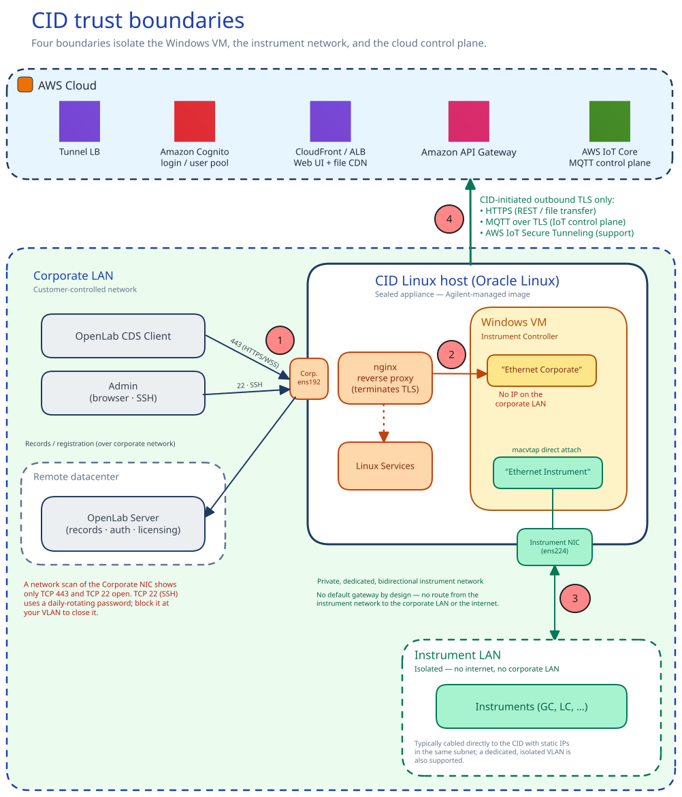
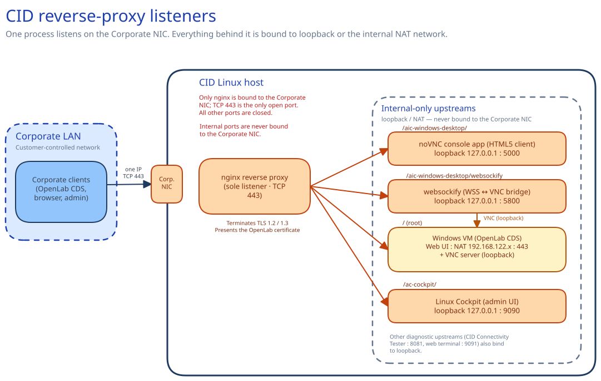
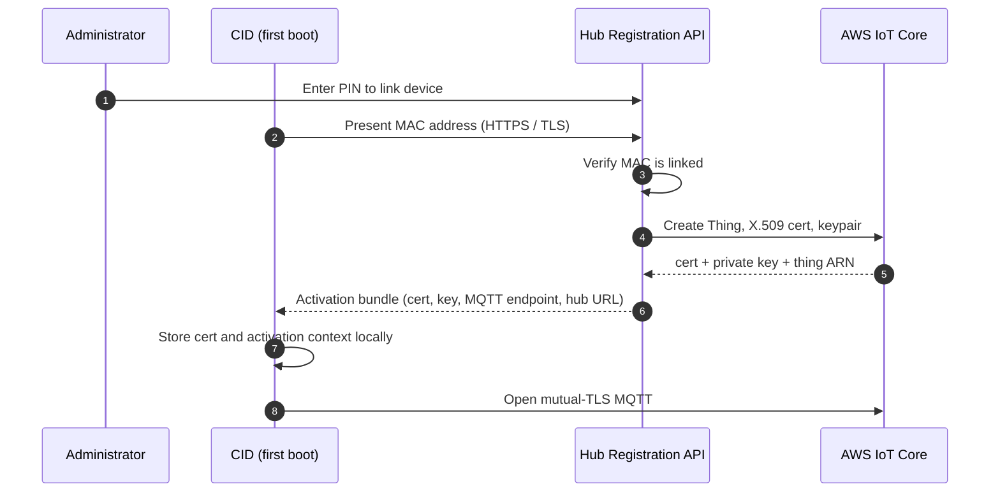

# Security model

This page describes the Connected Instrument Device (CID) trust boundaries, attack surface, device identity, and user identity. It provides the answers an IT reviewer needs to evaluate a CID against a domain-controlled lab PC. Procedures live in the [How-to guides](/howto). Authoritative network details live in [System Requirements](../reference/system-requirements). This page explains the relevant mechanisms and the current security posture of the Connected Instrument Device.

## Trust boundaries

The CID is a Linux appliance that hosts an embedded Windows 11 IoT Enterprise Long-Term Servicing Channel (LTSC) virtual machine. Four trust boundaries shape everything else on this page:

1. **Corporate LAN ⇄ Linux host.** The Linux host is the only component exposed to the corporate LAN. A network scan of the CID's Corporate NIC IP shows two open ports: TCP 443 and TCP 22 (SSH). TCP 443 carries HTTPS and WebSocket Secure (WSS) traffic for Chromatography Data System (CDS) clients and administrative interfaces. TCP 22 is open by default on all CIDs. It is available for Agilent support access and is protected by the daily-rotating administrative password. If you want to restrict SSH access at the network level, block port 22 at your VLAN. All other ports are closed. The CID does not require inbound connections from the public internet on either NIC. Because the CID cannot distinguish intranet from internet traffic, your firewall and network controls are what prevent public internet access to the device.
2. **Linux host ⇄ Windows VM.** The Windows VM has no IP address on the corporate LAN. It sits behind the CID's nginx reverse proxy, which terminates Transport Layer Security (TLS) on the Corporate NIC and forwards selected paths inward over an internal Network Address Translation (NAT) network. Anything not explicitly routed by the proxy is not reachable from the corporate LAN.
3. **Windows VM ⇄ Instrument LAN.** A second virtual NIC (V-NIC) connects the Windows VM directly to the Instrument LAN via macvtap direct attach to the physical Instrument NIC on the Linux host. The Instrument NIC has no default gateway by design. The Hub UI labels the gateway field **Gateway Address (Not Recommended)**. Instrument-network traffic therefore cannot route to the corporate LAN or the internet.
4. **CID ⇄ CID Hub.** All Hub traffic is CID-initiated outbound TLS to AWS endpoints in `us-east-1`. The CID uses HTTPS for REST and file transfer, MQTT (Message Queuing Telemetry Transport) over TLS for the IoT control plane, and AWS IoT Secure Tunneling for support sessions. The Hub never opens a connection back to a CID. Remote-management commands ride the MQTT channel the CID already holds open.

See the [Networking requirements](../reference/system-requirements#networking-requirements) section of System Requirements for the canonical inbound/outbound table, and [Data Flow & Privacy](./data-flow-and-privacy) for the inventory of what crosses each boundary.

## Attack surface

From an attacker on the corporate LAN, the CID presents:

- **A single Linux IP, with TCP 443 open.** The reverse proxy serves CDS-client traffic (`/` → Windows VM), the browser-based Windows VM console (`/aic-windows-desktop/`), and the Linux Cockpit administration UI (`/ac-cockpit/`). Every upstream binds to an internal-only interface, including the console's VNC service, which is reachable only through the TLS proxy and never on the Corporate NIC. The proxy is the only process listening on the corporate-facing interface.
- **An OpenLab-issued TLS certificate.** At runtime the CID replaces nginx's default self-signed certificate with the OpenLab certificate copied from the embedded Windows VM. Corporate clients therefore see the OpenLab-issued certificate rather than a bare device cert. The proxy accepts only TLS 1.2 and TLS 1.3; the legacy TLS 1.0 and 1.1 protocols are disabled.
- **No public internet exposure.** The CID is not addressable from the public internet on either NIC. The Hub-side IoT and tunnel endpoints are reached outbound from the CID; inbound communication is never required. Outbound traffic is limited to a known set of AWS and Agilent endpoints listed in the [Internet requirements](../reference/system-requirements#internet-requirements) section of System Requirements. CDS data flows entirely on the local network and continues even if the internet path is interrupted.

### Two-NIC trust topology

The two-NIC design (a Corporate NIC on the corporate LAN and a separate Instrument NIC on the lab network) is the foundation of the CID's network trust model. The two-NIC requirements themselves are listed in the [Networking requirements](../reference/system-requirements#networking-requirements) section of System Requirements. The following describes what the topology provides from a security standpoint:

- **No inbound communication from the internet on either NIC.** Neither NIC accepts unsolicited inbound connections from the internet. All CID Hub management and AWS connectivity happens over outbound TLS sessions the CID initiates (see the [Internet requirements](../reference/system-requirements#internet-requirements) section of System Requirements). The Corporate NIC does accept inbound connections from the corporate intranet. That is how OpenLab CDS clients reach the CID on TCP 443 (HTTPS / WSS) and how administrators reach the diagnostic UI. Since the CID listens for client connections on TCP 443, you must restrict this traffic to your corporate network. Your firewall must block all inbound internet access.
- **The embedded Windows VM is hidden from the corporate LAN.** The OpenLab Instrument Controller software runs in a Windows 11 virtual machine on the CID's Linux host. Corporate clients (OpenLab CDS, browsers) connect to the CID's reverse proxy on TCP 443, which terminates TLS and forwards to the VM internally over a private bridge network. The VM reaches the internet through the Linux host via NAT and is not directly addressable from the Corporate NIC.
- **The Instrument NIC is isolated from the WAN and the corporate LAN.** The Windows VM is connected to the Instrument NIC through a separate virtual NIC (V-NIC) via macvtap direct attach on the Linux host, putting the VM directly on the instrument network. Most OpenLab drivers initiate the connection from the VM out to the instrument, but some types of instruments initiate connections back to the VM. By default, the Instrument NIC is configured for DHCP. To maintain isolation, Agilent recommends that you do not configure a default gateway on this interface. You must make sure that your routing configuration prevents instrument traffic from reaching the corporate LAN or the internet. The instrument network is intended to be either a direct cable to one instrument or a dedicated, isolated LAN/VLAN.

### Boot integrity, at-rest data, and appliance model

- **Boot integrity is anchored by the Agilent-controlled factory image and centralized Linux Updates.** Instead of relying on UEFI Secure Boot, the device operates as a sealed appliance. The only supported method to install or change software is through Agilent-signed update bundles delivered by CID Hub. You must not manually install, side-load, or remove software on the Oracle Linux host or the embedded Windows VM. Any manual modification falls outside the supported configuration. Because of this strict update model, every CID maintains a single, auditable provenance for its running software.
- **The hardware includes a discrete TPM 2.0 (Trusted Platform Module, TCG-certified).** The module is present at the hardware level. The appliance's integrity model does not depend on it: UEFI Secure Boot is disabled and the device does not use TPM-based measured boot, relying instead on the sealed factory image and Hub-delivered signed updates described above. The TPM is therefore available but is not currently part of the boot-attestation or disk-encryption chain (see at-rest data below).
- **Laboratory records are protected at rest on the OpenLab CDS Server, not on the CID.** As an instrument controller, the CID is not a long-term record store. It temporarily collects data from the instrument during acquisition. As soon as the data is complete and ready, the CID transfers it to the customer-managed OpenLab CDS Server. This server acts as the true record store and is the appropriate location for protecting laboratory records at rest. Consistent with that role, full-disk encryption is not applied on the CID: neither the Oracle Linux 8 host nor the embedded Windows VM uses LUKS or BitLocker, and the appliance's fanless, throughput-constrained hardware profile reinforces that choice. Data-at-rest protection on the device itself therefore relies on physical security and the customer's network and access controls. See [Shared responsibility](#shared-responsibility) for the customer-side controls this implies.
- **The CID is delivered exclusively as the bundled IoT hardware** configured through CID Hub. Running the CID software on customer-supplied hardware or in a customer-managed hypervisor is not a supported configuration. The qualification, patching, and support model assumes the Agilent-supplied device. See the [Delivery and virtualization](../reference/hardware-and-bundle#delivery-and-virtualization) section of Hardware and Bundle.

## Posture versus a domain-controlled lab PC

The CID security model is materially different from a customer-managed Windows PC running an instrument-controller workload. Agilent owns the OS image, patching cadence, anti-malware, and remote-access posture on the CID itself. The customer remains in control of the corporate network it sits on and of the identities used to access the Hub.

- **Smaller attack surface.** One Linux IP, ports 443 and 22 only. The Windows VM is unreachable from the corporate LAN except through the reverse proxy. Port 22 is used for Agilent support access and is protected by the daily-rotating administrative password; customers can block it at the VLAN level if desired.
- **Appliance OS, not a productivity desktop.** The Windows VM runs Windows 11 IoT Enterprise LTSC, the edition Microsoft licenses specifically for fixed-purpose devices such as medical instruments, ATMs, and industrial controllers, not for general-purpose user PCs. The LTSC build ships without the Microsoft Store and the consumer in-box apps found on a standard Windows desktop. Microsoft holds its feature set static for a 10-year lifecycle and services it with security and quality fixes only, not feature updates. A smaller, unchanging software surface means fewer components to exploit and fewer update-driven regressions. Agilent delivers the VM as a single qualified gold image, building and testing the LTSC operating system, OpenLab CDS, and instrument drivers together before release. No Windows service or desktop interface is directly reachable from the corporate LAN; all access goes through the CID's nginx reverse proxy.
- **Centrally managed patching.** Linux host updates, Windows VM updates, driver updates, and CDS-version updates are delivered through the Hub. The Hub is the authoritative record of what was installed, when, and by whom. See [Traceability and compliance](./traceability-and-compliance) for the patch policy, SLA, and rollback posture.
- **Unique per-CID credentials.** Each CID has its own SSH keypair and rotated dedicated operator account. A compromise of one CID's credentials does not expose any other CID.
- **Daily-rotated administrative credentials.** The Linux host admin password and Windows VM console password are recycled every 24 hours. A credential that leaks today is invalid tomorrow without any customer action.
- **Bundled anti-malware, Agilent-managed.** Anti-malware is built into the Agilent image on both layers of the device. The Oracle Linux host runs ClamAV on a weekly schedule; signature updates ride the Linux Update channel, and detections are quarantined on the device and surfaced in the Hub Activity Log. The embedded Windows VM uses its built-in Microsoft Defender Antivirus, kept current through Windows security updates delivered via CID Hub. Both are kept current through CID Hub; customers apply Linux and Windows updates within their change-management window. Customers cannot install or substitute a third-party endpoint agent (for example, CrowdStrike, Microsoft Defender for Endpoint, or SentinelOne) on either layer; endpoint-management products run on the CDS client machines, which the customer continues to own.
- **No Active Directory or domain join.** The embedded Windows VM is not domain-joined and does not authenticate against the customer's Active Directory. The customer therefore cannot apply its own Group Policy, AD-backed login, screen-lock, or password-complexity rules to it. This is by design: the CID is a sealed appliance, not a general-purpose PC, and the controls an IT team would normally enforce through Group Policy are instead delivered and enforced by Agilent. Patching, OS hardening, anti-malware, attack-surface reduction, and credential rotation are all managed centrally through CID Hub (see the bullets above), which replaces that layer of control rather than removing it. The scope is limited to the CID and its embedded VM; CDS client machines, traditional Analytical Instrument Controllers, and OpenLab Server remain on the customer's standard endpoint-management stack and can be domain-joined.
- **No customer-driven local-account management on the VM.** User accounts on the embedded Windows VM are local. Only the rotated administrative credentials are exposed through Hub-managed UIs. Custom local accounts cannot be provisioned by the customer.

The full split (what Agilent owns versus what the customer owns across all CID surfaces) is enumerated in [Shared responsibility](#shared-responsibility) below.

## Device identity

Each CID is identified to the Hub by a unique AWS IoT Core–issued X.509 client certificate. This certificate establishes a persistent mutual TLS (mTLS) outbound connection to the AWS IoT control plane, enabling the Hub to securely communicate with the appliance without requiring inbound firewall access. Identity is established at activation and maintained over the device's lifetime.

### Activation and certificate issuance

The CID ships with an 8-character alphanumeric PIN code printed on a QR sticker on the chassis. An administrator enters this PIN code into the CID Hub to link the physical hardware to their account. At first boot, the CID contacts the Hub registration API and presents its MAC address. When the Hub recognizes the MAC address as linked, it issues a unique IoT X.509 client certificate and private key, and attaches them to a dedicated IoT Thing for that device. The Hub returns the bundle over HTTPS/TLS. The CID stores the certificate and records the activation context (cert paths, MQTT endpoint, Hub URL, thing name) locally. From that point forward the CID authenticates to AWS IoT Core using mutual TLS with that certificate.

This initial bootstrap is designed with strict boundaries to protect the device identity:
- **Time-limited exposure:** The activation bundle is only available during the brief window after an administrator links the PIN in the Hub and before the physical device claims it. Once claimed, the Hub rejects further activation attempts for that hardware.
- **Immediate detectability:** If an activation bundle were somehow claimed by an unauthorized system, the legitimate physical device would immediately fail to activate and sound a local fault indicator (beep code).
- **Instant remediation:** Deleting the CID record in the Hub permanently revokes the issued certificate, instantly neutralizing any misconfigured or rogue activation.
- **Contained scope:** The IoT certificate secures only the Hub management control plane. It does not provide access to laboratory sample data, which flows exclusively on the local network to the customer's OpenLab Server and never through the Hub.

The procedure side of this flow lives in [Activate a CID](../howto/onboarding/activate-a-cid). The data exchanged during activation is enumerated in [Data Flow & Privacy](./data-flow-and-privacy).

### Certificate lifecycle and revocation

- **Managed lifecycle.** Device certificates are issued directly by AWS IoT Core during activation and carry AWS's default validity. The CID does not rely on customer-managed PKI or manual certificate tracking.
- **Automated health checks.** The CID agent synchronously validates its certificate at startup and on a 7-day cadence. If a certificate is deleted from the Hub or eventually reaches its renewal window, the Hub automatically generates and attaches a new keypair and certificate. Certificates that have been manually revoked or disabled are intentionally excluded from auto-renewal.
- **Zero-downtime replacement.** When a certificate replacement does occur, the Hub only detaches and deletes the old certificate after the CID successfully transitions to the new one, ensuring no service interruption. If a rotation attempt fails, the CID retries every 5 minutes.
- **Instant revocation.** Because the certificate is long-lived, security relies on strict revocation capabilities. Deleting a CID record in the Hub instantly detaches the certificate from its IoT policy and signals the device to wipe its local keypair. The certificate secures only the Hub management control plane; it does not grant access to laboratory sample data.

### Decommissioning and offline devices

When an administrator deletes a CID from the Hub, the Hub deletes the device's record and signals the physical appliance to perform a factory reset on its next reboot. The reset wipes all local data, including the AWS IoT certificate and private key.

If a device is permanently offline before the reset signal arrives (for example, due to hardware failure, a return, or network isolation), its IoT certificate remains technically valid on the physical hardware. However, once the device's record is deleted in the Hub, the Hub rejects all API calls and management requests using that certificate.

While the Hub safely ignores connections from a deleted device, the certificate itself remains mathematically valid for raw AWS IoT connections. If your organization's compliance policy requires formal cryptographic revocation for decommissioned hardware, contact Agilent Support to deactivate the certificate directly inside AWS IoT Core.

## CDS user identity

The CID does not add or change any identity used to run CDS workflows. The login a lab technician uses for OpenLab CDS, to run samples, analyze results, and sign records, stays with the customer: it is provided by OpenLab Server and can be backed by the customer's Active Directory. The CID holds no per-user CDS accounts and never sees a technician's CDS credentials.

## CID Hub user identity

Managing a CID is controlled by a separate identity plane that lives in AWS Cognito, not on the device. It is scoped per tenant: each customer organization has its own Cognito user directory on the Hub side. Administrators and users sign in to the CID Hub with these accounts to manage and maintain their CIDs. The CID device itself holds no customer user accounts; the only on-device credentials are the rotated administrative accounts described under [Attack surface](#attack-surface).

### Account creation and recovery

- **Invitation-only.** New accounts are created only by an existing administrator. The new user receives an email invitation from `CID Hub <no-reply@hub.cid.agilent.com>` with a temporary password.
- **Email-verified recovery.** Password reset is performed through Cognito account recovery using the user's verified email address.

### Authentication

- **Access path.** Administrators and users reach the Hub from a browser over HTTPS at `hub.cid.agilent.com`.
- **Cognito-native accounts.** Users authenticate against the tenant's AWS Cognito user pool with a username and password. Accounts are Cognito-native; there is no federation to an external identity provider (SAML, OIDC, or SSO).
- **Password never sent in cleartext.** Sign-in uses the Secure Remote Password (SRP) protocol, so the password is not transmitted to the Hub even over the TLS channel.

### Roles and privileges

Two customer roles are defined: **Administrator** (full control, including CID lifecycle, user management, software templates, and network configuration) and **User** (operational access, including view CIDs, launch CDS Desktop, approve or revoke support sessions, and restart or shut down a CID). Privileges are enumerated in [Manage Users and Roles](../howto/account/manage-users-and-roles).

### Sessions and session revocation

Cognito access tokens and ID tokens are valid for 15 minutes; refresh tokens for 8 hours. A backend authentication monitor runs every 60 seconds and revokes the refresh token for any user who has not made an authenticated API request in the last 16 minutes (the 15-minute access-token life plus a 1-minute buffer). A "User logged out due to session expiry" entry is recorded in the Activity Log. The practical effects:

- **Idle sessions are bounded.** A user who walks away from the Hub UI is logged out within about a minute of their last token expiring. Resuming work requires re-authentication.
- **User deletion takes effect immediately.** When an administrator deletes a user, the user is removed from the Cognito directory, so no new or refreshed tokens can be issued, and is marked deleted in the Hub's own user records. Every Hub API call re-resolves the caller against those records, so the next request a deleted user makes is rejected with an authorization error even if their existing access token has not yet expired. A deleted user cannot read from or make changes through the Hub.

The deletion procedure lives in the [Remove a user](../howto/account/manage-users-and-roles#remove-a-user) section of Manage Users and Roles.

## Shared responsibility

Security on a CID deployment is split between Agilent and the customer organization that operates the CID. The split is not arbitrary. Agilent controls everything that lives on or inside the device: the OS image, the embedded Windows VM, the patching channel, the device identity, the on-device anti-malware, and the Hub-side SaaS infrastructure. This is because the CID is a sealed appliance with a single, auditable software provenance. The customer controls everything that lives around the device: the corporate network it sits on, the identities that reach the Hub, and the CDS clients, traditional Analytical Instrument Controllers (AICs), and OpenLab Server that the CID interoperates with. Those systems are part of the customer's wider IT estate and the customer is the only party positioned to manage them.

The reference list of customer obligations lives in the [Security requirements](../reference/system-requirements#security-requirements) section of System Requirements. The table below shows both sides of the split together, so an IT reviewer can see at a glance which surfaces are Agilent's responsibility and which are the customer's.

| Area | Agilent owns | Customer owns |
|---|---|---|
| **Network firewall and segmentation** | — | Configuring the corporate firewall to permit the outbound domains listed in the [Internet requirements](../reference/system-requirements#internet-requirements) section of System Requirements, and isolating the Instrument NIC's LAN/VLAN from the corporate WAN and the internet. |
| **Physical security and placement of the CID** | — | Securing the lab or facility where the CID resides, using the same physical access controls that protect the instruments it sits beside. Because it is a fanless, passively cooled appliance (see [Hardware and Bundle](../reference/hardware-and-bundle)), give it room to dissipate heat: keep its vents clear, do not stack units or place them under other equipment, and keep it within its rated operating temperature. |
| **CID device identity** | X.509 client certificate provisioned at activation, rotated on the Agilent-managed cadence, and revocable through the Hub. | — |
| **CID Hub user identity** | Per-tenant Amazon Cognito user pool, Cognito-enforced password policy and account lockout, invitation-only account creation, and logging of administrator actions in the Activity Log. | Inviting and removing users, assigning roles, and offboarding users when they leave the organization. |
| **Active Directory / corporate identity** | — | Configuring how OpenLab CDS authenticates its users (OpenLab Server supports Internal, Windows Domain, or OpenLab ECM 3.x providers) and managing identity on other customer-managed Windows PCs. The CID's embedded Windows VM is not domain-joined, so the customer's Active Directory does not extend to the device. |
| **CID host OS, Windows VM, drivers** | OS hardening, image baseline, security patches (Linux Updates and Windows Updates), and driver delivery, all distributed centrally through CID Hub. | Applying the delivered OS security updates in a timely manner. |
| **Software installation on the device** | All software on the Oracle Linux host and the embedded Windows VM, delivered exclusively through Agilent-signed update bundles. The CID is a sealed appliance. | Customers must not manually install, side-load, or remove software on either the Linux host or the embedded Windows VM; doing so falls outside the device's qualified, supported configuration. |
| **Vulnerability response and updates** | Triaging vulnerabilities affecting CID-delivered components and distributing fixes through Linux Updates, Windows Updates, and driver updates. | Applying the delivered OS security updates in a timely manner. |
| **Antivirus on the CID** | ClamAV pre-installed on the Linux host (signatures refreshed through the Linux Updates channel, weekly scheduled scans, detections surfaced in the Activity Log); built-in Microsoft Defender Antivirus on the embedded Windows VM, kept current through the monthly Windows security updates delivered via CID Hub. | Applying the delivered OS security updates in a timely manner. |
| **CID Hub (SaaS) infrastructure** | AWS infrastructure, infrastructure patching, TLS termination, infrastructure monitoring, encryption in transit and at rest on the Hub side, and multi-tenant isolation. | — |
| **Activity Log** | Generating and retaining records of Hub-side and CID-side actions, and surfacing them through the Activity Log UI. | Incorporating the Activity Log into the customer's own monitoring, review, or SIEM workflow. |

## See also

- [CID Hub Architecture](./cid-hub-architecture) — Hub-side AWS service inventory, tenant isolation, region and data-residency posture.
- [Data Flow & Privacy](./data-flow-and-privacy) — the nine-category inventory of what crosses the CID ⇄ Hub boundary, plus PHI/PII stance and retention.
- [Remote Access](./remote-access) — Windows VM console, Linux Cockpit, AWS IoT Secure Tunneling, and the Agilent support-access approval flow.
- [Traceability and compliance](./traceability-and-compliance) — activity-log model, retention, tamper protection, patch SLA, and the CID's relationship to 21 CFR Part 11 and EU GMP Annex 11.
- [System Requirements](../reference/system-requirements) — authoritative networking, internet-requirements, hardware, and shared-responsibility tables.
