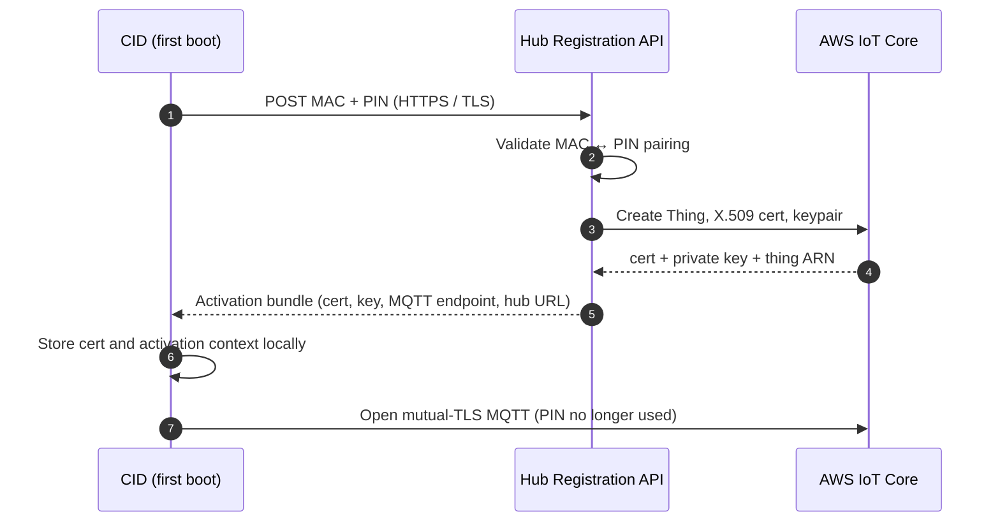
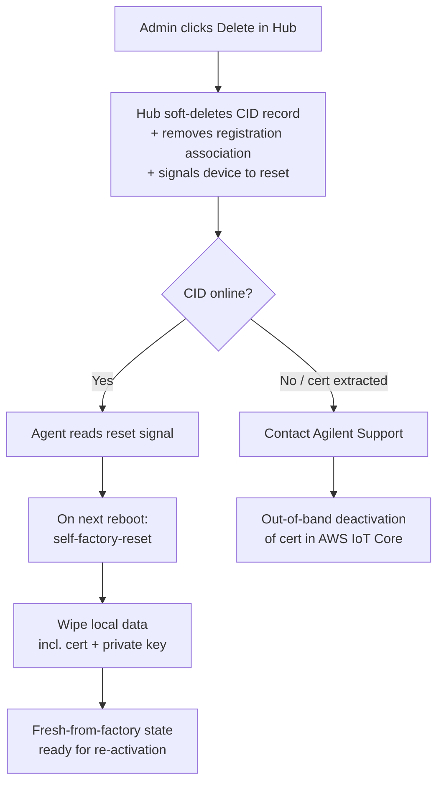
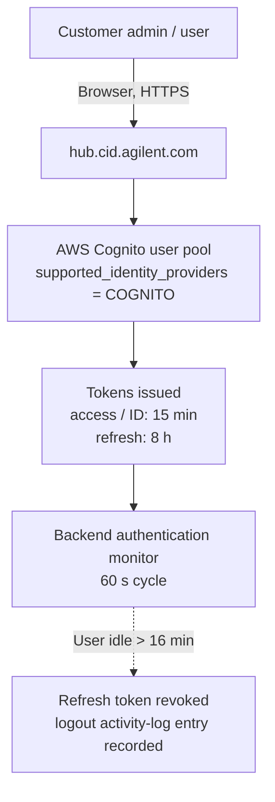

# <mark>Security model</mark>

This page describes the Connected Instrument Device (CID) trust boundaries, attack surface, device identity, and user identity. It provides the answers an IT reviewer needs to evaluate a CID against a domain-controlled lab PC. Procedures live in the [How-to](../howto/onboarding/activate-a-cid) pages. Authoritative network details live in [System Requirements](../reference/system-requirements). This page explains *why* those mechanisms add up to a defensible posture.

## Trust boundaries

:::note[Diagram placeholder — `trust-boundaries.svg`]
Show the four boundaries as concentric / adjacent zones: Corporate LAN, CID Linux host (single House-NIC IP, TCP 443 + reverse proxy), embedded Windows VM (no LAN IP, behind proxy on an internal bridge), V-NIC bridge to the Instrument LAN (no default gateway), and an outbound TLS arrow to AWS endpoints in `us-east-1` (Hub, IoT Core, Secure Tunneling). Mark the four boundaries listed below.
:::

The CID is a Linux appliance that hosts an embedded Windows 11 IoT Enterprise Long-Term Servicing Channel (LTSC) virtual machine. Four trust boundaries shape everything else on this page:

- **Corporate LAN ⇄ Linux host.** The Linux host is the only component exposed to the corporate LAN. A network scan of the CID's House-NIC IP shows TCP 443 open (HTTPS / WSS for Chromatography Data System (CDS) clients and admin UIs). On non-productive systems only, TCP 22 is also open. All other ports are closed. No inbound connection from the public internet is required or accepted on either NIC.
- **Linux host ⇄ Windows VM.** The Windows VM has no IP address on the corporate LAN. It sits behind the CID's nginx reverse proxy, which terminates TLS on the House-NIC and forwards selected paths inward over an internal bridge network. Anything not explicitly routed by the proxy (RDP, SMB, WinRM, file shares) is not reachable from the corporate LAN.
- **Windows VM ⇄ Instrument LAN.** A second virtual NIC (V-NIC) bridges the Windows VM directly onto the Instrument LAN through a dedicated bridge on the Linux host. The Instrument NIC has no default gateway by design. The Hub UI labels the gateway field "Gateway Address (Not Recommended)." Instrument-network traffic therefore cannot route to the corporate LAN or the internet.
- **CID ⇄ CID Hub.** All Hub traffic is CID-initiated outbound over TLS to AWS endpoints in `us-east-1` (HTTPS for REST/file transfer, MQTT-over-TLS for the IoT control plane, AWS IoT Secure Tunneling for support sessions). The Hub never opens a connection back to a CID. Remote-management commands ride the MQTT channel the CID already holds open.

See [System Requirements §Networking](../reference/system-requirements#networking-requirements) for the canonical inbound/outbound table, and [Data Flow & Privacy](./data-flow-and-privacy) for the inventory of what crosses each boundary.

## Attack surface

:::note[Diagram placeholder — `reverse-proxy-listeners.svg`]
Show the CID nginx reverse proxy as the only thing listening on the House-NIC IP at TCP 443, with internal-only upstreams: `/` → Windows VM, `/aic-windows-desktop/` → browser-based Windows console, `/ac-cockpit/` → Linux Cockpit admin UI. Make clear that none of the upstream services are bound to the House-NIC interface.
:::

From an attacker on the corporate LAN, the CID presents:

- **A single Linux IP, with TCP 443 open.** The reverse proxy serves CDS-client traffic (`/` → Windows VM), the browser-based Windows console (`/aic-windows-desktop/`), and the Linux Cockpit admin UI (`/ac-cockpit/`). All upstream services are bound to internal-only interfaces. The proxy is the only process listening on the corporate-facing interface.
- **An OpenLab-issued TLS certificate.** At runtime the CID replaces nginx's default self-signed certificate with the OpenLab certificate copied from the embedded Windows VM. Corporate clients therefore see the OpenLab-issued certificate rather than a bare device cert.
- **No public internet exposure.** The CID is not addressable from the public internet on either NIC. The Hub-side IoT and tunnel endpoints are reached outbound from the CID; nothing inbound is ever required. Outbound traffic is limited to a known set of AWS and Agilent endpoints listed in [System Requirements → Internet Requirements](../reference/system-requirements#internet-requirements). Internet connectivity is required for activation, security updates, and remote management. CDS data acquisition itself runs entirely on the customer's local network and continues if the internet path is interrupted. Only Hub-mediated functions (updates, support tunnels, status reporting) become unavailable.

:::note[TLS protocol versions]
The CID's reverse proxy currently accepts TLS 1.0, 1.1, and 1.2. Customer vulnerability scanners that flag the legacy protocols are responding to this configuration.
:::

### Two-NIC trust topology

The two-NIC design (a House NIC on the corporate LAN and a separate Instrument NIC on the lab network) is the foundation of the CID's network trust model. The two-NIC requirements themselves are listed in [System Requirements → Networking](../reference/system-requirements#networking-requirements). The following describes what the topology provides from a security standpoint:

- **No inbound from the internet on either NIC.** Neither NIC accepts unsolicited inbound connections from the internet. All CID Hub management and AWS connectivity happens over outbound TLS sessions the CID initiates (see [System Requirements → Internet Requirements](../reference/system-requirements#internet-requirements)). The House NIC does accept inbound connections from the corporate intranet. That is how OpenLab CDS clients reach the CID on TCP 443 (HTTPS / WSS) and how administrators reach the diagnostic UI. No port on the CID is reachable from outside the customer's firewall.
- **The embedded Windows VM is hidden from the corporate LAN.** The OpenLab Instrument Controller software runs in a Windows 11 virtual machine on the CID's Linux host. Corporate clients (OpenLab CDS, browsers) connect to the CID's reverse proxy on TCP 443, which terminates TLS and forwards to the VM internally over a private bridge network. The VM reaches the internet through the Linux host via NAT and is not directly addressable from the House NIC.
- **The Instrument NIC is isolated from the WAN and the corporate LAN.** The Windows VM is bridged onto the Instrument NIC through a separate virtual NIC (V-NIC) on the Linux host, putting the VM directly on the instrument network. Most OpenLab drivers initiate the connection from the VM out to the instrument. GC instrument drivers are an exception: the GC initiates the connection back to a driver process listening on the V-NIC inside the Windows VM. In either case the Instrument NIC has no default gateway by design. Traffic on the instrument network cannot route to the corporate LAN or to the internet. The instrument network is intended to be either a direct cable to one instrument or a dedicated, isolated LAN/VLAN.

### Boot integrity, at-rest data, and appliance model

- **Boot integrity is anchored by the Agilent-controlled gold image and the centralized Linux Update channel** rather than by the UEFI Secure Boot chain. The CID is a sealed appliance: the only paths to install or change software on the device are the Agilent-signed update bundles delivered through CID Hub. Every CID in the fleet has a single, auditable provenance for what is running. UEFI Secure Boot itself is not enabled on the device.
- **Full-disk encryption is not applied on the CID.** The CID is not used as a long-term record store. Sample data is staged transiently during acquisition and persisted to the OpenLab CDS Server (customer-operated, customer-backed-up), which remains the true record store and the appropriate point for at-rest protection of laboratory records. On the CID's fanless Atom-class hardware profile, encryption overhead would compete with real-time instrument-acquisition throughput. Data-at-rest protection on the CID relies on physical security of the device and on the customer's network and access controls. Neither the Oracle Linux 8 host nor the embedded Windows VM uses LUKS or BitLocker. See [Shared responsibility](#shared-responsibility) for the customer-side controls this implies.
- **The CID is delivered exclusively as the bundled IoT hardware** configured through CID Hub. Running the CID software on customer-supplied hardware or in a customer-managed hypervisor is not a supported configuration. The qualification, patching, and support model assumes the Agilent-supplied device. See [Hardware and Bundle → Delivery and Virtualization](../reference/hardware-and-bundle#delivery-and-virtualization).

## Posture vs a domain-controlled lab PC

The CID's security model is materially different from a customer-managed Windows PC running an instrument-controller workload. Agilent owns the OS image, patching cadence, anti-malware, and remote-access posture on the CID itself. The customer remains in control of the corporate network it sits on and of the identities used to access the Hub.

### What the CID gives you that a domain-controlled PC does not

- **Smaller attack surface.** One Linux IP, port 443 only. The Windows VM is unreachable from the corporate LAN except through the reverse proxy.
- **Appliance OS, not a productivity desktop.** The Windows VM is a Windows 11 IoT Enterprise LTSC build curated by Agilent. It has no end-user productivity software, no browsing, and no general-purpose Windows admin surface exposed on the corporate LAN.
- **Centrally-managed patching.** Linux host updates, Windows VM updates, driver updates, and CDS-version updates are delivered through the Hub. The Hub is the audit-trail source of truth for what was installed, when, and by whom. See [Audit & Compliance](./audit-and-compliance) for the patch policy, SLA, and rollback posture.
- **Unique per-CID credentials.** Each CID has its own SSH keypair, root password, and rotated dedicated operator account. A compromise of one CID's credentials does not expose any other CID.
- **Daily-rotated administrative credentials.** The Cockpit and Windows-console passwords are recycled every 24 hours. A credential that leaks today is invalid tomorrow without any customer action.
- **Bundled anti-malware.** The CID runs ClamAV on a weekly schedule. Signature updates ride the Linux Update channel. Detections are quarantined on the device and surfaced in the Hub Activity Log.

### What a domain-controlled PC gives you that the CID does not

- **No Active Directory or domain join.** The embedded Windows VM is not domain-joined and does not authenticate against the customer's Active Directory. AD-driven policy, Group Policy, AD-backed login, AD-driven screen lock, and AD-driven password complexity rules do not apply on the CID itself. The VM is an appliance OS, not a productivity desktop, and its administrative credentials are rotated daily by the CID agent. The scope of this is the embedded VM only. It does not affect:
    - Other (non-CID) instrument controllers a customer deploys alongside CIDs, which remain on the customer's standard endpoint-management stack.
    - CDS-client machines, which remain customer-owned and can be domain-joined.
    - OpenLab CDS user authentication at the CDS layer. OpenLab Server can still authenticate CDS users against the customer's Active Directory.
- **No customer-managed anti-malware product.** Agilent ships ClamAV on the CID. Customers cannot install a third-party agent (CrowdStrike, Defender ATP, SentinelOne, etc.) on either the Linux host or the embedded Windows VM. Endpoint-management products run on the CDS client machines, which the customer continues to own.
- **No customer-driven local-account management on the VM.** User accounts on the embedded Windows VM are local. Only the rotated administrative credentials are exposed through Hub-managed UIs. Custom local accounts cannot be provisioned by the customer.

The full split (what Agilent owns versus what the customer owns across all CID surfaces) is enumerated in [Shared responsibility](#shared-responsibility) below.

## Device identity

Each CID is identified to the Hub by a unique AWS IoT Core–issued X.509 client certificate. Identity is established once at activation and maintained over the device's lifetime. It does not depend on any customer-managed PKI.

### Activation and certificate issuance

The CID ships with an 8-character alphanumeric registration code (PIN) printed on a QR sticker on the chassis. At first boot the CID contacts the Hub registration API and presents its MAC address and PIN. The Hub validates the pairing, issues a unique IoT X.509 client certificate and private key, and attaches them to a dedicated IoT Thing for that device. The Hub returns the bundle over HTTPS/TLS. The CID stores the certificate and records the activation context (cert paths, MQTT endpoint, Hub URL, thing name) locally. From that point forward the CID authenticates to AWS IoT Core using mutual TLS with that certificate. The PIN is not re-used.

The procedure side of this flow lives in [Activate a CID](../howto/onboarding/activate-a-cid). The data exchanged during activation is enumerated in [Data Flow & Privacy](./data-flow-and-privacy).

### Certificate lifetime and rotation

- **Lifetime.** Device certificates are AWS IoT Core–issued and carry the AWS default validity of approximately 50 years (approximately 18,262 days). This is the AWS-issued maximum and is not customer-configurable.
- **Renewal check.** The CID agent checks the certificate synchronously at startup and on a 7-day cadence thereafter. If the certificate is expiring within the renewal window, has expired, or has been deleted, the agent triggers a rotation. Failed checks retry every 5 minutes.
- **Rotation.** The Hub creates a new keypair and certificate, attaches it to the existing IoT Thing and policy, hands it to the CID, and only then detaches and deletes the old certificate. The CID swaps to the new credential without service interruption. If the rotation fails partway through, the Hub re-attaches the old certificate so the CID can retry on the next cycle.
- **AWS IoT Core is the certificate authority.** Each CID's device certificate is issued and managed by AWS IoT Core. The activation and rotation flows above operate entirely within that authority.

### Decommissioning and revocation

When an administrator deletes a CID from the Hub, three things happen server-side. The CID's record is soft-deleted (so future registration API calls from that device are rejected). The device-registration association is removed (the hardware can be re-associated with a fresh PIN). Finally, the Hub signals the device to perform a factory reset via the IoT control plane.

The CID agent reads the reset signal on its next reachable cycle. On the next reboot the device performs a self-factory-reset: local data is wiped, including the on-device X.509 certificate and private key. The device returns to a fresh-from-factory state ready for re-activation under a new PIN.

:::warning[Lost or stolen devices: offline revocation]
Deleting a CID record marks the device deleted in the Hub but does not automatically deactivate the certificate inside AWS IoT Core. A device that is online when it is deleted self-wipes (including the cert and key) before it can be removed from the customer's premises. For a device that was offline at the time of deletion, or where there is reason to believe the certificate and private key were extracted, contact Agilent Support to deactivate the certificate inside AWS IoT Core as an out-of-band step.
:::

## User identity and authentication

A CID deployment has two distinct identity planes. It is important not to conflate them:

- **CDS-workflow identity.** The identity a scientist uses to log into OpenLab CDS to run samples, sign records, and read results. This is provided by OpenLab Server on the customer's infrastructure and can be backed by the customer's Active Directory at the CDS layer. The CID does not change this plane.
- **CID-management identity.** The identity a user (administrator or operator) uses to log into the CID Hub to register a CID, change its network configuration, apply updates, or approve a support session. This is provided by AWS Cognito, per-tenant, and is the subject of the rest of this section.

User access to the CID Hub Web UI is mediated by AWS Cognito. Identity is per-tenant: each customer organization gets its own user directory on the Hub side. The CID device itself does not hold customer user accounts. The only on-device credentials are the rotated administrative accounts described under [Attack surface](#attack-surface).

### Identity providers

- **AWS Cognito is the identity provider.** All customer users authenticate against the Hub's AWS Cognito user pool using credentials issued in the Hub itself.
- **Invitation-only account creation.** New users are created by an existing administrator and receive an email invitation from `CID Hub <no-reply@hub.cid.agilent.com>` with a temporary password.
- **Email-verified password reset.** Cognito account recovery is performed via verified email.

### Authentication

Users authenticate to the Hub with their Cognito-issued username and password. Sessions are governed by the Cognito token lifetimes and the backend authorization monitor described under [Sessions and session revocation](#sessions-and-session-revocation).

### Roles

Two customer roles are defined: **Administrator** (full control, including CID lifecycle, user management, software templates, and network configuration) and **User** (operational access, including view CIDs, launch CDS Desktop, approve/revoke support sessions, and restart or shut down a CID). Privileges are enumerated in [Manage Users and Roles](../howto/account/manage-users-and-roles).

### Sessions and session revocation

Cognito access tokens and ID tokens are valid for 15 minutes. Refresh tokens are valid for 8 hours. A backend authentication monitor runs every 60 seconds and revokes the refresh token for any user who has not made an authenticated API request in the last 16 minutes (the 15-minute access-token life plus a 1-minute buffer). A "User logged out due to session expiry" entry is recorded in the Activity Log. The practical effects:

- **Idle sessions are bounded.** A user who walks away from the Hub UI is logged out within about a minute of their last token expiring. Resuming work requires re-authentication.
- **User deletion.** When an administrator deletes a user, the user is removed from the Cognito directory immediately and can no longer obtain new tokens. An access token the user already holds remains technically valid until it expires (up to 15 minutes) because Cognito access tokens cannot be individually revoked once issued. The next refresh attempt fails.

The deletion procedure lives in [Manage Users and Roles → Delete a User](../howto/account/manage-users-and-roles#delete-a-user).

## Shared responsibility

Security on a CID deployment is split between Agilent and the customer organization that operates the CID. The split is not arbitrary. Agilent controls everything that lives on or inside the device: the OS image, the embedded Windows VM, the patching channel, the device identity, the on-device anti-malware, and the Hub-side SaaS infrastructure. This is because the CID is a sealed appliance with a single, auditable software provenance. The customer controls everything that lives around the device: the corporate network it sits on, the identities that reach the Hub, and the CDS clients, traditional Analytical Instrument Controllers (AICs), and OpenLab Server that the CID interoperates with. Those systems are part of the customer's wider IT estate and the customer is the only party positioned to manage them.

The reference list of customer obligations lives in [System Requirements → Security Requirements](../reference/system-requirements#security-requirements). The table below shows both sides of the split together, so an IT reviewer can see at a glance which surfaces are Agilent's responsibility and which are the customer's.

| Area | Agilent owns | Customer owns |
|---|---|---|
| **Network firewall and segmentation** | — | Configuring the corporate firewall to permit the outbound domains under [System Requirements → Internet Requirements](../reference/system-requirements#internet-requirements), and isolating the Instrument NIC's LAN/VLAN from the corporate WAN and the internet. |
| **Physical security of the CID** | — | Restricting physical access to the device. Full-disk encryption is not applied on the CID, so physical and network controls are the primary at-rest protection on the device itself. |
| **CID device identity** | X.509 client certificate provisioned at activation, rotated on the Agilent-managed cadence, and revocable through the Hub. | — |
| **CID Hub user identity** | Per-tenant Amazon Cognito user pool, Cognito-enforced password policy and account lockout, invitation-only account creation, and audit logging of admin actions. | Inviting and removing users, assigning roles, and offboarding users when they leave the organization. |
| **Active Directory / corporate identity** | — | All AD or IdP configuration for CDS clients and other customer-managed Windows PCs. The CID's embedded Windows VM is not domain-joined. |
| **CID host OS, Windows VM, drivers** | OS hardening, image baseline, security patches (Linux Updates and Windows Updates), and driver delivery, all distributed centrally through CID Hub. | Authorizing when updates are applied within the change-management window, and confirming via the activity log that they landed. |
| **Vulnerability response and updates** | Triaging vulnerabilities affecting CID-delivered components and distributing fixes through Linux Updates, Windows Updates, and driver updates. | Applying delivered updates within the customer's own change-management window. |
| **Antivirus on the CID** | ClamAV pre-installed, signatures refreshed through the Linux Updates channel, weekly scheduled scans, and detections surfaced in the activity log. | — |
| **CID Hub (SaaS) infrastructure** | AWS infrastructure, infrastructure patching, TLS termination, infrastructure monitoring, encryption in transit and at rest on the Hub side, and multi-tenant isolation. | — |
| **CDS client PCs and traditional AICs** | — | OS patching, anti-malware, screen-lock policy, password-cache policy, accurate system clock, and physical access. CID Hub does not manage these systems. |
| **Sample data and lab records** | The CID stages sample data on local disk during acquisition; this copy is transient by design. | The true record of sample data lives on the OpenLab CDS Server, which is customer-operated and customer-backed-up. Agilent does not back up CID-local CDS data. |
| **Audit logs** | Generating and retaining audit records of Hub-side and CID-side actions; surfacing them through the activity-log UI. | Incorporating the activity log into the customer's own monitoring, review, or SIEM workflow. |
| **Agilent support access** | Issuing the support-access request and providing the per-session tunnel infrastructure (AWS IoT Secure Tunneling); session start, end, and audit-log entries. | Reviewing and approving or declining each support request at the device, and closing the session when work is complete. See [Approve or Revoke Agilent Support Access](../howto/operations/cid-administration#approve-or-revoke-agilent-support-access). |

## See also

- [CID Hub Architecture](./cid-hub-architecture) — Hub-side AWS service inventory, tenant isolation, region and data-residency posture.
- [Data Flow & Privacy](./data-flow-and-privacy) — the nine-category inventory of what crosses the CID ⇄ Hub boundary, plus PHI/PII stance and retention.
- [Remote Access](./remote-access) — Windows console, Linux Cockpit, AWS IoT Secure Tunneling, and the Agilent support-access approval flow.
- [Audit & Compliance](./audit-and-compliance) — audit-log model, retention, tamper protection, patch SLA, and the CID's relationship to 21 CFR Part 11 and EU GMP Annex 11.
- [System Requirements](../reference/system-requirements) — authoritative networking, internet-requirements, hardware, and shared-responsibility tables.
