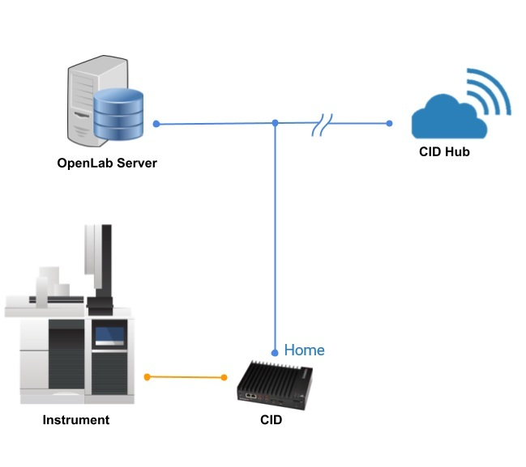

## Ensuring your CIDs are ready for the lab!

:::warning[CRITICAL]
**Network IT Administrators must prepare the network environment before installing CIDs.**
:::

### Step 1: Enabling CID Connectivity

 1. **Ensure CIDs have internet connection** for activation, security updates, monitoring, and other maintenance activities
 2. Configure the network and firewalls to allow connections from the CIDs to specific internet sites – **see complete list in the [System Requirements](/docs/system-requirements.md#internet-requirements).**
 3. Review the applicable [SSL Certificate Requirements for HTTPS](/docs/system-requirements.md#ssl-certificate-requirements-for-https) before proceeding.

---

### Step 2: Enabling CID Network Readiness

1. When first connected, the CID automatically gets its network settings using DHCP. After activation, a static network configuration can be used.
2. If your DHCP servers support dynamic DNS registration for Linux systems, the DHCP server will register the CID hostname automatically with the DNS server.
3. Otherwise, register the desired CID hostnames in DHCP and DNS using the device MAC address (found on QR code label).
4. CDS clients must resolve CID hostnames to their IP addresses for proper operation.
5. Refer to [DHCP and DNS Requirements](/docs/system-requirements.md#dhcp-and-dns-requirements) for more detail.

---

### Step 3: Connecting CID to your Network

1. Ensure the number and location of electrical outlets for your CID(s) and instruments are planned.
2. Place the CID next to the instrument and ensure the device has proper ventilation during operation. Do not place CIDs one top of the other, in a sealed box or near any heat sources.
3. Proceed to connect the CID LAN ports: **House (Corporate) NIC** connects to the corporate LAN and provides access to the OpenLab Server and the internet, and **Instrument NIC** connects to analytical instruments – directly or via instrument dedicated LAN/VLAN.
4. Connect the power cable and turn on the CID.
5. On bootup, the CID connects to the CID Hub via the internet. If successful, it will beep three times every 30 seconds until the CID is [added to the Hub](register-activate#3-add-the-cid-to-the-cid-hub). See the troubleshooting tips in [Internet Requirements](/docs/system-requirements.md#internet-requirements) for other beep codes.

---

### Step 4: Register and Activate your CIDs

1. Your lab is now ready for your CID(s)!
2. Continue to **[Register & Activate your CIDs](register-activate)**.
3. For further reference, see the CID Requirements Guide and Site Preparation Checklist documents. 

:::info[NOTE]
Agilent is here to support you - feel free to reach out!
--
**[Technical Support | Agilent](https://www.agilent.com/en/support)**
:::