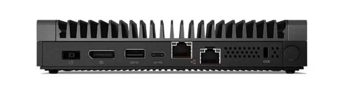
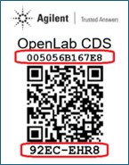
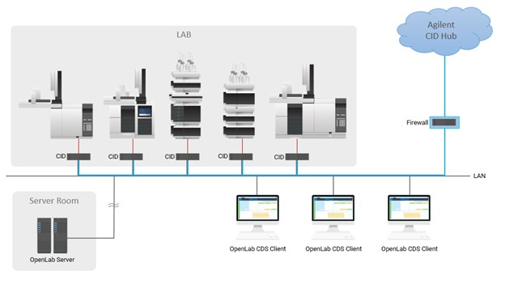
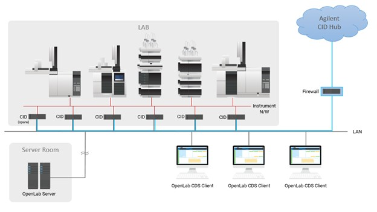

# System Requirements

## Networking Requirements

Each CID is equipped with two network interfaces:
- **House NIC** – Connects to the corporate LAN and provides access to the OpenLab Server and the internet.
- **Instrument NIC** – Connects to analytical instruments, either directly or via a dedicated instrument LAN/VLAN.

The 12-character MAC address for the “House” NIC and an 8-character PIN are printed on a QR code sticker attached to the device. The PIN is used to link the physical CID with its record in the CID Hub.

| Component	| CID Networking |
| --- | --- |
| **House NIC** | **Connects to corporate LAN and internet** |
| - *Internet outbound* |	See “[Internet Requirements](#internet-requirements)” section below. |
|	- *Internet inbound* | No inbound communication from the internet is required. |
| - *Intranet outbound*	| DHCP, DNS, HTTPS, ICMP (to OLSS, OpenLab Server), HTTP/HTTPS (to ECM 3.x), and SMB (optional). |
| - *Intranet inbound* | ICMP, HTTPS (for various services like Acquisition Server and diagnostics), and SSH (for troubleshooting). |
| **Instrument NIC** | **Connects to Instrument** |
| - *Internet outbound* | No outbound communication to the internet is required. |
| - *Internet inbound* | No inbound communication from the internet is required.
| - *Intranet outbound* | Acquisition Server to Instrument communication (instrument-specific port requirements); isolated and unrestricted communication is recommended. |
| - *Intranet inbound* | Instrument to Acquisition Server communication (instrument-specific port requirements); isolated and unrestricted communication is recommended. |

---

## Internet Requirements

CIDs require an internet connection for activation, security updates, monitoring, and other maintenance activities. CIDs access resources in the following domains:

1.  CID Hub and associated services:
    1. *.agilent.com (https)
    2. *.s3.amazonaws.com (https)
    3. *.s3.us-east-1.amazonaws.com (https)
    4. *.s3.us-west-2.amazonaws.com (https)
    5. *.iot.us-east-1.amazonaws.com (https)
2. Microsoft Windows Updates:
    1. *.microsoft.com (https)
    2. *.cloudfront.net (https)
    3. *.oneget.org (https)
    4. *.trafficmanager.net (https)
    5. *.blob.core.windows.net (https)
    6. *.azurefd.net (https)
    7. *.powershellgallery.com (https)
3. NTP Server
    1. *.pool.ntp.org (ntp)

:::info[Firewall Configuration]
Your firewall must be configured to allow outbound communication from CIDs to the sites listed above.
:::

Internet access is not required for CDS functionality. It is used only for administration, monitoring, and software configuration management.

:::info[Troubleshooting Beep Codes]
As the CID boots up, it attempts to connect to the CID Hub. If the connection fails, it will beep every 30 seconds.
- **1 Beep**: No network connection (check cables/NIC connections).
- **2 Beeps**: Cannot contact the CID Hub registration API (*.agilent.com). This could be a firewall issue, incorrect NIC wiring, or an internet outage.
- **3 Beeps**: No linked CID record found in the CID Hub.
- **4 Beeps**: An activated CID cannot connect to the registration API on bootup. If CDS is already installed, the CID beeps four times and continues to boot; otherwise, it will beep four times every 30 seconds.
:::

---

## DHCP and DNS Requirements
-  **House Network**
    -  When first connected, CID's **house** network uses DHCP to acquire an IP address, DNS servers, and DNS search strings. After activation, a static configuration can be applied to house network.
    -  Upon activation, the CID updates its hostname from the factory default (`agilent-cid`) to the name specified in the CID Hub, then reboots.
    -  If your DHCP servers support dynamic DNS registration (RFC 2136) for Linux systems, DHCP server will register the CID hostname automatically with the DNS server.
    -  Otherwise, the desired CID hostnames must be explicitly registered in DHCP and DNS using the device's "house" MAC address (printed on the QR code label).
    -  During activation, the CID validates name resolution using `nslookup 'hostname'`.
    -  CDS clients **must** resolve CID hostnames to their IP addresses for proper operation.
-  **Instrument Network**
    -  By default instrument network are also configured to use DHCP. After activation, a static configuration can be applied to the instrument network.

---

## SSL Certificate Requirements for HTTPS

### ECM 3.x
To successfully run an ECM 3.x server over HTTPS in an environment with CIDs, you must use a **publicly trusted SSL certificate**.
Certificates issued by internal, corporate, or self-signed certificate authorities (CAs) are not recognized by CIDs.

### ECM XT / OpenLab Server
Certificates issued by internal, corporate, or self-signed certificate authorities (CAs), as well as publicly trusted certificates, may be used for running ECM XT / OpenLab Servers over HTTPS in an environment with CIDs.

---

## Optional Network Share
CIDs optionally support using an SMB (Server Message Block) share accessible over the local LAN. In environments with many CIDs, this helps optimize performance and reduce internet bandwidth requirements.
This SMB share must be reachable from the device with at least read permissions to fetch required files. When write access is also granted, the device can automatically copy downloaded files into the share, making them available for other devices and preventing repeated downloads.
- CIDs can access a shared SMB folder over the LAN.
- **Full access (recommended)**: Cache downloaded CDS VM images for other CIDs to use.
- **Read access**: Use cached CDS VM images from the network share instead of downloading them from the CID Hub.
- This is configurable during OpenLab Server registration or later via the CID Hub.

:::info[Note]
1. After making changes to server settings, CIDs must be rebooted for the changes to take effect.
2. The User Principal Name (UPN) format is recommended for usernames (e.g., `username@domain.com`).
:::

---

## Supported Topologies

### 1. Direct Instrument Connection
- The Corporate NIC connects to the corporate LAN.
- The Instrument NIC connects directly to the instrument.
- Example: The instrument is set to a static IP of `192.168.1.2`, and the CID Instrument NIC is set to `192.168.1.3`.

### 2. Instrument LAN/VLAN Connection
- The Corporate NIC connects to the corporate LAN.
- Instruments and the CID are placed on a dedicated LAN or VLAN.
- Instrument IP assignment may be DHCP or static.

---

## Hardware Specification
The Agilent provided CID Bundle for OpenLab CDS includes IoT hardware from Lenovo that has been fully tested and qualified to run OpenLab CDS 2.7 and above.

| Component                | CID IoT Hardware for Agilent OpenLab CDS  |
|--------------------------|-------------------------------------------|
| Form Factor              | Fanless IoT device (44 x 151 x 195 mm)    |
| Processor                | Intel Atom 1.9 GHz                        |
| Hard Disk                | 1 TB SSD                                  |
| Memory                   | 16 GB DDR4 3200 SoDIMM                    |
| Graphics                 | Integrated graphics                       |
| Instrument Configuration | 1:1                                       |
| Operating                | Temperature 0 to 50 °C                    |
| Power                    | 65 W (adapter included)                   |
| Physical Interfaces      | Dual Gigabit LAN ports (RJ45), 4x USB ports, DisplayPort, HDMI, Mic In, Audio Out, 2x Serial ports (DB9) |

---

## Software Compatibility
The CID Bundle for OpenLab CDS includes IoT hardware from Lenovo that has been fully tested and qualified to run OpenLab CDS 2.7 and above. The CID solution requires the deployment of the bundled IoT hardware as configured within the CID Hub. 
Reference: [Software Compatibility](./compatiblity.md)

**Delivery**: CID Hub only (manual installation not supported).

**Virtualization**: Virtualization of CIDs is not supported.

---

## Licensing
The CID Bundle for OpenLab CDS includes the following licensing:
- OpenLab CDS Software (2.7 and above)
- Instrument connection licenses (2)
  - Agilent physical instrument (LC or GC), or
  - Agilent 3D UV/DAD instrument, or
  - Agilent LC/MS or GC/MS

---

## Summary
The Agilent CID provides a standardized, secure, and resilient solution for OpenLab CDS client/server systems. With dual NICs for clear separation of corporate and instrument networks, centralized software configuration via CID Hub, and tested hardware/software bundles, it simplifies deployment while ensuring compliance with enterprise IT and laboratory requirements.
