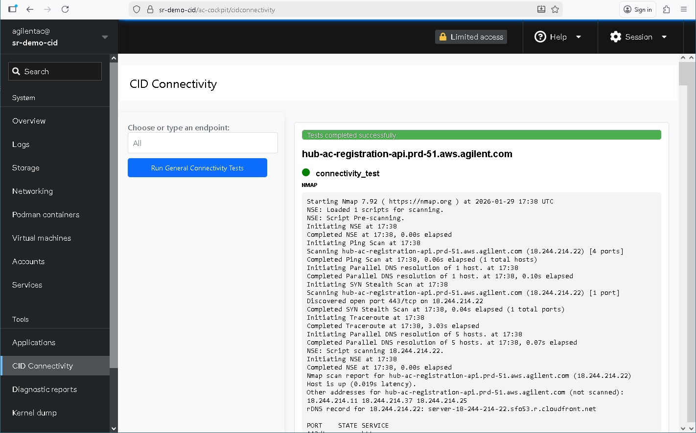

# CID Connectivity Tester

The Connectivity Tester is a diagnostic application within the Linux Cockpit interface of the CID. It tests the device's ability to reach the external services required for activation, monitoring, and software management. Crucially, it works on unactivated CIDs — making it the first tool to reach for when a new device is failing to connect.



## Accessing the App

Access method and credentials depend on whether the CID has been activated.

### Activated CIDs

1. In the CID Hub, navigate to the **Administration** tab for the device
2. Click **Launch Cockpit**
3. Log in with:
   - **Username:** `agilentac`
   - **Password:** The complex, 10-character password shown in the Administration tab
   - **Note:** This password is automatically recycled every 24 hours

### Unactivated CIDs

1. Find the CID's IP address on your network
2. Open a browser and navigate to `https://<CID-IP>/ac-cockpit/`
3. Log in with:
   - **Username:** `agilentac`
   - **Password:** The factory default password provided by Agilent support or services personnel

### No Network Access — Direct Console

If the CID cannot be reached over the network (for example, because of a misconfigured IP address or a complete connectivity failure), you can attach a monitor and keyboard directly to the CID and log in via the console. From there, you can run the manual diagnostic commands described in the [CID-NET troubleshooting guides](#troubleshooting-connectivity-issues) directly in the terminal.

## Running a Connectivity Test

The **CID Connectivity** page is listed in the Cockpit left-hand navigation. Once open, you have two options:

### Test All Endpoints

Click **Run General Connectivity Tests** to test all endpoints required by the CID in one go. This is the recommended starting point. For the full list of domains tested, see [System Requirements → Internet Requirements](/system-requirements#internet-requirements).

### Test a Specific Endpoint

Use the **Choose or type an endpoint** field to select a predefined endpoint or enter a custom URL (e.g., `www.agilent.com`), then run the test. This is useful for isolating a specific service or testing general internet reachability.

### Reading the Results

Each test runs the following command against the endpoint:

```bash
nmap -v --script=resolveall --traceroute -p 443 <URL>
```

Results are displayed inline below the controls. Key things to look for:

- **DNS resolution** — the output will show whether the hostname resolved to an IP address. If resolution fails, refer to [CID-NET-05: DNS Resolution Failure](/cid-net-05)
- **Port 443 state** — look for `open` (reachable), `filtered` (silently blocked by a firewall), or `closed` (actively refused)
- **Traceroute hops** — shows the network path to the destination. If the path terminates at an internal IP address, traffic is not reaching the internet

## Troubleshooting Connectivity Issues

Use the failure type to identify the right next step:

| Failure Symptom | Go To |
|---|---|
| Port 443 connection times out or is refused | [CID-NET-01: TCP Port 443 Blocked](/cid-net-01) |
| TCP connects but TLS handshake fails | [CID-NET-02: TLS Handshake Failure](/cid-net-02) |
| Certificate error — corporate CA shown instead of expected issuer | [CID-NET-03: SSL Inspection / Certificate Substitution](/cid-net-03) |
| NTP-related errors or time sync warnings | [CID-NET-04: NTP Time Synchronization Failure](/cid-net-04) |
| Hostname cannot be resolved | [CID-NET-05: DNS Resolution Failure](/cid-net-05) |

### Cockpit Terminal

Cockpit includes a built-in **Terminal** tab that provides direct shell access to the CID. This can be used to run manual diagnostic commands — such as the `mtr` commands in the CID-NET guides — without requiring a separate SSH connection. The terminal is available to any user logged in to Cockpit.
