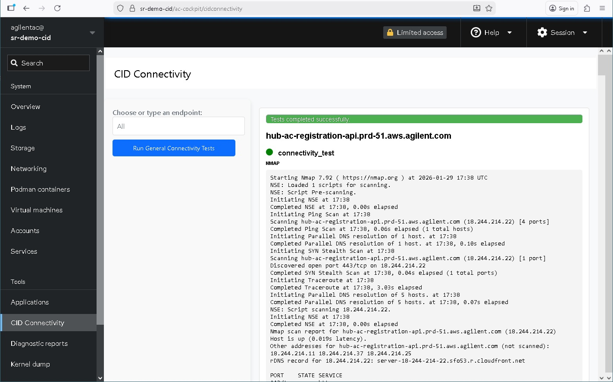

# Verify CID internet connectivity

**Product:** Agilent Connected Instrument Device (CID) for OpenLab CDS
**Audience:** Agilent Support, IT/network administrators
**Support reference:** Network / connectivity triage

:::warning[For IT administrators only]
The diagnostic procedures on this page are intended for IT administrators familiar with Linux commands. Incorrect use of the underlying tools can misconfigure the CID and render it inoperable. Proceed only if you are comfortable working in a Linux environment.
:::

---

## Symptom

You suspect a network or connectivity problem is preventing the CID from reaching Agilent cloud services, but you do not yet have a specific error to act on. Common triggers:

- Activation of a brand-new CID is stalling or failing with no clear error string.
- Activation, monitoring, or software updates began failing after a network change (for example, a new firewall rule, NIC swap, VLAN move, or proxy change).
- The CID appears offline in **CID Hub** and you need to confirm whether the cause is at the network layer before opening a support ticket.

---

## Confirm this is the right document

| You observe | Go to |
|---|---|
| One or more beeps on startup | [Beep codes on startup](/troubleshooting/beep-codes-on-startup) |
| A specific TCP, TLS, certificate, NTP, or DNS error in logs or the UI | The matching page in [Related documents](#related-documents) below |
| No specific error, but connectivity is suspect | Continue with this page |

---

## Affected services

A connectivity failure detected on this page can affect any CID service that depends on outbound access, including:

- Activation and registration with **CID Hub**
- Telemetry and health reporting
- Software update delivery
- Communication with the OpenLab server

For the canonical list of endpoints the CID must reach, see [System requirements, Internet requirements](/reference/system-requirements#internet-requirements).

---

## Background

The connectivity tester runs the following command against each endpoint:

```bash
nmap -v --script=resolveall --traceroute -p 443 <URL>
```

Interpret the result with the right level of confidence:

- A **failed** test is reliable evidence that connectivity is broken at the DNS, routing, firewall, or TCP layer. If the tester cannot reach an endpoint, the CID cannot either.
- A **passed** test means TCP port 443 is reachable. It does **not** guarantee the CID will activate successfully. TLS inspection, certificate substitution, NTP skew, and application-layer rejections can still block activation even when the tester passes. Treat a clean run as "the network layer is not the problem" rather than "everything is fine."

This is why the tester is the first tool to use for a suspected network issue, and why a clean run still routes you on to the TLS, certificate, NTP, and OpenLab server pages.

---

## Prerequisites

- Access to the Linux Cockpit interface of the CID. See [Access the connectivity tester](#access-the-connectivity-tester) below for the three available paths.
- Familiarity with reading `nmap` output: DNS resolution, port state (`open` / `filtered` / `closed`), and traceroute hops.

### Access the connectivity tester

The connectivity tester is a diagnostic application inside the Linux Cockpit interface. The access path depends on whether the CID has been activated.

#### Activated CID

1. In **CID Hub**, navigate to the **Administration** tab for the device.
2. Click **Launch Cockpit**.
3. Log in with:
   - **Username:** `agilentac`
   - **Password:** the complex, 10-character password shown on the **Administration** tab. This password is rotated every 24 hours.

#### Unactivated CID

1. Find the CID's IP address on your network.
2. Open a browser to `https://<CID-IP>/ac-cockpit/`.
3. Log in with:
   - **Username:** `agilentac`
   - **Password:** the factory default password provided by Agilent support or services personnel.

#### No network access (direct console)

If the CID cannot be reached over the network, for example because of a misconfigured IP address or a complete connectivity failure, attach a monitor and keyboard directly to the CID and log in at the console. From the console you can run the manual diagnostic commands described in the linked failure-mode pages directly in the terminal.

---

## Diagnostic steps

### Step 1. Launch the tester

In the Cockpit left-hand navigation, open the **CID Connectivity** page.



### Step 2. Run the general connectivity test

Click **Run general connectivity tests** to test every endpoint the CID requires in a single pass. This is the recommended starting point.

For the full endpoint list, see [System requirements, Internet requirements](/reference/system-requirements#internet-requirements).

| Result | Next step |
|---|---|
| All endpoints pass | The network layer is not the problem. If activation or sync is still failing, continue to Step 4 to check the false-positive cases. |
| One or more endpoints fail | Note which endpoints failed, then continue to Step 3. |

### Step 3. Read the result for each failed endpoint

Each failed result includes DNS, port-state, and traceroute information. Use the result indicator to route to the right page.

| Result indicator | Failure type | Next step |
|---|---|---|
| Hostname does not resolve to an IP address | DNS | [DNS resolution failure](/troubleshooting/dns-resolution-failure) |
| Port 443 shows `filtered`, or the connection times out | Firewall silently dropping TCP 443 | [TCP port 443 blocked](/troubleshooting/tcp-port-443-blocked) |
| Port 443 shows `closed` (actively refused) | Firewall or routing rejecting TCP 443 | [TCP port 443 blocked](/troubleshooting/tcp-port-443-blocked) |
| Traceroute terminates at an internal IP address | Traffic is not leaving the corporate network | [TCP port 443 blocked](/troubleshooting/tcp-port-443-blocked) |

### Step 4. Rule out the false-positive cases

A passing tester does not exclude every cause. If activation or sync continues to fail despite a clean run, work through the matching page below.

| Symptom alongside a passing tester | Next step |
|---|---|
| Certificate or TLS errors in logs | [TLS handshake failure](/troubleshooting/tls-handshake-failure) |
| Corporate CA shown in place of the expected issuer | [SSL inspection and certificate substitution](/troubleshooting/ssl-inspection) |
| NTP errors, time-sync warnings, or clock-skew messages during activation | [NTP time synchronization failure](/troubleshooting/ntp-time-sync-failure) |
| OpenLab server cannot be reached or fails validation | [OpenLab server unreachable](/troubleshooting/openlab-server-unreachable) |

### Step 5. Test a specific endpoint (optional)

Use the **Choose or type an endpoint** field to select a predefined endpoint or to enter a custom URL such as `www.agilent.com`. This is useful for isolating one service or for confirming general internet reachability when the general test passes but a downstream service still fails.

---

## Resolution

This page does not resolve a connectivity failure on its own. Its job is to identify which failure-mode page applies. Apply the resolution from the page identified in Step 3 or Step 4.

If every test passes and no downstream failure-mode page applies, the failure is not at the network layer. Collect a support bundle and open a support ticket.

---

## Related documents

- [TCP port 443 blocked](/troubleshooting/tcp-port-443-blocked)
- [TLS handshake failure](/troubleshooting/tls-handshake-failure)
- [SSL inspection and certificate substitution](/troubleshooting/ssl-inspection)
- [NTP time synchronization failure](/troubleshooting/ntp-time-sync-failure)
- [DNS resolution failure](/troubleshooting/dns-resolution-failure)
- [OpenLab server unreachable](/troubleshooting/openlab-server-unreachable)
- [Beep codes on startup](/troubleshooting/beep-codes-on-startup)
- [System requirements, Internet requirements](/reference/system-requirements#internet-requirements)
