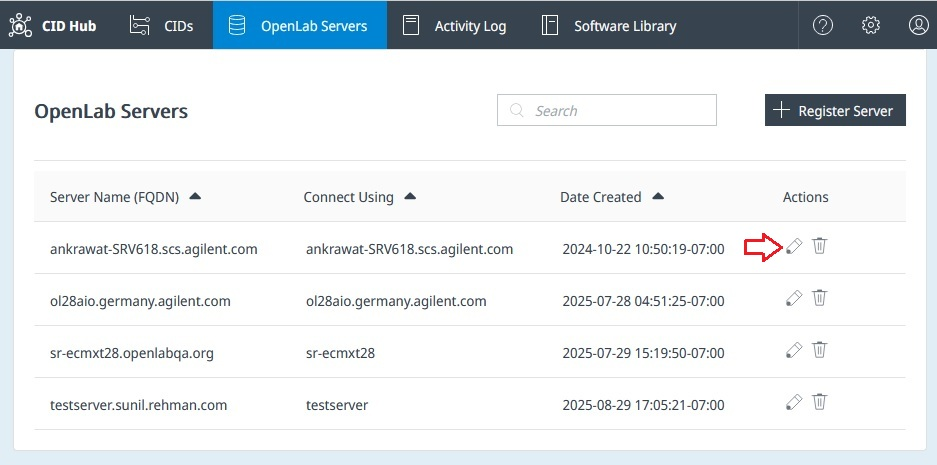
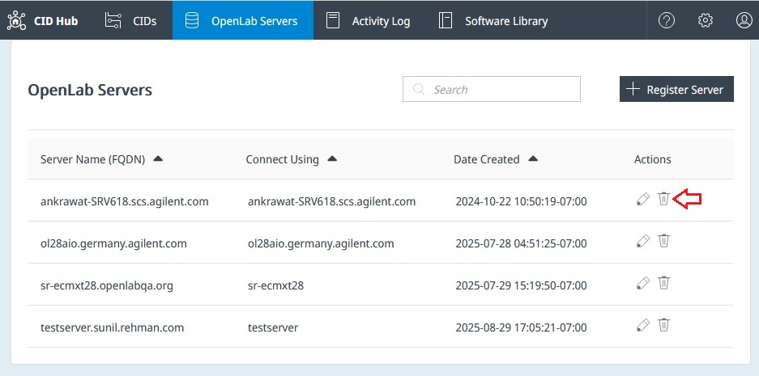

# OpenLab Server Registries in CID Hub

## Overview

You need to save information about your OpenLab Server(s) in CID Hub. When CID devices start up, they use this stored information to automatically register with the OpenLab Server.

You can add server details to CID Hub as soon as they are known. The OpenLab Server does not need to be running or available at the time you register its information.

:::info
CID Hub does not verify, or use this information to connect to the server. It only stores the information so that CID devices can retrieve and use it.
:::

## Registering Your OpenLab Server in CID Hub

Click **Register Server** to add a new OpenLab Server.  

### Field Descriptions  

- **Server Name (FQDN)**  
  Enter the fully qualified domain name of the OpenLab Server (e.g., `olserver.prod.example.com`).  
  For better compatibility with some DNS systems, it is recommended to use **lowercase letters** when entering the FQDN.  

- **Connect to**  
  Specify how CIDs should connect to the server: by hostname or by FQDN.  
  :::caution[Important]
  It is important to use the same convetion (hostname or FQDN) consistently across all CDS Clients, AICs, and CIDs to avoid functional issues in CDS.  
  :::

- **Username / Password**  
  Used by CIDs during their initial registration as instrument controllers with OLSS. It is important to keep this information current and available because:
  - Some drivers, after installation or upgrade, use this information to register with OLSS, and
  - This information is needed for administrative functions such as Register CID and Reset OpenLab CDS.  

- **CID Network Share** *(Optional but recommended)*  
  Provides a shared path for CIDs to cache downloaded CDS versions. This improves performance and reduces internet bandwidth usage.  
  - When a CID downloads a CDS version (~25 GB) from the CID Hub, it caches a copy in a `downloads` subfolder under this share.  
  - Other CIDs can then retrieve the cached files from the network share instead of downloading them again from the internet.  
  - It is also possible to manually download CDS files from the CID Hub's Software Library and cache them in this share path.  

- **Network Share Username / Password**  
  Required if anonymous access is not allowed. Depending on your setup, the username format can be:  
  - `user`  
  - `domain\user`  
  - `user@domain.com`

## Editing Existing Registries

OpenLab Server Registries can be edited by clicking on the pencil icon under the action column. 

If the server FQDN is updated, then all the CIDs connected to that server need to be re-registered. This can be done by clicking the **Register CID** button in the CID Administration page.

Updates to other information takes affect when the CIDs are restarted. CIDs can be restarted by clicking the **Reboot System** button in the CID Administration page.

## Deleting Existing Registries

OpenLab Server Registries can be removed by clicking on the trashcan icon under the action column. 

:::info 
Only unused Server Registries can be removed from the CID Hub. Servers cannot be removed when there are one or more CIDs associated with it.
:::
