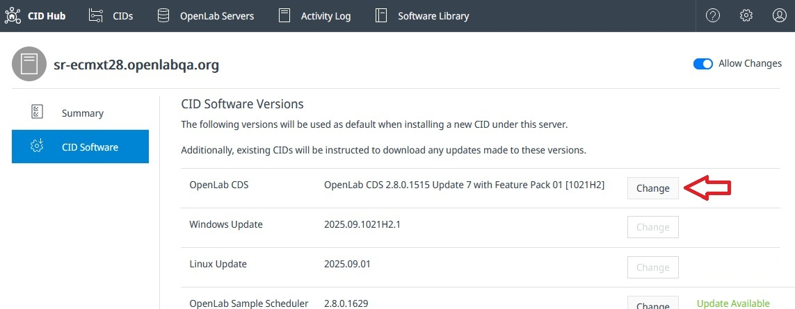
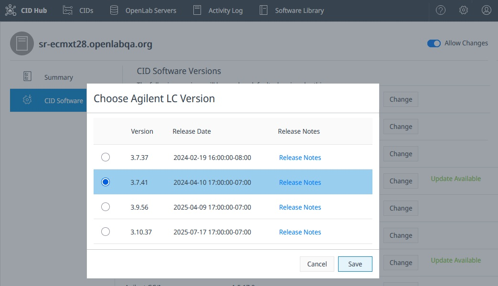

# Defining Software Template for CIDs

## Overview
As part of the server configuration, you need to define the software versions that will be used in your CDS client–server environment.  
This setup acts as the **default software configuration template** that gets applied to all CIDs connected to the server.

When this template is updated for the server, connected CIDs automatically download the required software packages. Installation must then be manually triggered by an administrator.

---

## Selecting CDS Version
By default, new servers are configured with the latest CDS version available on the CDS Hub.  
Click **Change** to select a different version.

When a new minor version is released, the system displays **Update Available** next to the **Change** button.  
:::caution
When upgrading, ensure that all Clients, AICs, and CIDs connected to the server are updated to the **same version** of CDS.
:::

---

## OS Updates
Security and system updates are published regularly on the CID Hub:  

- **Windows Updates**: The latest version is automatically selected when available.  
- **CID Agent and Linux Updates**: The latest compatible versions are also automatically selected.  

This ensures that all connected CIDs remain secure and up to date.

---

## Instrument Drivers & Add-on Software
The selected CDS version determines the minimum compatible versions of drivers and add-ons.  
These are automatically preselected, but you can change them by clicking **Change** next to the relevant driver or add-on.

:::caution
When you change the CDS version, all driver and add-on selections are reset to their defaults for that version.  
If your setup requires specific driver or add-on versions, make sure to reselect them after changing the CDS version.
:::
